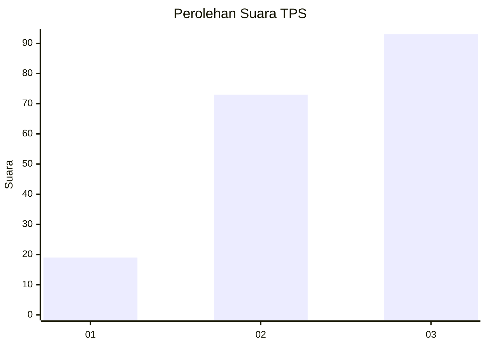
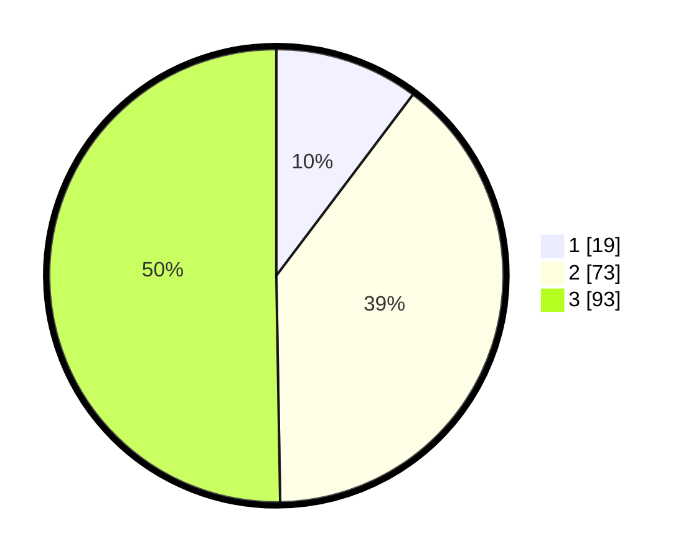

# Hasil

## Grafik

## Tabel

| No. | Nama Paslon    | Suara | Suara (raw) | Persentase |
|:--- |:-------------- | -----:| -----------:| ----------:|
| 1   | ANIES MUHAIMIN | 19    | [19][p-1]   | 10,27      |
| 2   | PRABOWO GIBRAN | 73    | [73][p-2]   | 39,46      |
| 3   | GANJAR MAHFUD  | 93    | [93][p-3]   | 50,27      |

[p-1]: https://github.com/gigit-pemilu/pemilu-2024-33-jawa-tengah/blob/main/pilpres/hitung-suara/sub/33-jawa-tengah/sub/07-wonosobo/sub/12-garung/sub/1005-garung/sub/007-tps/sub/paslon-1.txt
[p-2]: https://github.com/gigit-pemilu/pemilu-2024-33-jawa-tengah/blob/main/pilpres/hitung-suara/sub/33-jawa-tengah/sub/07-wonosobo/sub/12-garung/sub/1005-garung/sub/007-tps/sub/paslon-2.txt
[p-3]: https://github.com/gigit-pemilu/pemilu-2024-33-jawa-tengah/blob/main/pilpres/hitung-suara/sub/33-jawa-tengah/sub/07-wonosobo/sub/12-garung/sub/1005-garung/sub/007-tps/sub/paslon-3.txt

## Foto C Plano

https://sirekap-obj-formc.kpu.go.id/c992/pemilu/ppwp/33/07/12/10/05/3307121005007-20240215-003235--dc59a663-3508-4c1e-8eba-46c69ccc0d01.jpg

https://sirekap-obj-formc.kpu.go.id/c992/pemilu/ppwp/33/07/12/10/05/3307121005007-20240215-003354--1ba166e9-f0da-4872-b7a4-7cae4be29573.jpg

https://sirekap-obj-formc.kpu.go.id/c992/pemilu/ppwp/33/07/12/10/05/3307121005007-20240215-003457--57db5310-8cdd-41fa-b703-db5bb5ee23df.jpg

## Metadata

| Key        | Value               |
| ---------- | ------------------- |
| Time Stamp | 2024-02-19 06:16:00 |

