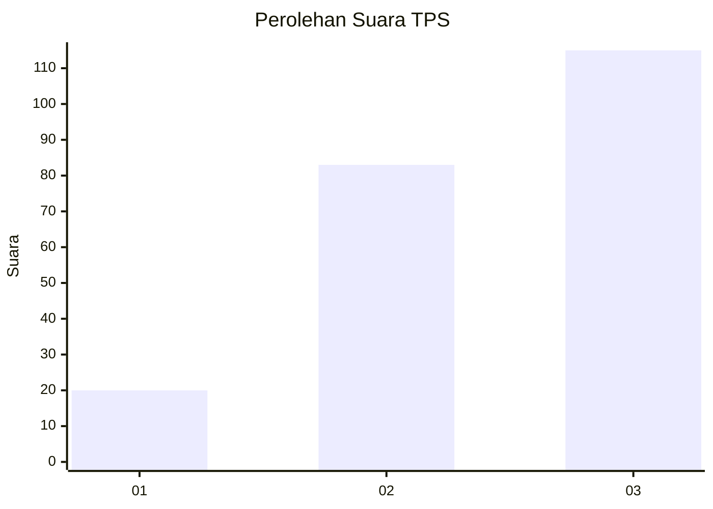
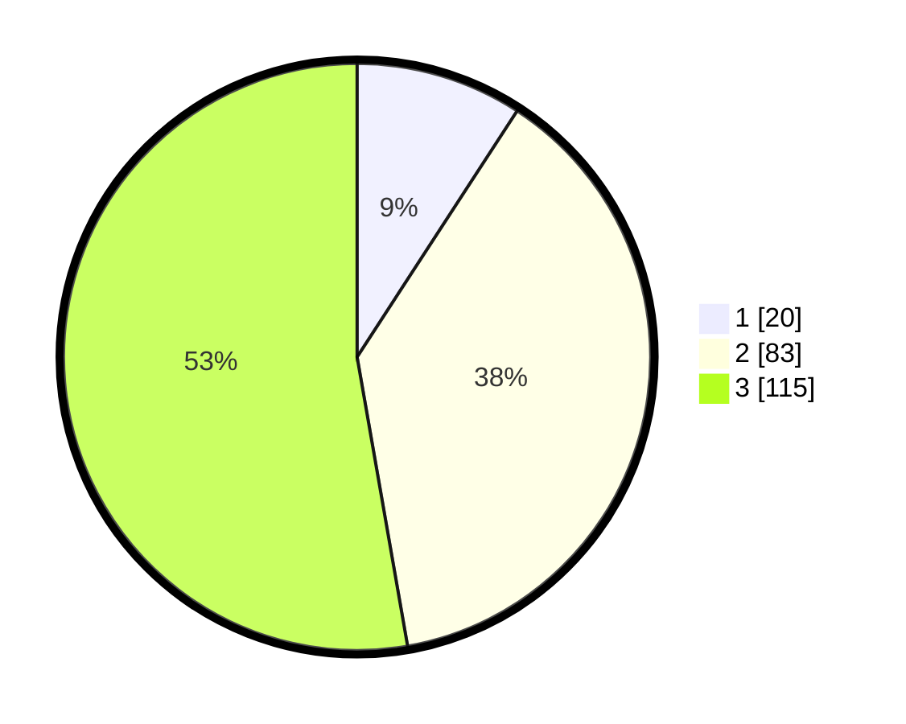

# Hasil

## Grafik

## Tabel

| No. | Nama Paslon    | Suara | Suara (raw) | Persentase |
|:--- |:-------------- | -----:| -----------:| ----------:|
| 1   | ANIES MUHAIMIN | 20    | [20][p-1]   | 9,17       |
| 2   | PRABOWO GIBRAN | 83    | [83][p-2]   | 38,07      |
| 3   | GANJAR MAHFUD  | 115   | [115][p-3]  | 52,75      |

[p-1]: https://github.com/gigit-pemilu/pemilu-2024-33-jawa-tengah/blob/main/pilpres/hitung-suara/sub/33-jawa-tengah/sub/07-wonosobo/sub/12-garung/sub/1005-garung/sub/013-tps/sub/paslon-1.txt
[p-2]: https://github.com/gigit-pemilu/pemilu-2024-33-jawa-tengah/blob/main/pilpres/hitung-suara/sub/33-jawa-tengah/sub/07-wonosobo/sub/12-garung/sub/1005-garung/sub/013-tps/sub/paslon-2.txt
[p-3]: https://github.com/gigit-pemilu/pemilu-2024-33-jawa-tengah/blob/main/pilpres/hitung-suara/sub/33-jawa-tengah/sub/07-wonosobo/sub/12-garung/sub/1005-garung/sub/013-tps/sub/paslon-3.txt

## Foto C Plano

https://sirekap-obj-formc.kpu.go.id/90c6/pemilu/ppwp/33/07/12/10/05/3307121005013-20240214-221809--d214be6d-9ab0-4b33-8e40-cc97c9c16128.jpg

https://sirekap-obj-formc.kpu.go.id/90c6/pemilu/ppwp/33/07/12/10/05/3307121005013-20240214-222147--02e6e3cf-43c9-4239-b482-0c4977abc63d.jpg

https://sirekap-obj-formc.kpu.go.id/90c6/pemilu/ppwp/33/07/12/10/05/3307121005013-20240214-222011--1bccfb06-8973-444a-920c-f0e484b96137.jpg

## Metadata

| Key        | Value               |
| ---------- | ------------------- |
| Time Stamp | 2024-02-15 15:00:29 |

