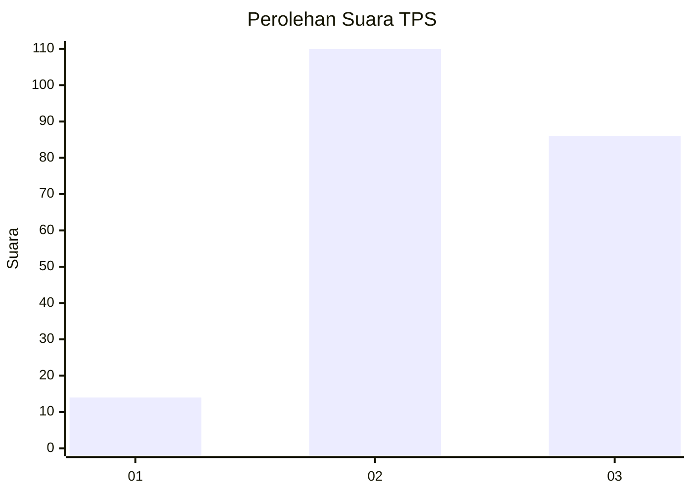
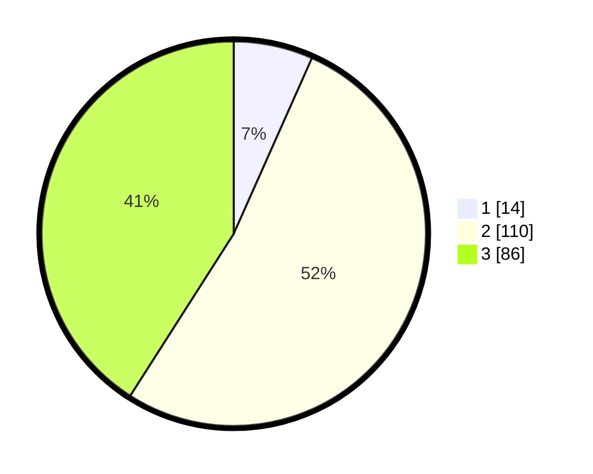

# Hasil

## Grafik

## Tabel

| No. | Nama Paslon    | Suara | Suara (raw) | Persentase |
|:--- |:-------------- | -----:| -----------:| ----------:|
| 1   | ANIES MUHAIMIN | 14    | [14][p-1]   | 6,67       |
| 2   | PRABOWO GIBRAN | 110   | [110][p-2]  | 52,38      |
| 3   | GANJAR MAHFUD  | 86    | [86][p-3]   | 40,95      |

[p-1]: https://github.com/gigit-pemilu/pemilu-2024-33-jawa-tengah/blob/main/pilpres/hitung-suara/sub/33-jawa-tengah/sub/07-wonosobo/sub/12-garung/sub/2002-gemblengan/sub/004-tps/sub/paslon-1.txt
[p-2]: https://github.com/gigit-pemilu/pemilu-2024-33-jawa-tengah/blob/main/pilpres/hitung-suara/sub/33-jawa-tengah/sub/07-wonosobo/sub/12-garung/sub/2002-gemblengan/sub/004-tps/sub/paslon-2.txt
[p-3]: https://github.com/gigit-pemilu/pemilu-2024-33-jawa-tengah/blob/main/pilpres/hitung-suara/sub/33-jawa-tengah/sub/07-wonosobo/sub/12-garung/sub/2002-gemblengan/sub/004-tps/sub/paslon-3.txt

## Foto C Plano

https://sirekap-obj-formc.kpu.go.id/6e52/pemilu/ppwp/33/07/12/20/02/3307122002004-20240214-211543--9f08468d-9e93-4c41-9636-89519d9ff529.jpg

https://sirekap-obj-formc.kpu.go.id/6e52/pemilu/ppwp/33/07/12/20/02/3307122002004-20240214-211608--c095b2e1-056c-4aab-8cc0-e54e86b377f2.jpg

https://sirekap-obj-formc.kpu.go.id/6e52/pemilu/ppwp/33/07/12/20/02/3307122002004-20240214-211649--4c1bb9c7-9cb8-4223-acb7-687ada9be88e.jpg

## Metadata

| Key        | Value               |
| ---------- | ------------------- |
| Time Stamp | 2024-02-15 01:47:43 |

