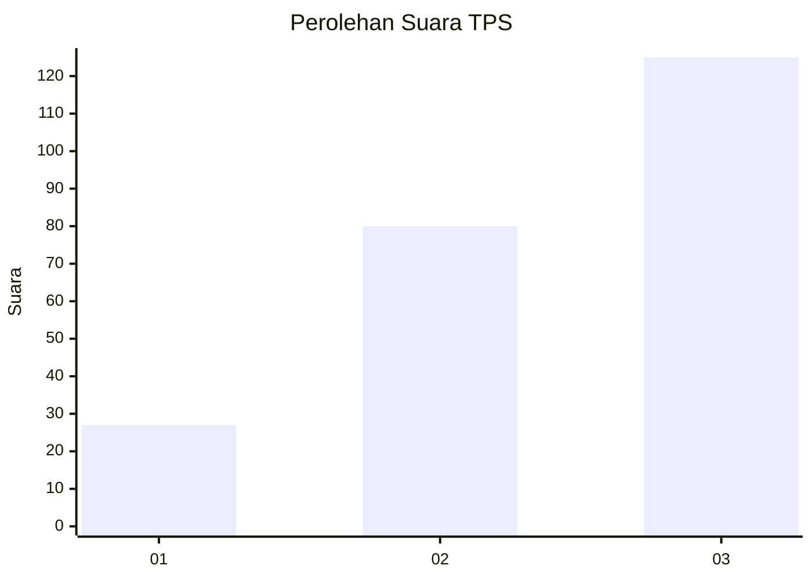
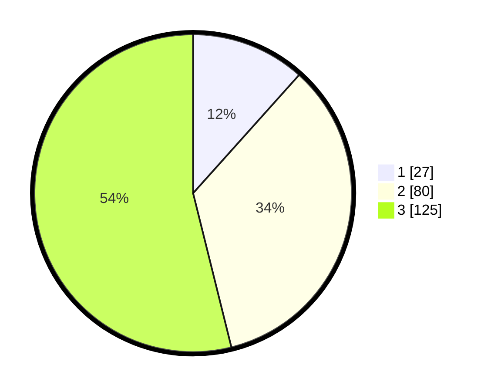

# Hasil

## Grafik

## Tabel

| No. | Nama Paslon    | Suara | Suara (raw) | Persentase |
|:--- |:-------------- | -----:| -----------:| ----------:|
| 1   | ANIES MUHAIMIN | 27    | [27][p-1]   | 11,64      |
| 2   | PRABOWO GIBRAN | 80    | [80][p-2]   | 34,48      |
| 3   | GANJAR MAHFUD  | 125   | [125][p-3]  | 53,88      |

[p-1]: https://github.com/gigit-pemilu/pemilu-2024/blob/main/pilpres/hitung-suara/sub/33-jawa-tengah/sub/07-wonosobo/sub/12-garung/sub/2004-kayugiyang/sub/010-tps/sub/paslon-1.txt
[p-2]: https://github.com/gigit-pemilu/pemilu-2024/blob/main/pilpres/hitung-suara/sub/33-jawa-tengah/sub/07-wonosobo/sub/12-garung/sub/2004-kayugiyang/sub/010-tps/sub/paslon-2.txt
[p-3]: https://github.com/gigit-pemilu/pemilu-2024/blob/main/pilpres/hitung-suara/sub/33-jawa-tengah/sub/07-wonosobo/sub/12-garung/sub/2004-kayugiyang/sub/010-tps/sub/paslon-3.txt

## Foto C Plano

https://sirekap-obj-formc.kpu.go.id/6b66/pemilu/ppwp/33/07/12/20/04/3307122004010-20240214-225600--5b6c1755-2010-4dee-a814-ece6249fd8bd.jpg

https://sirekap-obj-formc.kpu.go.id/6b66/pemilu/ppwp/33/07/12/20/04/3307122004010-20240214-223202--45ce66a8-7909-49d3-bff6-2d1e2da401de.jpg

https://sirekap-obj-formc.kpu.go.id/6b66/pemilu/ppwp/33/07/12/20/04/3307122004010-20240214-223344--15c82494-a478-469c-874c-7cd1ed963ba9.jpg

## Metadata

| Key        | Value               |
| ---------- | ------------------- |
| Time Stamp | 2024-02-15 15:00:29 |

