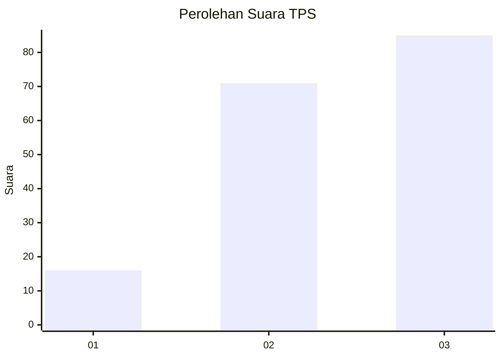
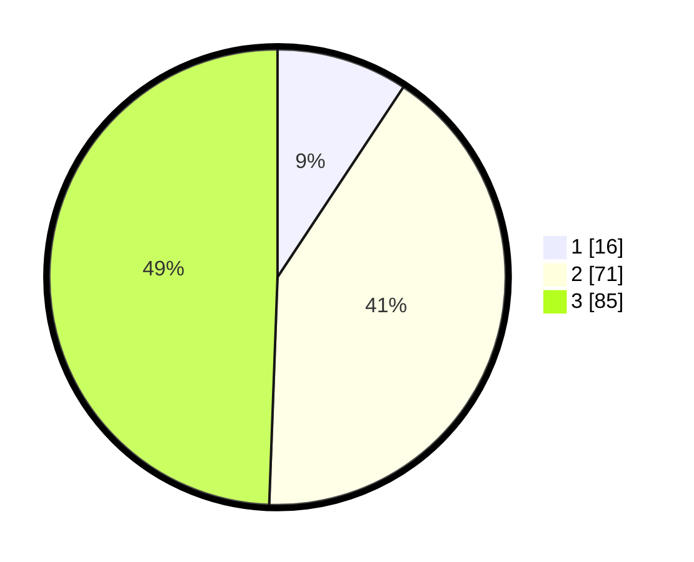

# Hasil

## Grafik

## Tabel

| No. | Nama Paslon    | Suara | Suara (raw) | Persentase |
|:--- |:-------------- | -----:| -----------:| ----------:|
| 1   | ANIES MUHAIMIN | 16    | [16][p-1]   | 9,30       |
| 2   | PRABOWO GIBRAN | 71    | [71][p-2]   | 41,28      |
| 3   | GANJAR MAHFUD  | 85    | [85][p-3]   | 49,42      |

[p-1]: https://github.com/gigit-pemilu/pemilu-2024/blob/main/pilpres/hitung-suara/sub/33-jawa-tengah/sub/07-wonosobo/sub/12-garung/sub/2009-tlogo/sub/004-tps/sub/paslon-1.txt
[p-2]: https://github.com/gigit-pemilu/pemilu-2024/blob/main/pilpres/hitung-suara/sub/33-jawa-tengah/sub/07-wonosobo/sub/12-garung/sub/2009-tlogo/sub/004-tps/sub/paslon-2.txt
[p-3]: https://github.com/gigit-pemilu/pemilu-2024/blob/main/pilpres/hitung-suara/sub/33-jawa-tengah/sub/07-wonosobo/sub/12-garung/sub/2009-tlogo/sub/004-tps/sub/paslon-3.txt

## Foto C Plano

https://sirekap-obj-formc.kpu.go.id/f30a/pemilu/ppwp/33/07/12/20/09/3307122009004-20240214-233823--b0aa1ce7-1698-487d-ba78-fee19a42db05.jpg

https://sirekap-obj-formc.kpu.go.id/f30a/pemilu/ppwp/33/07/12/20/09/3307122009004-20240214-233831--f541de9e-61ce-4744-ab77-a82e5d17d9b7.jpg

https://sirekap-obj-formc.kpu.go.id/f30a/pemilu/ppwp/33/07/12/20/09/3307122009004-20240215-152114--70206c2e-906d-4966-9262-14d71d3fda40.jpg

## Metadata

| Key        | Value               |
| ---------- | ------------------- |
| Time Stamp | 2024-02-15 15:30:25 |

