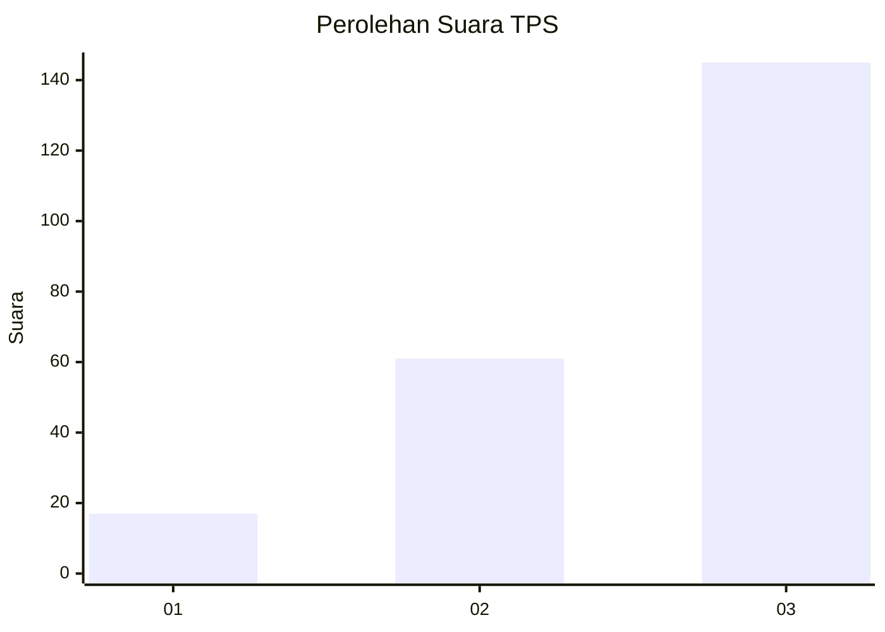
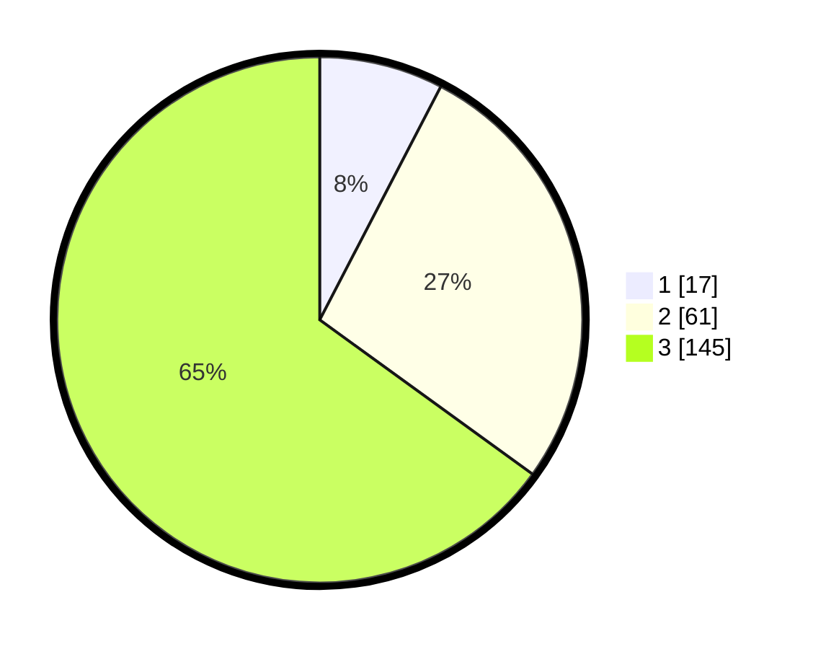

# Hasil

## Grafik

## Tabel

| No. | Nama Paslon    | Suara | Suara (raw) | Persentase |
|:--- |:-------------- | -----:| -----------:| ----------:|
| 1   | ANIES MUHAIMIN | 17    | [17][p-1]   | 7,62       |
| 2   | PRABOWO GIBRAN | 61    | [61][p-2]   | 27,35      |
| 3   | GANJAR MAHFUD  | 145   | [145][p-3]  | 65,02      |

[p-1]: https://github.com/gigit-pemilu/pemilu-2024-33-jawa-tengah/blob/main/pilpres/hitung-suara/sub/33-jawa-tengah/sub/07-wonosobo/sub/12-garung/sub/2010-maron/sub/001-tps/sub/paslon-1.txt
[p-2]: https://github.com/gigit-pemilu/pemilu-2024-33-jawa-tengah/blob/main/pilpres/hitung-suara/sub/33-jawa-tengah/sub/07-wonosobo/sub/12-garung/sub/2010-maron/sub/001-tps/sub/paslon-2.txt
[p-3]: https://github.com/gigit-pemilu/pemilu-2024-33-jawa-tengah/blob/main/pilpres/hitung-suara/sub/33-jawa-tengah/sub/07-wonosobo/sub/12-garung/sub/2010-maron/sub/001-tps/sub/paslon-3.txt

## Foto C Plano

https://sirekap-obj-formc.kpu.go.id/a7c9/pemilu/ppwp/33/07/12/20/10/3307122010001-20240215-033202--cb53b989-66be-431c-bbdc-b2c74d62e440.jpg

https://sirekap-obj-formc.kpu.go.id/a7c9/pemilu/ppwp/33/07/12/20/10/3307122010001-20240215-033245--6a9a7837-bdca-43f8-8b43-89abb29e0913.jpg

https://sirekap-obj-formc.kpu.go.id/a7c9/pemilu/ppwp/33/07/12/20/10/3307122010001-20240215-033319--b9e4d76a-2c01-4050-b599-c9bd31a53d46.jpg

## Metadata

| Key        | Value               |
| ---------- | ------------------- |
| Time Stamp | 2024-02-15 15:00:29 |

