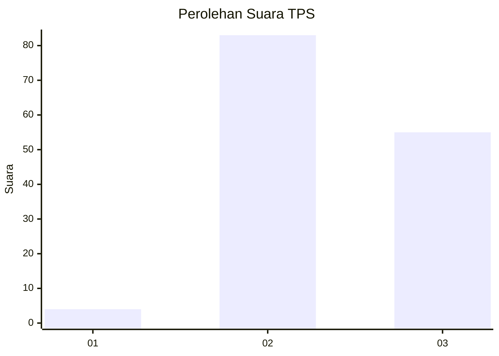
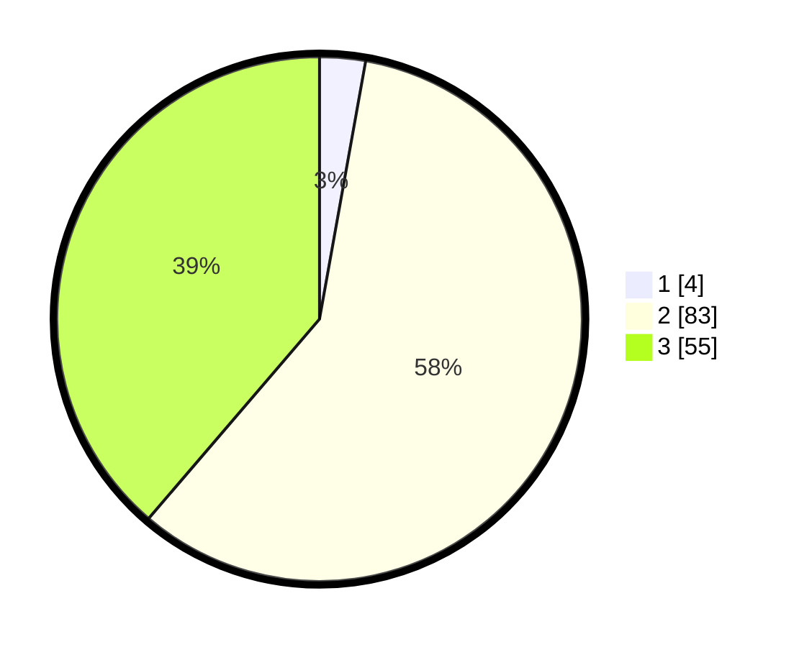

# Hasil

## Grafik

## Tabel

| No. | Nama Paslon    | Suara | Suara (raw) | Persentase |
|:--- |:-------------- | -----:| -----------:| ----------:|
| 1   | ANIES MUHAIMIN | 4     | [4][p-1]    | 2,82       |
| 2   | PRABOWO GIBRAN | 83    | [83][p-2]   | 58,45      |
| 3   | GANJAR MAHFUD  | 55    | [55][p-3]   | 38,73      |

[p-1]: https://github.com/gigit-pemilu/pemilu-2024/blob/main/pilpres/hitung-suara/sub/33-jawa-tengah/sub/07-wonosobo/sub/12-garung/sub/2012-mlandi/sub/011-tps/sub/paslon-1.txt
[p-2]: https://github.com/gigit-pemilu/pemilu-2024/blob/main/pilpres/hitung-suara/sub/33-jawa-tengah/sub/07-wonosobo/sub/12-garung/sub/2012-mlandi/sub/011-tps/sub/paslon-2.txt
[p-3]: https://github.com/gigit-pemilu/pemilu-2024/blob/main/pilpres/hitung-suara/sub/33-jawa-tengah/sub/07-wonosobo/sub/12-garung/sub/2012-mlandi/sub/011-tps/sub/paslon-3.txt

## Foto C Plano

https://sirekap-obj-formc.kpu.go.id/9ccb/pemilu/ppwp/33/07/12/20/12/3307122012011-20240215-002639--f90de042-4888-47e4-a26d-1c3e007907a3.jpg

https://sirekap-obj-formc.kpu.go.id/9ccb/pemilu/ppwp/33/07/12/20/12/3307122012011-20240216-131100--2683ca3b-1439-4c3b-a6ff-1c34b7649554.jpg

https://sirekap-obj-formc.kpu.go.id/9ccb/pemilu/ppwp/33/07/12/20/12/3307122012011-20240215-002330--68b711c8-66a1-4409-9751-41904bcb0f8a.jpg

## Metadata

| Key        | Value               |
| ---------- | ------------------- |
| Time Stamp | 2024-02-19 06:16:00 |

