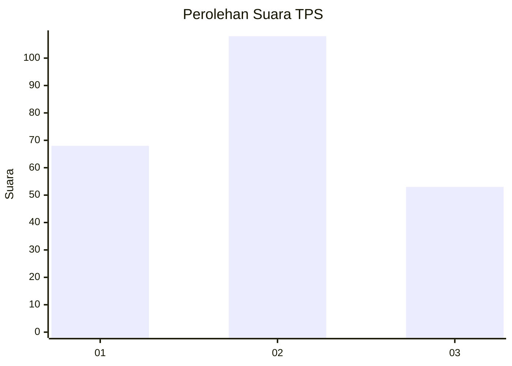
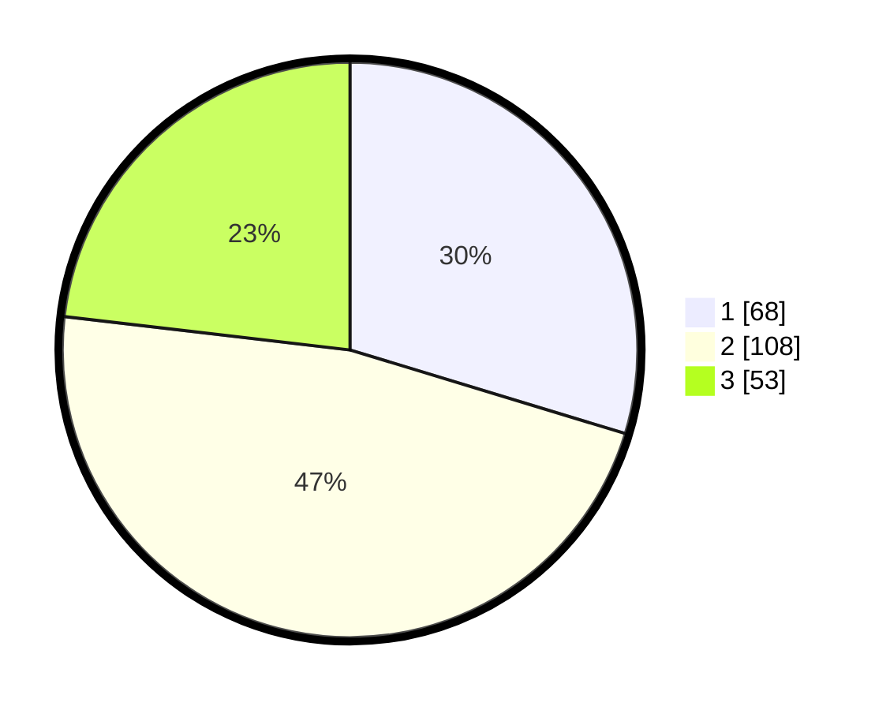

# Hasil

## Grafik

## Tabel

| No. | Nama Paslon    | Suara | Suara (raw) | Persentase |
|:--- |:-------------- | -----:| -----------:| ----------:|
| 1   | ANIES MUHAIMIN | 68    | [68][p-1]   | 29,69      |
| 2   | PRABOWO GIBRAN | 108   | [108][p-2]  | 47,16      |
| 3   | GANJAR MAHFUD  | 53    | [53][p-3]   | 23,14      |

[p-1]: https://github.com/gigit-pemilu/pemilu-2024/blob/main/pilpres/hitung-suara/sub/33-jawa-tengah/sub/07-wonosobo/sub/13-kejajar/sub/1008-kejajar/sub/001-tps/sub/paslon-1.txt
[p-2]: https://github.com/gigit-pemilu/pemilu-2024/blob/main/pilpres/hitung-suara/sub/33-jawa-tengah/sub/07-wonosobo/sub/13-kejajar/sub/1008-kejajar/sub/001-tps/sub/paslon-2.txt
[p-3]: https://github.com/gigit-pemilu/pemilu-2024/blob/main/pilpres/hitung-suara/sub/33-jawa-tengah/sub/07-wonosobo/sub/13-kejajar/sub/1008-kejajar/sub/001-tps/sub/paslon-3.txt

## Foto C Plano

https://sirekap-obj-formc.kpu.go.id/8300/pemilu/ppwp/33/07/13/10/08/3307131008001-20240215-012725--b025f181-e7ba-463b-bbfb-91d5e8fe4295.jpg

https://sirekap-obj-formc.kpu.go.id/8300/pemilu/ppwp/33/07/13/10/08/3307131008001-20240215-012839--8d78045d-6107-47dd-a474-d7efb850715f.jpg

https://sirekap-obj-formc.kpu.go.id/8300/pemilu/ppwp/33/07/13/10/08/3307131008001-20240215-013124--d2340c90-24aa-412c-97a5-df386aeffb3a.jpg

## Metadata

| Key        | Value               |
| ---------- | ------------------- |
| Time Stamp | 2024-02-17 14:45:18 |

