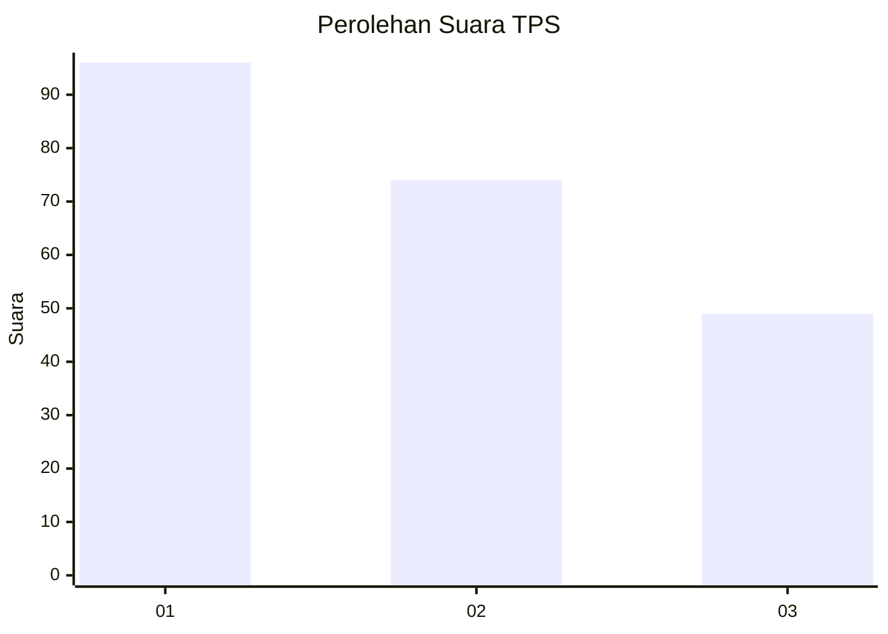
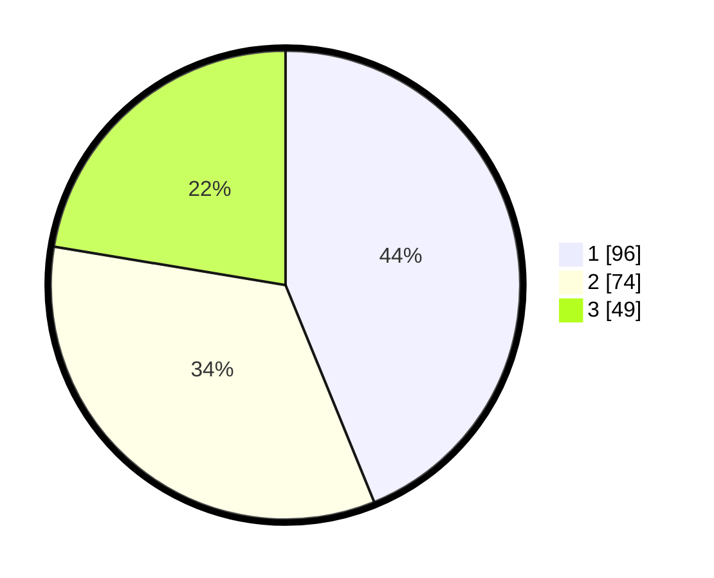

# Hasil

## Grafik

## Tabel

| No. | Nama Paslon    | Suara | Suara (raw) | Persentase |
|:--- |:-------------- | -----:| -----------:| ----------:|
| 1   | ANIES MUHAIMIN | 96    | [96][p-1]   | 43,84      |
| 2   | PRABOWO GIBRAN | 74    | [74][p-2]   | 33,79      |
| 3   | GANJAR MAHFUD  | 49    | [49][p-3]   | 22,37      |

[p-1]: https://github.com/gigit-pemilu/pemilu-2024/blob/main/pilpres/hitung-suara/sub/33-jawa-tengah/sub/07-wonosobo/sub/13-kejajar/sub/1008-kejajar/sub/002-tps/sub/paslon-1.txt
[p-2]: https://github.com/gigit-pemilu/pemilu-2024/blob/main/pilpres/hitung-suara/sub/33-jawa-tengah/sub/07-wonosobo/sub/13-kejajar/sub/1008-kejajar/sub/002-tps/sub/paslon-2.txt
[p-3]: https://github.com/gigit-pemilu/pemilu-2024/blob/main/pilpres/hitung-suara/sub/33-jawa-tengah/sub/07-wonosobo/sub/13-kejajar/sub/1008-kejajar/sub/002-tps/sub/paslon-3.txt

## Foto C Plano

https://sirekap-obj-formc.kpu.go.id/c6fb/pemilu/ppwp/33/07/13/10/08/3307131008002-20240215-042344--45b260c6-88d4-42e1-869f-52bf5d40e53a.jpg

https://sirekap-obj-formc.kpu.go.id/c6fb/pemilu/ppwp/33/07/13/10/08/3307131008002-20240215-042539--0a1b6b1b-45d7-4463-a050-df2b4c53a4c5.jpg

https://sirekap-obj-formc.kpu.go.id/c6fb/pemilu/ppwp/33/07/13/10/08/3307131008002-20240215-042724--77c07e91-35ab-4cf8-91a7-e5efab2841bf.jpg

## Metadata

| Key        | Value               |
| ---------- | ------------------- |
| Time Stamp | 2024-02-17 14:45:18 |

