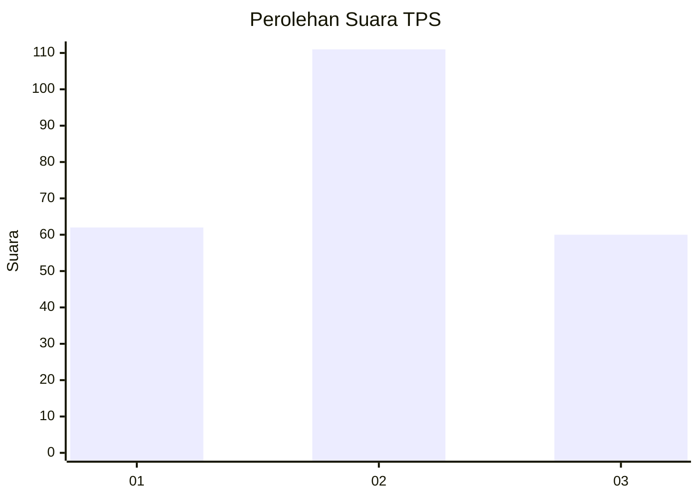
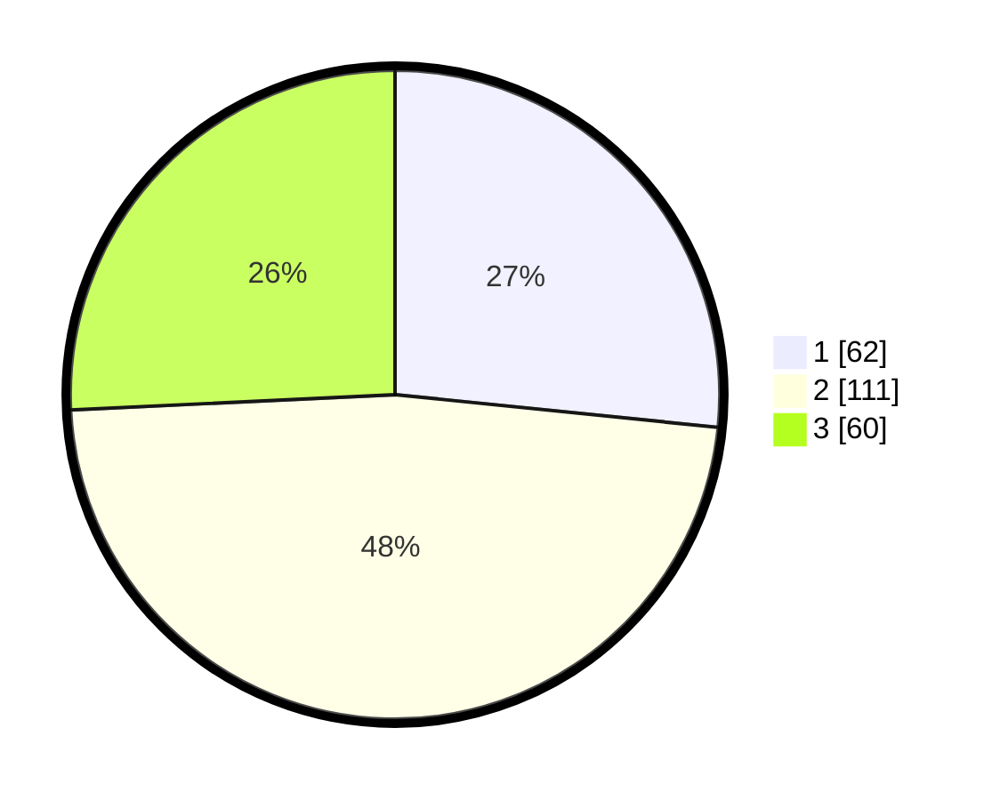

# Hasil

## Grafik

## Tabel

| No. | Nama Paslon    | Suara | Suara (raw) | Persentase |
|:--- |:-------------- | -----:| -----------:| ----------:|
| 1   | ANIES MUHAIMIN | 62    | [62][p-1]   | 26,61      |
| 2   | PRABOWO GIBRAN | 111   | [111][p-2]  | 47,64      |
| 3   | GANJAR MAHFUD  | 60    | [60][p-3]   | 25,75      |

[p-1]: https://github.com/gigit-pemilu/pemilu-2024/blob/main/pilpres/hitung-suara/sub/33-jawa-tengah/sub/07-wonosobo/sub/13-kejajar/sub/1008-kejajar/sub/003-tps/sub/paslon-1.txt
[p-2]: https://github.com/gigit-pemilu/pemilu-2024/blob/main/pilpres/hitung-suara/sub/33-jawa-tengah/sub/07-wonosobo/sub/13-kejajar/sub/1008-kejajar/sub/003-tps/sub/paslon-2.txt
[p-3]: https://github.com/gigit-pemilu/pemilu-2024/blob/main/pilpres/hitung-suara/sub/33-jawa-tengah/sub/07-wonosobo/sub/13-kejajar/sub/1008-kejajar/sub/003-tps/sub/paslon-3.txt

## Foto C Plano

https://sirekap-obj-formc.kpu.go.id/0832/pemilu/ppwp/33/07/13/10/08/3307131008003-20240215-040124--167c728e-73b9-4b0b-85c0-bcd6b064d594.jpg

https://sirekap-obj-formc.kpu.go.id/0832/pemilu/ppwp/33/07/13/10/08/3307131008003-20240215-041108--a0f276b9-574d-4034-a65c-01ffeecbba32.jpg

https://sirekap-obj-formc.kpu.go.id/0832/pemilu/ppwp/33/07/13/10/08/3307131008003-20240215-041451--716e6221-726d-4e4a-971d-4d1c295f2808.jpg

## Metadata

| Key        | Value               |
| ---------- | ------------------- |
| Time Stamp | 2024-02-15 12:00:28 |

