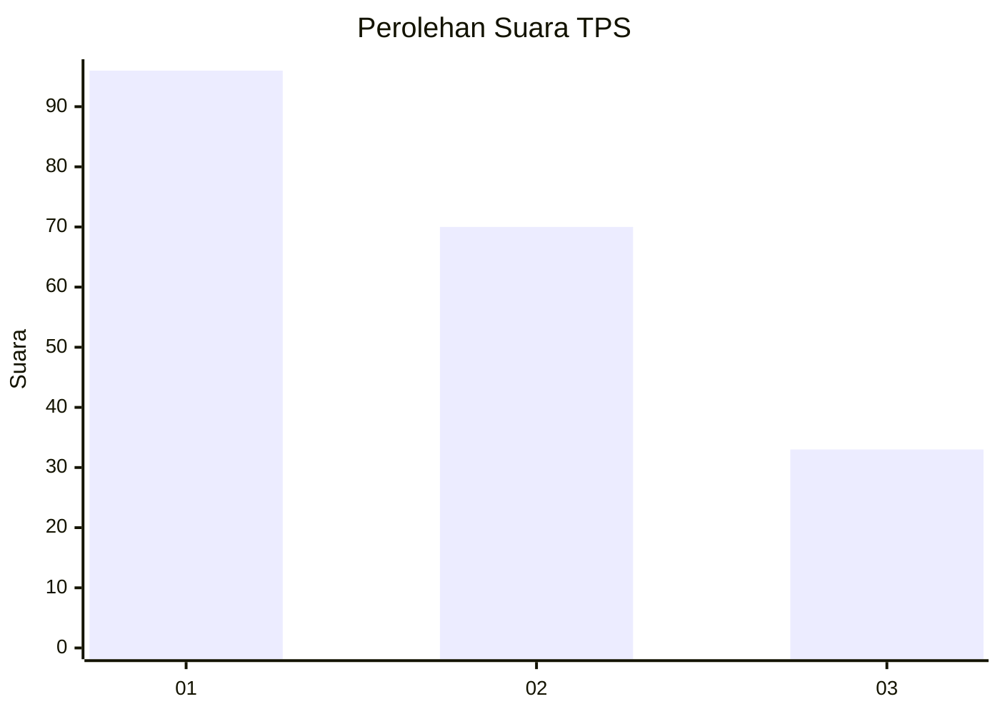
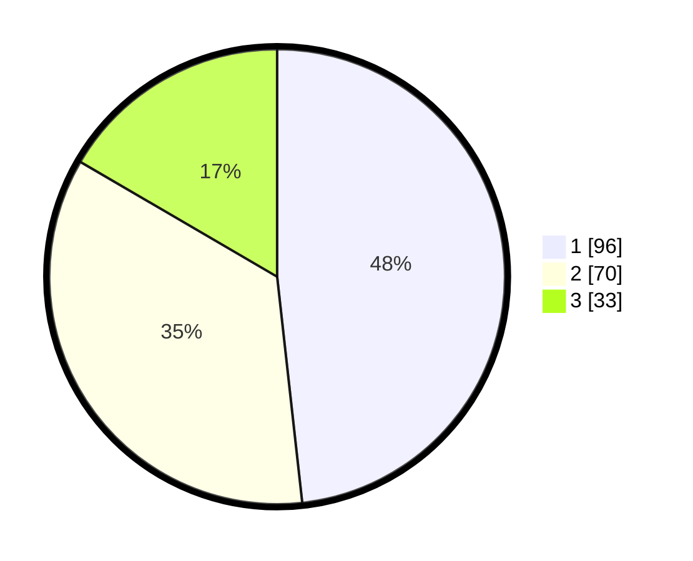

# Hasil

## Grafik

## Tabel

| No. | Nama Paslon    | Suara | Suara (raw) | Persentase |
|:--- |:-------------- | -----:| -----------:| ----------:|
| 1   | ANIES MUHAIMIN | 96    | [96][p-1]   | 48,24      |
| 2   | PRABOWO GIBRAN | 70    | [70][p-2]   | 35,18      |
| 3   | GANJAR MAHFUD  | 33    | [33][p-3]   | 16,58      |

[p-1]: https://github.com/gigit-pemilu/pemilu-2024/blob/main/pilpres/hitung-suara/sub/33-jawa-tengah/sub/07-wonosobo/sub/13-kejajar/sub/1008-kejajar/sub/004-tps/sub/paslon-1.txt
[p-2]: https://github.com/gigit-pemilu/pemilu-2024/blob/main/pilpres/hitung-suara/sub/33-jawa-tengah/sub/07-wonosobo/sub/13-kejajar/sub/1008-kejajar/sub/004-tps/sub/paslon-2.txt
[p-3]: https://github.com/gigit-pemilu/pemilu-2024/blob/main/pilpres/hitung-suara/sub/33-jawa-tengah/sub/07-wonosobo/sub/13-kejajar/sub/1008-kejajar/sub/004-tps/sub/paslon-3.txt

## Foto C Plano

https://sirekap-obj-formc.kpu.go.id/db43/pemilu/ppwp/33/07/13/10/08/3307131008004-20240214-221313--8415979b-7191-4b38-8afb-39ae9c51863c.jpg

https://sirekap-obj-formc.kpu.go.id/db43/pemilu/ppwp/33/07/13/10/08/3307131008004-20240214-221420--ee750eca-a66b-48e4-86b9-e455aa9ed53d.jpg

https://sirekap-obj-formc.kpu.go.id/db43/pemilu/ppwp/33/07/13/10/08/3307131008004-20240214-221512--df0d82c4-2865-47ab-b9c8-cc9e1740ddd2.jpg

## Metadata

| Key        | Value               |
| ---------- | ------------------- |
| Time Stamp | 2024-02-15 17:30:25 |

