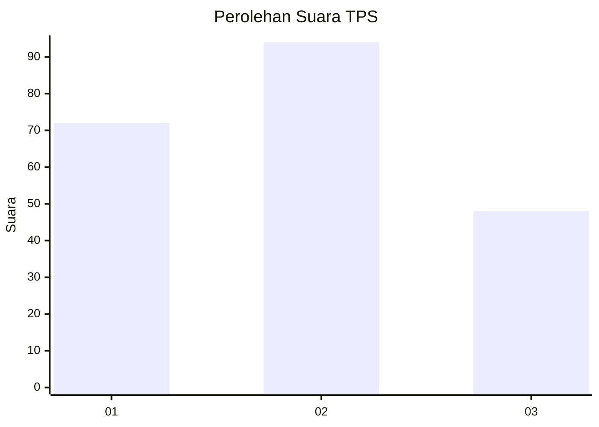
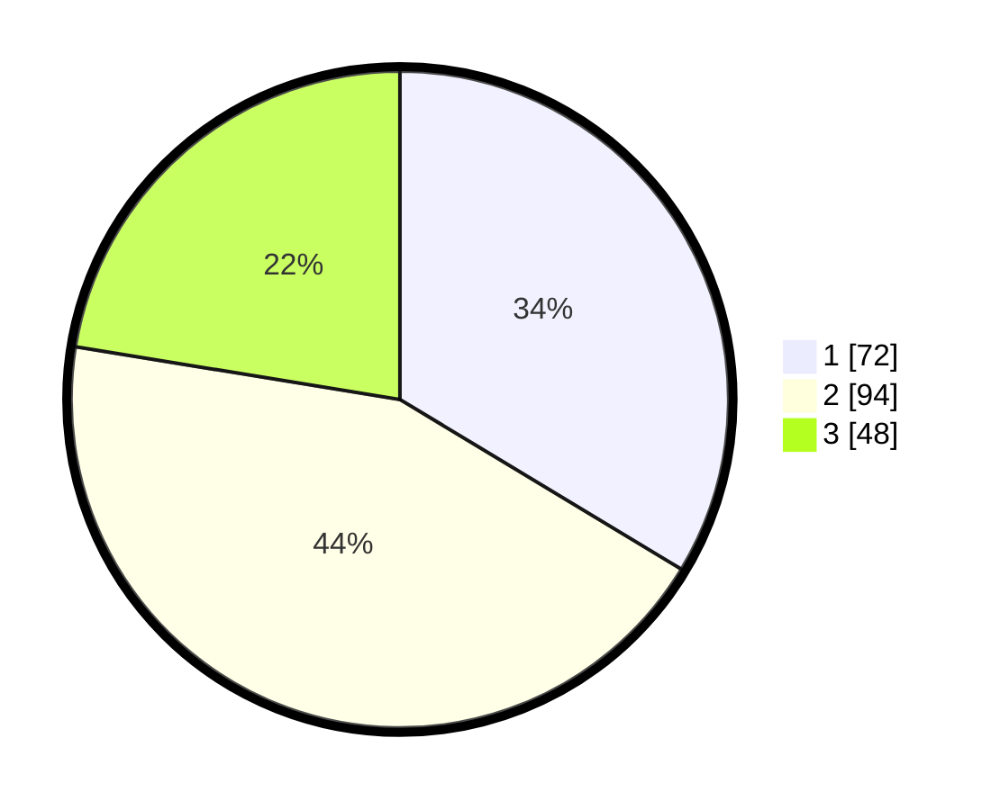

# Hasil

## Grafik

## Tabel

| No. | Nama Paslon    | Suara | Suara (raw) | Persentase |
|:--- |:-------------- | -----:| -----------:| ----------:|
| 1   | ANIES MUHAIMIN | 72    | [72][p-1]   | 33,64      |
| 2   | PRABOWO GIBRAN | 94    | [94][p-2]   | 43,93      |
| 3   | GANJAR MAHFUD  | 48    | [48][p-3]   | 22,43      |

[p-1]: https://github.com/gigit-pemilu/pemilu-2024/blob/main/pilpres/hitung-suara/sub/33-jawa-tengah/sub/07-wonosobo/sub/13-kejajar/sub/1008-kejajar/sub/005-tps/sub/paslon-1.txt
[p-2]: https://github.com/gigit-pemilu/pemilu-2024/blob/main/pilpres/hitung-suara/sub/33-jawa-tengah/sub/07-wonosobo/sub/13-kejajar/sub/1008-kejajar/sub/005-tps/sub/paslon-2.txt
[p-3]: https://github.com/gigit-pemilu/pemilu-2024/blob/main/pilpres/hitung-suara/sub/33-jawa-tengah/sub/07-wonosobo/sub/13-kejajar/sub/1008-kejajar/sub/005-tps/sub/paslon-3.txt

## Foto C Plano

https://sirekap-obj-formc.kpu.go.id/c793/pemilu/ppwp/33/07/13/10/08/3307131008005-20240215-000726--715420ba-daea-4f1b-bb6f-cb80032fbd46.jpg

https://sirekap-obj-formc.kpu.go.id/c793/pemilu/ppwp/33/07/13/10/08/3307131008005-20240215-000745--923b6bc2-fbaa-4be4-89c3-37e70eeaa776.jpg

https://sirekap-obj-formc.kpu.go.id/c793/pemilu/ppwp/33/07/13/10/08/3307131008005-20240215-000833--44cc60f5-2a0b-4cae-963b-78d648ce7172.jpg

## Metadata

| Key        | Value               |
| ---------- | ------------------- |
| Time Stamp | 2024-02-15 17:30:25 |

