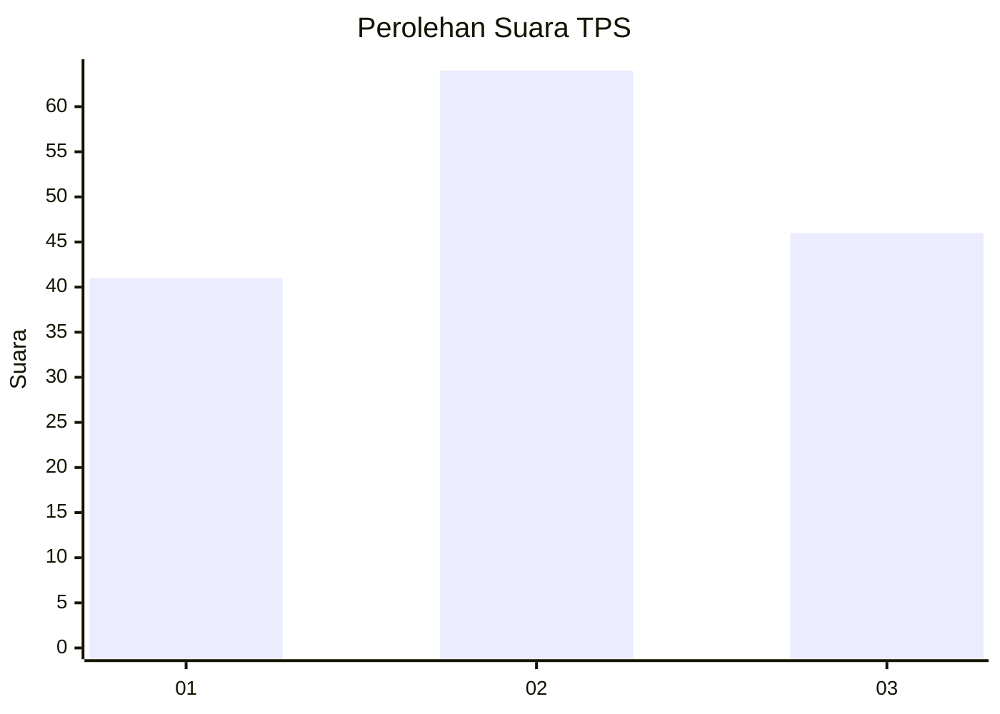
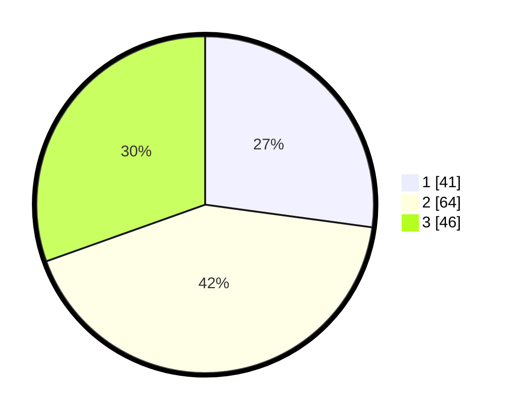

# Hasil

## Grafik

## Tabel

| No. | Nama Paslon    | Suara | Suara (raw) | Persentase |
|:--- |:-------------- | -----:| -----------:| ----------:|
| 1   | ANIES MUHAIMIN | 41    | [41][p-1]   | 27,15      |
| 2   | PRABOWO GIBRAN | 64    | [64][p-2]   | 42,38      |
| 3   | GANJAR MAHFUD  | 46    | [46][p-3]   | 30,46      |

[p-1]: https://github.com/gigit-pemilu/pemilu-2024/blob/main/pilpres/hitung-suara/sub/33-jawa-tengah/sub/07-wonosobo/sub/13-kejajar/sub/2002-sikunang/sub/005-tps/sub/paslon-1.txt
[p-2]: https://github.com/gigit-pemilu/pemilu-2024/blob/main/pilpres/hitung-suara/sub/33-jawa-tengah/sub/07-wonosobo/sub/13-kejajar/sub/2002-sikunang/sub/005-tps/sub/paslon-2.txt
[p-3]: https://github.com/gigit-pemilu/pemilu-2024/blob/main/pilpres/hitung-suara/sub/33-jawa-tengah/sub/07-wonosobo/sub/13-kejajar/sub/2002-sikunang/sub/005-tps/sub/paslon-3.txt

## Foto C Plano

https://sirekap-obj-formc.kpu.go.id/dc6e/pemilu/ppwp/33/07/13/20/02/3307132002005-20240215-095726--f4dc95c1-451f-4b7a-9126-b048eb1b1bbf.jpg

https://sirekap-obj-formc.kpu.go.id/dc6e/pemilu/ppwp/33/07/13/20/02/3307132002005-20240215-095902--50602d07-64d2-42c0-b915-fb8ef623f876.jpg

https://sirekap-obj-formc.kpu.go.id/dc6e/pemilu/ppwp/33/07/13/20/02/3307132002005-20240215-100117--88101b1a-2408-4d3f-a048-f5c1fdc9c0aa.jpg

## Metadata

| Key        | Value               |
| ---------- | ------------------- |
| Time Stamp | 2024-02-17 14:45:18 |

