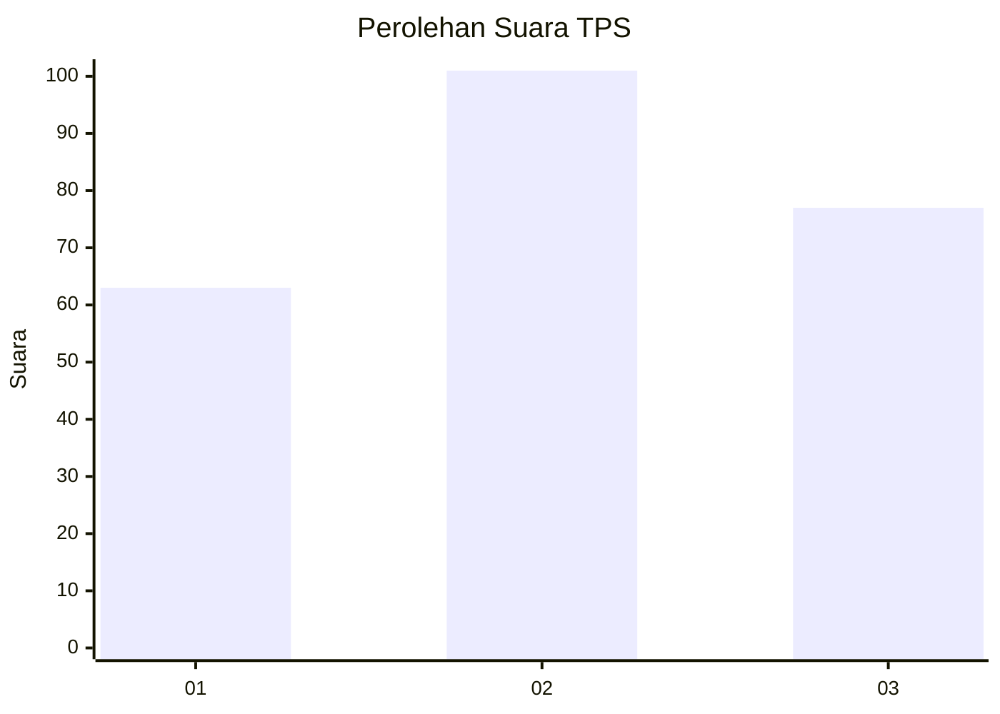
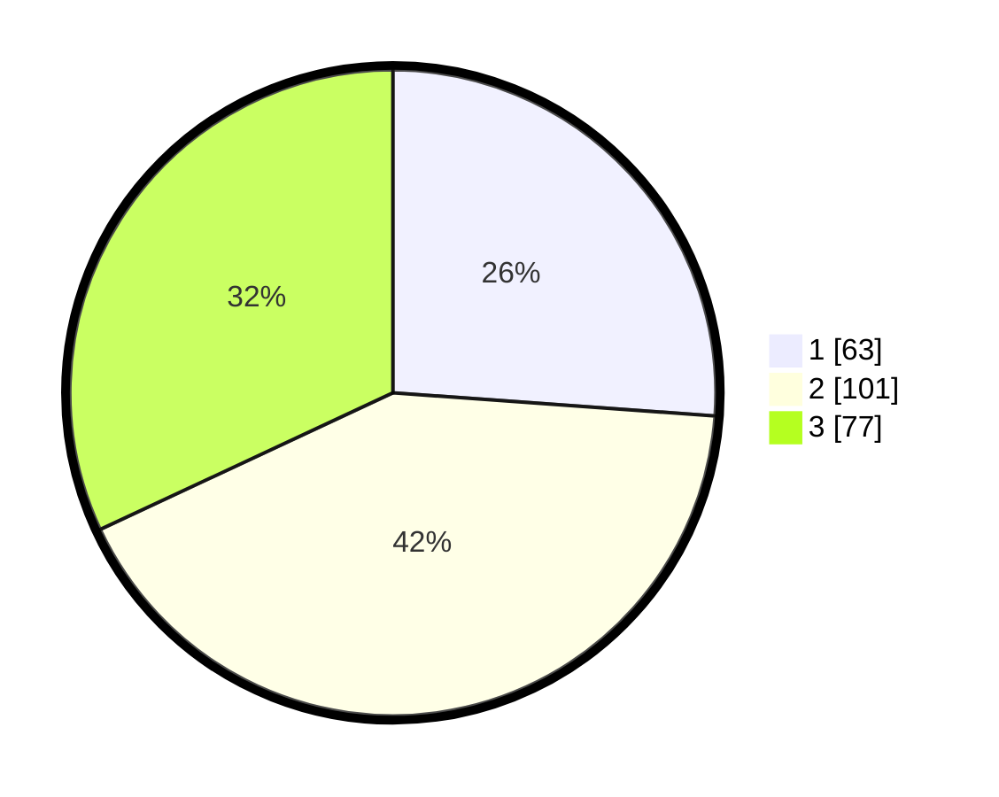

# Hasil

## Grafik

## Tabel

| No. | Nama Paslon    | Suara | Suara (raw) | Persentase |
|:--- |:-------------- | -----:| -----------:| ----------:|
| 1   | ANIES MUHAIMIN | 63    | [63][p-1]   | 26,14      |
| 2   | PRABOWO GIBRAN | 101   | [101][p-2]  | 41,91      |
| 3   | GANJAR MAHFUD  | 77    | [77][p-3]   | 31,95      |

[p-1]: https://github.com/gigit-pemilu/pemilu-2024-33-jawa-tengah/blob/main/pilpres/hitung-suara/sub/33-jawa-tengah/sub/07-wonosobo/sub/13-kejajar/sub/2009-serang/sub/005-tps/sub/paslon-1.txt
[p-2]: https://github.com/gigit-pemilu/pemilu-2024-33-jawa-tengah/blob/main/pilpres/hitung-suara/sub/33-jawa-tengah/sub/07-wonosobo/sub/13-kejajar/sub/2009-serang/sub/005-tps/sub/paslon-2.txt
[p-3]: https://github.com/gigit-pemilu/pemilu-2024-33-jawa-tengah/blob/main/pilpres/hitung-suara/sub/33-jawa-tengah/sub/07-wonosobo/sub/13-kejajar/sub/2009-serang/sub/005-tps/sub/paslon-3.txt

## Foto C Plano

https://sirekap-obj-formc.kpu.go.id/55b6/pemilu/ppwp/33/07/13/20/09/3307132009005-20240214-225450--4271afca-7f68-4714-b2ee-9ccf020183e6.jpg

https://sirekap-obj-formc.kpu.go.id/55b6/pemilu/ppwp/33/07/13/20/09/3307132009005-20240214-230813--d06cbf55-c0ea-4bb4-a160-8adcad7b5e30.jpg

https://sirekap-obj-formc.kpu.go.id/55b6/pemilu/ppwp/33/07/13/20/09/3307132009005-20240214-231145--854284b2-db70-4994-bbfa-970aab6f7a51.jpg

## Metadata

| Key        | Value               |
| ---------- | ------------------- |
| Time Stamp | 2024-02-15 15:00:29 |

