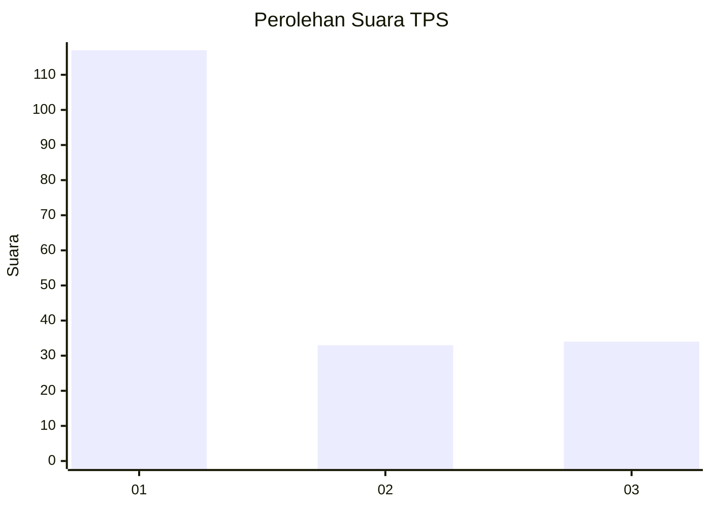
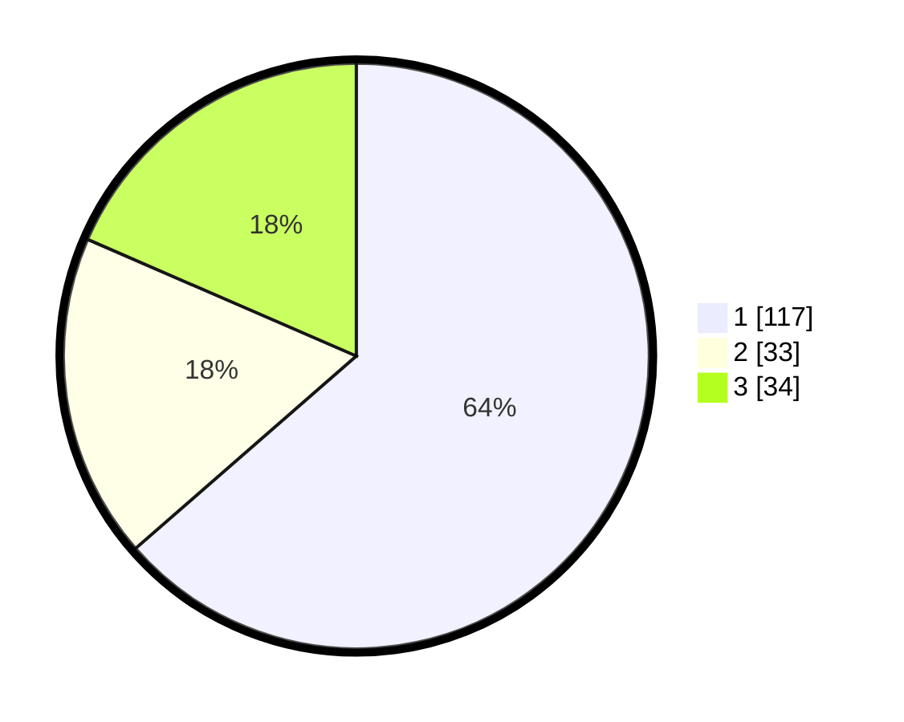

# Hasil

## Grafik

## Tabel

| No. | Nama Paslon    | Suara | Suara (raw) | Persentase |
|:--- |:-------------- | -----:| -----------:| ----------:|
| 1   | ANIES MUHAIMIN | 117   | [117][p-1]  | 63,59      |
| 2   | PRABOWO GIBRAN | 33    | [33][p-2]   | 17,93      |
| 3   | GANJAR MAHFUD  | 34    | [34][p-3]   | 18,48      |

[p-1]: https://github.com/gigit-pemilu/pemilu-2024/blob/main/pilpres/hitung-suara/sub/33-jawa-tengah/sub/07-wonosobo/sub/13-kejajar/sub/2010-tieng/sub/004-tps/sub/paslon-1.txt
[p-2]: https://github.com/gigit-pemilu/pemilu-2024/blob/main/pilpres/hitung-suara/sub/33-jawa-tengah/sub/07-wonosobo/sub/13-kejajar/sub/2010-tieng/sub/004-tps/sub/paslon-2.txt
[p-3]: https://github.com/gigit-pemilu/pemilu-2024/blob/main/pilpres/hitung-suara/sub/33-jawa-tengah/sub/07-wonosobo/sub/13-kejajar/sub/2010-tieng/sub/004-tps/sub/paslon-3.txt

## Foto C Plano

https://sirekap-obj-formc.kpu.go.id/3674/pemilu/ppwp/33/07/13/20/10/3307132010004-20240214-214030--03919c2a-0ac0-45ea-8188-70227402b4ff.jpg

https://sirekap-obj-formc.kpu.go.id/3674/pemilu/ppwp/33/07/13/20/10/3307132010004-20240214-214339--58023aa6-88c8-4372-b581-5a4ef0b59266.jpg

https://sirekap-obj-formc.kpu.go.id/3674/pemilu/ppwp/33/07/13/20/10/3307132010004-20240214-214423--d816b364-96ed-4c22-877a-3721e383dfaa.jpg

## Metadata

| Key        | Value               |
| ---------- | ------------------- |
| Time Stamp | 2024-02-15 12:00:28 |

