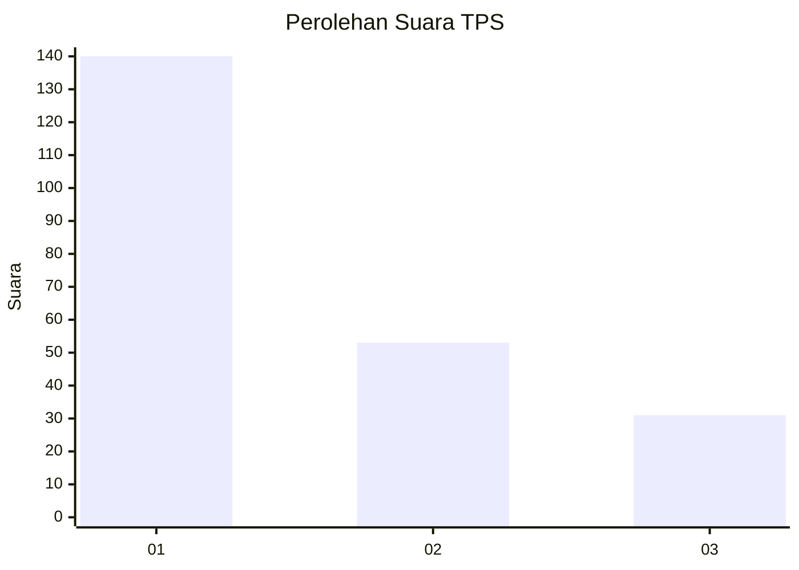
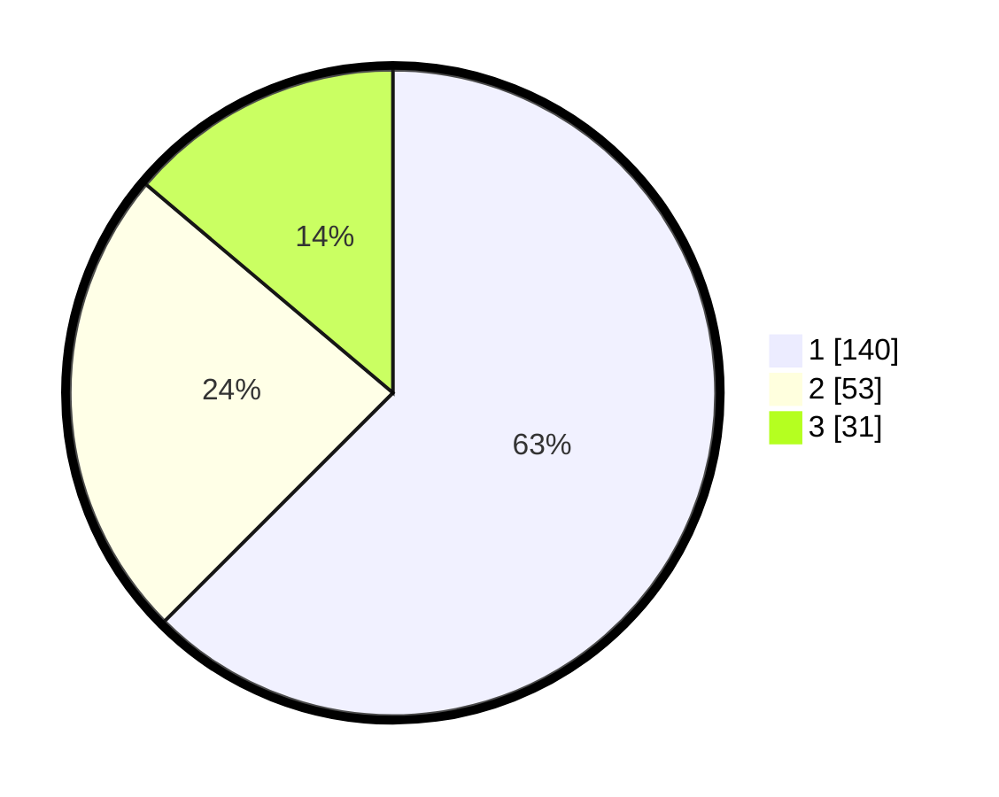

# Hasil

## Grafik

## Tabel

| No. | Nama Paslon    | Suara | Suara (raw) | Persentase |
|:--- |:-------------- | -----:| -----------:| ----------:|
| 1   | ANIES MUHAIMIN | 140   | [140][p-1]  | 62,50      |
| 2   | PRABOWO GIBRAN | 53    | [53][p-2]   | 23,66      |
| 3   | GANJAR MAHFUD  | 31    | [31][p-3]   | 13,84      |

[p-1]: https://github.com/gigit-pemilu/pemilu-2024-33-jawa-tengah/blob/main/pilpres/hitung-suara/sub/33-jawa-tengah/sub/07-wonosobo/sub/13-kejajar/sub/2010-tieng/sub/006-tps/sub/paslon-1.txt
[p-2]: https://github.com/gigit-pemilu/pemilu-2024-33-jawa-tengah/blob/main/pilpres/hitung-suara/sub/33-jawa-tengah/sub/07-wonosobo/sub/13-kejajar/sub/2010-tieng/sub/006-tps/sub/paslon-2.txt
[p-3]: https://github.com/gigit-pemilu/pemilu-2024-33-jawa-tengah/blob/main/pilpres/hitung-suara/sub/33-jawa-tengah/sub/07-wonosobo/sub/13-kejajar/sub/2010-tieng/sub/006-tps/sub/paslon-3.txt

## Foto C Plano

https://sirekap-obj-formc.kpu.go.id/ae0b/pemilu/ppwp/33/07/13/20/10/3307132010006-20240215-003520--be3c72c6-8643-4aa7-ba91-5950278fe1b3.jpg

https://sirekap-obj-formc.kpu.go.id/ae0b/pemilu/ppwp/33/07/13/20/10/3307132010006-20240215-003814--6dcdbe33-9dd7-42d0-b3b9-10adfba26913.jpg

https://sirekap-obj-formc.kpu.go.id/ae0b/pemilu/ppwp/33/07/13/20/10/3307132010006-20240215-003948--5f9b4aff-1a46-428d-a2c0-5e92bdf3963a.jpg

## Metadata

| Key        | Value               |
| ---------- | ------------------- |
| Time Stamp | 2024-02-15 06:00:23 |

