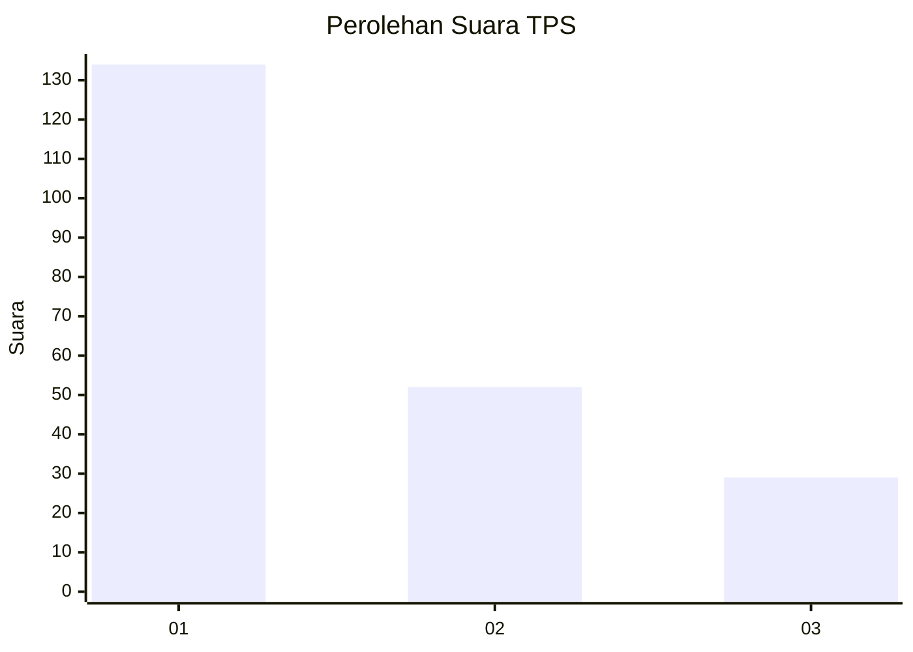
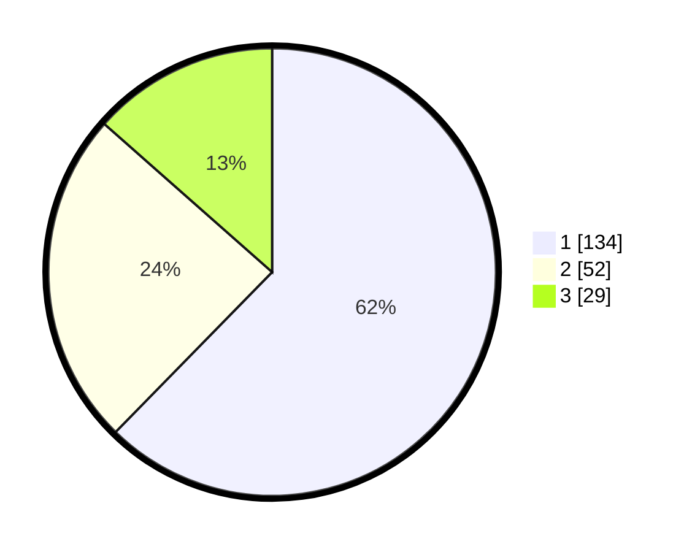

# Hasil

## Grafik

## Tabel

| No. | Nama Paslon    | Suara | Suara (raw) | Persentase |
|:--- |:-------------- | -----:| -----------:| ----------:|
| 1   | ANIES MUHAIMIN | 134   | [134][p-1]  | 62,33      |
| 2   | PRABOWO GIBRAN | 52    | [52][p-2]   | 24,19      |
| 3   | GANJAR MAHFUD  | 29    | [29][p-3]   | 13,49      |

[p-1]: https://github.com/gigit-pemilu/pemilu-2024-33-jawa-tengah/blob/main/pilpres/hitung-suara/sub/33-jawa-tengah/sub/07-wonosobo/sub/13-kejajar/sub/2010-tieng/sub/007-tps/sub/paslon-1.txt
[p-2]: https://github.com/gigit-pemilu/pemilu-2024-33-jawa-tengah/blob/main/pilpres/hitung-suara/sub/33-jawa-tengah/sub/07-wonosobo/sub/13-kejajar/sub/2010-tieng/sub/007-tps/sub/paslon-2.txt
[p-3]: https://github.com/gigit-pemilu/pemilu-2024-33-jawa-tengah/blob/main/pilpres/hitung-suara/sub/33-jawa-tengah/sub/07-wonosobo/sub/13-kejajar/sub/2010-tieng/sub/007-tps/sub/paslon-3.txt

## Foto C Plano

https://sirekap-obj-formc.kpu.go.id/2038/pemilu/ppwp/33/07/13/20/10/3307132010007-20240214-223220--6a99f659-4126-4e16-a596-82f284be477a.jpg

https://sirekap-obj-formc.kpu.go.id/2038/pemilu/ppwp/33/07/13/20/10/3307132010007-20240214-223239--8a87adfc-bc59-4d8f-9fe7-093cd539af34.jpg

https://sirekap-obj-formc.kpu.go.id/2038/pemilu/ppwp/33/07/13/20/10/3307132010007-20240214-223252--00f5187b-a298-47fa-9dc0-51b32b56408e.jpg

## Metadata

| Key        | Value               |
| ---------- | ------------------- |
| Time Stamp | 2024-02-15 12:00:28 |

