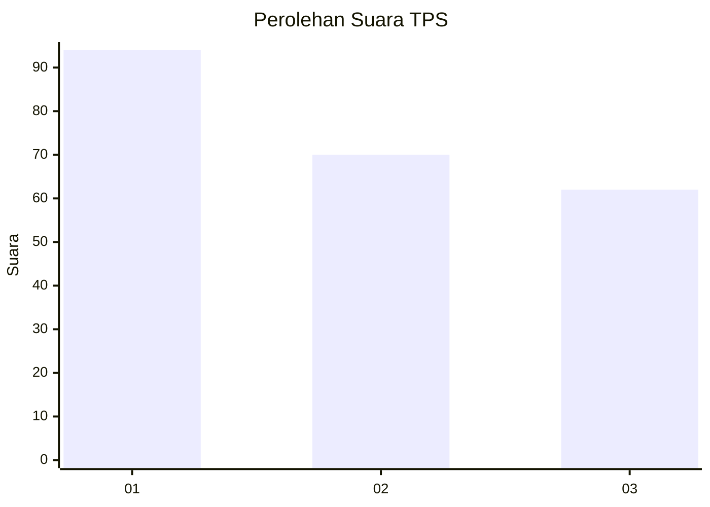
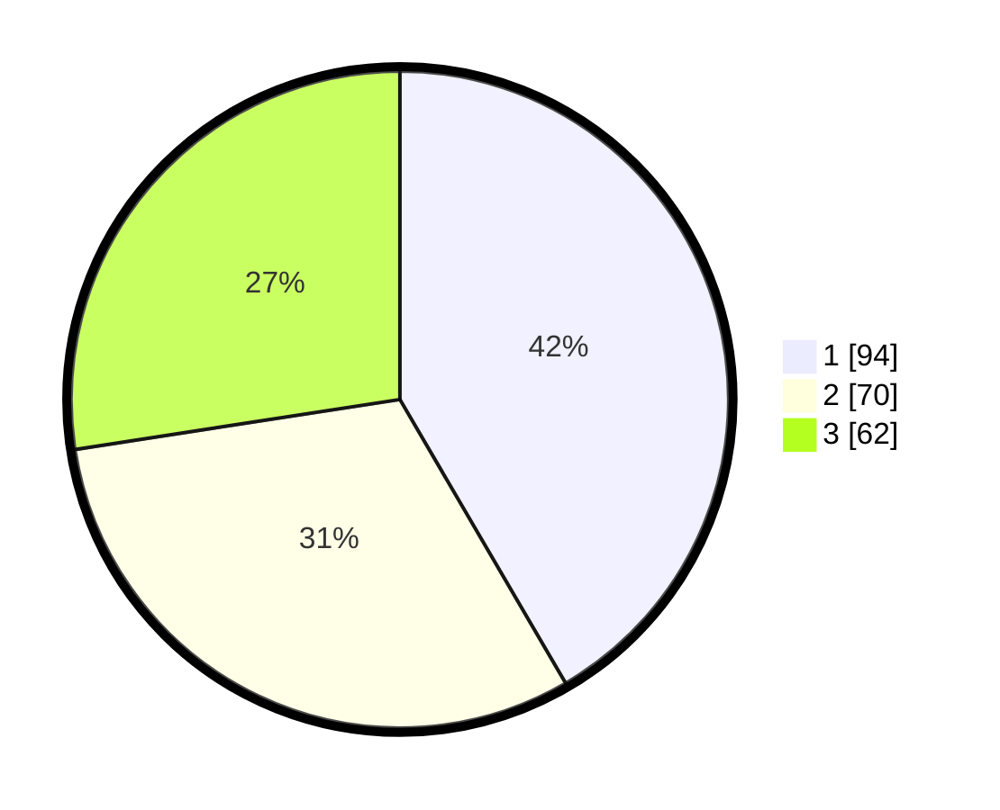

# Hasil

## Grafik

## Tabel

| No. | Nama Paslon    | Suara | Suara (raw) | Persentase |
|:--- |:-------------- | -----:| -----------:| ----------:|
| 1   | ANIES MUHAIMIN | 94    | [94][p-1]   | 41,59      |
| 2   | PRABOWO GIBRAN | 70    | [70][p-2]   | 30,97      |
| 3   | GANJAR MAHFUD  | 62    | [62][p-3]   | 27,43      |

[p-1]: https://github.com/gigit-pemilu/pemilu-2024-33-jawa-tengah/blob/main/pilpres/hitung-suara/sub/33-jawa-tengah/sub/07-wonosobo/sub/13-kejajar/sub/2011-parikesit/sub/001-tps/sub/paslon-1.txt
[p-2]: https://github.com/gigit-pemilu/pemilu-2024-33-jawa-tengah/blob/main/pilpres/hitung-suara/sub/33-jawa-tengah/sub/07-wonosobo/sub/13-kejajar/sub/2011-parikesit/sub/001-tps/sub/paslon-2.txt
[p-3]: https://github.com/gigit-pemilu/pemilu-2024-33-jawa-tengah/blob/main/pilpres/hitung-suara/sub/33-jawa-tengah/sub/07-wonosobo/sub/13-kejajar/sub/2011-parikesit/sub/001-tps/sub/paslon-3.txt

## Foto C Plano

https://sirekap-obj-formc.kpu.go.id/c062/pemilu/ppwp/33/07/13/20/11/3307132011001-20240214-212853--b285020d-9786-41b3-a8fb-ccfb1e44c762.jpg

https://sirekap-obj-formc.kpu.go.id/c062/pemilu/ppwp/33/07/13/20/11/3307132011001-20240214-225843--42ebf37c-e560-4ee9-bc27-482e48fcccac.jpg

https://sirekap-obj-formc.kpu.go.id/c062/pemilu/ppwp/33/07/13/20/11/3307132011001-20240214-225928--fa800271-82d6-418c-a11b-71eb9b5a6193.jpg

## Metadata

| Key        | Value               |
| ---------- | ------------------- |
| Time Stamp | 2024-02-17 14:56:33 |

