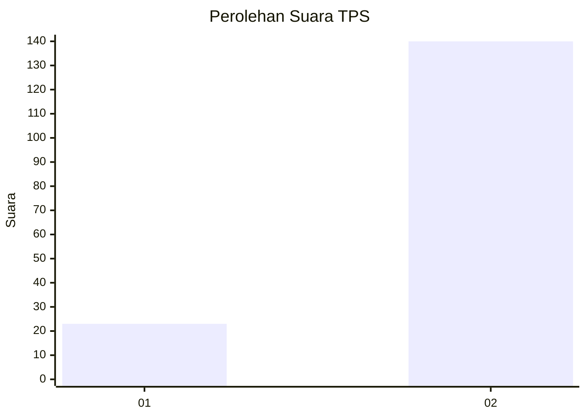
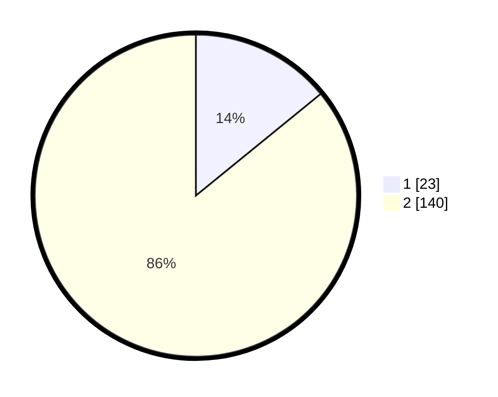

# Hasil

## Grafik

## Tabel

| No. | Nama Paslon    | Suara | Suara (raw) | Persentase |
|:--- |:-------------- | -----:| -----------:| ----------:|
| 1   | ANIES MUHAIMIN | 23    | [23][p-1]   | 14,11      |
| 2   | PRABOWO GIBRAN | 140   | [140][p-2]  | 85,89      |

[p-1]: https://github.com/gigit-pemilu/pemilu-2024/blob/main/pilpres/hitung-suara/sub/33-jawa-tengah/sub/07-wonosobo/sub/13-kejajar/sub/2014-patakbanteng/sub/004-tps/sub/paslon-1.txt
[p-2]: https://github.com/gigit-pemilu/pemilu-2024/blob/main/pilpres/hitung-suara/sub/33-jawa-tengah/sub/07-wonosobo/sub/13-kejajar/sub/2014-patakbanteng/sub/004-tps/sub/paslon-2.txt
[p-3]: https://github.com/gigit-pemilu/pemilu-2024/blob/main/pilpres/hitung-suara/sub/33-jawa-tengah/sub/07-wonosobo/sub/13-kejajar/sub/2014-patakbanteng/sub/004-tps/sub/paslon-3.txt

## Foto C Plano

https://sirekap-obj-formc.kpu.go.id/5431/pemilu/ppwp/33/07/13/20/14/3307132014004-20240215-013314--0f84ae03-e617-4982-b879-1c5c4cb2b2c2.jpg

https://sirekap-obj-formc.kpu.go.id/5431/pemilu/ppwp/33/07/13/20/14/3307132014004-20240215-013114--7460b31e-925a-4177-bba7-ea054300fef0.jpg

https://sirekap-obj-formc.kpu.go.id/5431/pemilu/ppwp/33/07/13/20/14/3307132014004-20240215-012941--8a096f06-3597-41e3-9eea-4bae956be80c.jpg

## Metadata

| Key        | Value               |
| ---------- | ------------------- |
| Time Stamp | 2024-02-15 12:00:28 |

