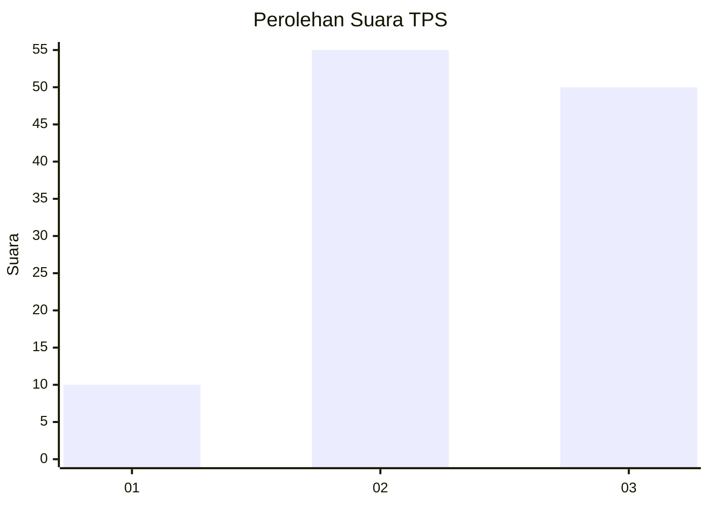
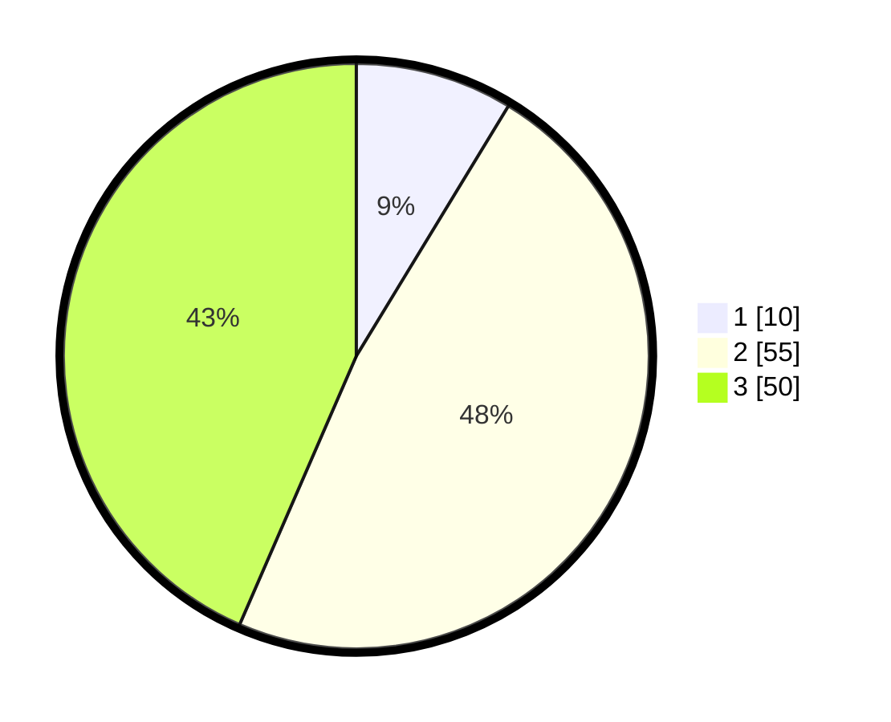

# Hasil

## Grafik

## Tabel

| No. | Nama Paslon    | Suara | Suara (raw) | Persentase |
|:--- |:-------------- | -----:| -----------:| ----------:|
| 1   | ANIES MUHAIMIN | 10    | [10][p-1]   | 8,70       |
| 2   | PRABOWO GIBRAN | 55    | [55][p-2]   | 47,83      |
| 3   | GANJAR MAHFUD  | 50    | [50][p-3]   | 43,48      |

[p-1]: https://github.com/gigit-pemilu/pemilu-2024/blob/main/pilpres/hitung-suara/sub/33-jawa-tengah/sub/07-wonosobo/sub/14-sukoharjo/sub/2003-sukoharjo/sub/014-tps/sub/paslon-1.txt
[p-2]: https://github.com/gigit-pemilu/pemilu-2024/blob/main/pilpres/hitung-suara/sub/33-jawa-tengah/sub/07-wonosobo/sub/14-sukoharjo/sub/2003-sukoharjo/sub/014-tps/sub/paslon-2.txt
[p-3]: https://github.com/gigit-pemilu/pemilu-2024/blob/main/pilpres/hitung-suara/sub/33-jawa-tengah/sub/07-wonosobo/sub/14-sukoharjo/sub/2003-sukoharjo/sub/014-tps/sub/paslon-3.txt

## Foto C Plano

https://sirekap-obj-formc.kpu.go.id/a7f8/pemilu/ppwp/33/07/14/20/03/3307142003014-20240214-204743--df9d0740-ec4b-4dcf-9092-026e1e238d90.jpg

https://sirekap-obj-formc.kpu.go.id/a7f8/pemilu/ppwp/33/07/14/20/03/3307142003014-20240214-204852--a9a0e9ad-3187-466f-9140-e435daa795db.jpg

https://sirekap-obj-formc.kpu.go.id/a7f8/pemilu/ppwp/33/07/14/20/03/3307142003014-20240214-205011--b7bdc046-cb61-42a8-a5cb-e46245611b97.jpg

## Metadata

| Key        | Value               |
| ---------- | ------------------- |
| Time Stamp | 2024-02-15 23:29:50 |

