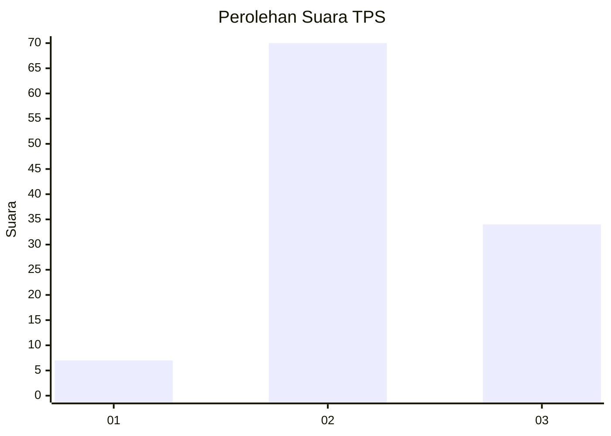
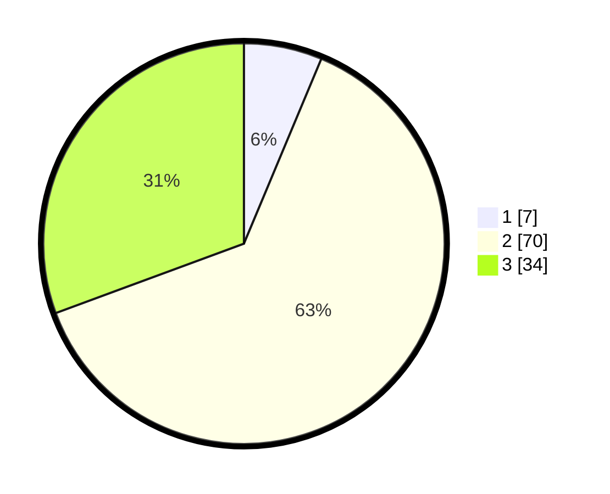

# Hasil

## Grafik

## Tabel

| No. | Nama Paslon    | Suara | Suara (raw) | Persentase |
|:--- |:-------------- | -----:| -----------:| ----------:|
| 1   | ANIES MUHAIMIN | 7     | [7][p-1]    | 6,31       |
| 2   | PRABOWO GIBRAN | 70    | [70][p-2]   | 63,06      |
| 3   | GANJAR MAHFUD  | 34    | [34][p-3]   | 30,63      |

[p-1]: https://github.com/gigit-pemilu/pemilu-2024-33-jawa-tengah/blob/main/pilpres/hitung-suara/sub/33-jawa-tengah/sub/07-wonosobo/sub/15-kalibawang/sub/2001-pengarengan/sub/003-tps/sub/paslon-1.txt
[p-2]: https://github.com/gigit-pemilu/pemilu-2024-33-jawa-tengah/blob/main/pilpres/hitung-suara/sub/33-jawa-tengah/sub/07-wonosobo/sub/15-kalibawang/sub/2001-pengarengan/sub/003-tps/sub/paslon-2.txt
[p-3]: https://github.com/gigit-pemilu/pemilu-2024-33-jawa-tengah/blob/main/pilpres/hitung-suara/sub/33-jawa-tengah/sub/07-wonosobo/sub/15-kalibawang/sub/2001-pengarengan/sub/003-tps/sub/paslon-3.txt

## Foto C Plano

https://sirekap-obj-formc.kpu.go.id/797f/pemilu/ppwp/33/07/15/20/01/3307152001003-20240215-045510--06546865-ce72-454b-9459-450174345f25.jpg

https://sirekap-obj-formc.kpu.go.id/797f/pemilu/ppwp/33/07/15/20/01/3307152001003-20240215-022544--61f767c2-8c6f-4c2a-80d1-b90f67d96aad.jpg

https://sirekap-obj-formc.kpu.go.id/797f/pemilu/ppwp/33/07/15/20/01/3307152001003-20240215-022401--29b898ce-0e8e-46d1-8162-aef37132db7f.jpg

## Metadata

| Key        | Value               |
| ---------- | ------------------- |
| Time Stamp | 2024-02-15 15:00:29 |

