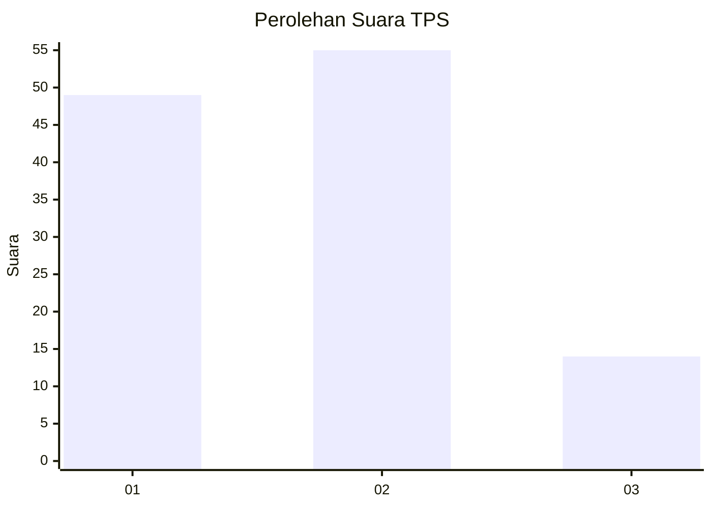
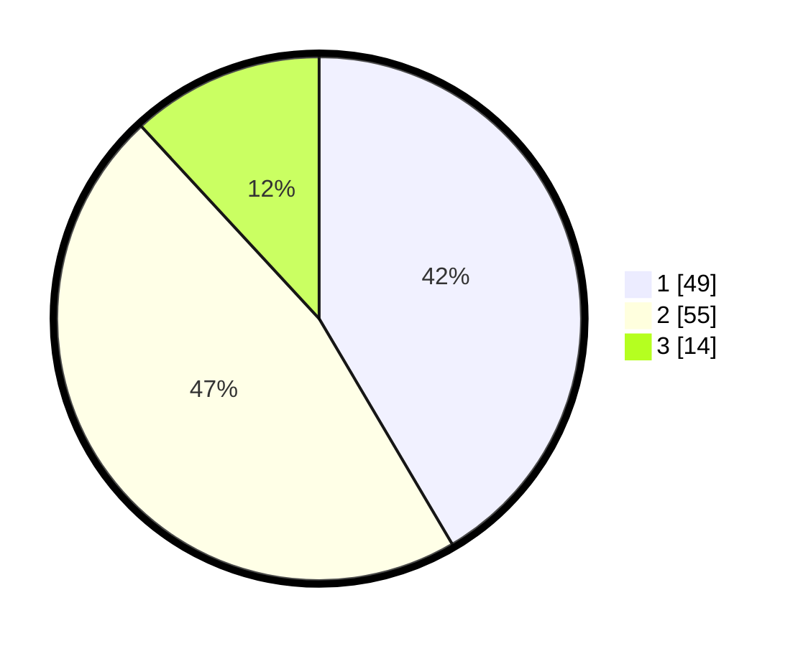

# Hasil

## Grafik

## Tabel

| No. | Nama Paslon    | Suara | Suara (raw) | Persentase |
|:--- |:-------------- | -----:| -----------:| ----------:|
| 1   | ANIES MUHAIMIN | 49    | [49][p-1]   | 41,53      |
| 2   | PRABOWO GIBRAN | 55    | [55][p-2]   | 46,61      |
| 3   | GANJAR MAHFUD  | 14    | [14][p-3]   | 11,86      |

[p-1]: https://github.com/gigit-pemilu/pemilu-2024-33-jawa-tengah/blob/main/pilpres/hitung-suara/sub/33-jawa-tengah/sub/07-wonosobo/sub/15-kalibawang/sub/2001-pengarengan/sub/011-tps/sub/paslon-1.txt
[p-2]: https://github.com/gigit-pemilu/pemilu-2024-33-jawa-tengah/blob/main/pilpres/hitung-suara/sub/33-jawa-tengah/sub/07-wonosobo/sub/15-kalibawang/sub/2001-pengarengan/sub/011-tps/sub/paslon-2.txt
[p-3]: https://github.com/gigit-pemilu/pemilu-2024-33-jawa-tengah/blob/main/pilpres/hitung-suara/sub/33-jawa-tengah/sub/07-wonosobo/sub/15-kalibawang/sub/2001-pengarengan/sub/011-tps/sub/paslon-3.txt

## Foto C Plano

https://sirekap-obj-formc.kpu.go.id/d7f2/pemilu/ppwp/33/07/15/20/01/3307152001011-20240214-231621--90ad7cb6-bd51-4723-bf96-49b2543d3995.jpg

https://sirekap-obj-formc.kpu.go.id/d7f2/pemilu/ppwp/33/07/15/20/01/3307152001011-20240214-232001--3976b9cf-5025-47a4-89fa-e5859954ab82.jpg

https://sirekap-obj-formc.kpu.go.id/d7f2/pemilu/ppwp/33/07/15/20/01/3307152001011-20240214-232508--e0540bed-27ca-44de-b21e-ef427aa645de.jpg

## Metadata

| Key        | Value               |
| ---------- | ------------------- |
| Time Stamp | 2024-02-24 22:31:28 |

