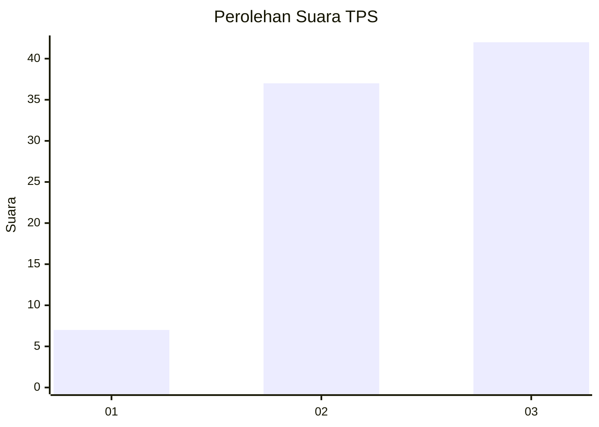
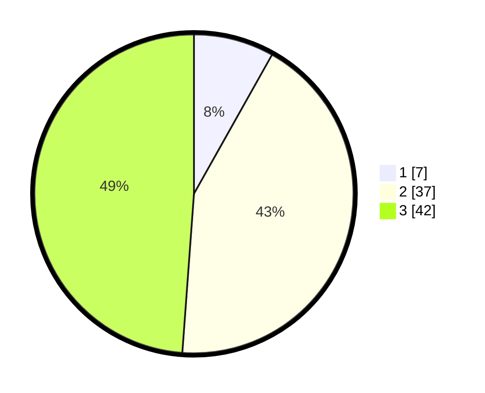

# Hasil

## Grafik

## Tabel

| No. | Nama Paslon    | Suara | Suara (raw) | Persentase |
|:--- |:-------------- | -----:| -----------:| ----------:|
| 1   | ANIES MUHAIMIN | 7     | [7][p-1]    | 8,14       |
| 2   | PRABOWO GIBRAN | 37    | [37][p-2]   | 43,02      |
| 3   | GANJAR MAHFUD  | 42    | [42][p-3]   | 48,84      |

[p-1]: https://github.com/gigit-pemilu/pemilu-2024/blob/main/pilpres/hitung-suara/sub/33-jawa-tengah/sub/07-wonosobo/sub/15-kalibawang/sub/2002-kalikarung/sub/010-tps/sub/paslon-1.txt
[p-2]: https://github.com/gigit-pemilu/pemilu-2024/blob/main/pilpres/hitung-suara/sub/33-jawa-tengah/sub/07-wonosobo/sub/15-kalibawang/sub/2002-kalikarung/sub/010-tps/sub/paslon-2.txt
[p-3]: https://github.com/gigit-pemilu/pemilu-2024/blob/main/pilpres/hitung-suara/sub/33-jawa-tengah/sub/07-wonosobo/sub/15-kalibawang/sub/2002-kalikarung/sub/010-tps/sub/paslon-3.txt

## Foto C Plano

https://sirekap-obj-formc.kpu.go.id/57a9/pemilu/ppwp/33/07/15/20/02/3307152002010-20240214-224235--8f5e8e39-5293-47c8-8f3b-84b8cd90723e.jpg

https://sirekap-obj-formc.kpu.go.id/57a9/pemilu/ppwp/33/07/15/20/02/3307152002010-20240214-224950--70fddbe3-dcf2-4b92-91e1-60219eae3d1f.jpg

https://sirekap-obj-formc.kpu.go.id/57a9/pemilu/ppwp/33/07/15/20/02/3307152002010-20240214-224805--95ecf071-e2f3-4a6d-9efe-b03877771118.jpg

## Metadata

| Key        | Value               |
| ---------- | ------------------- |
| Time Stamp | 2024-02-15 12:00:28 |

