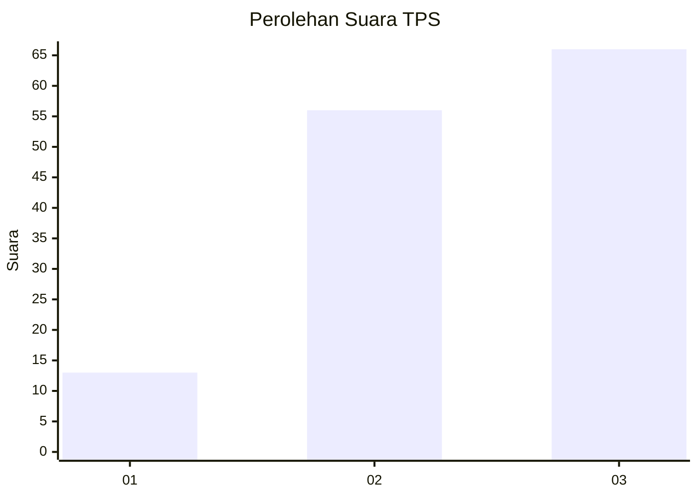
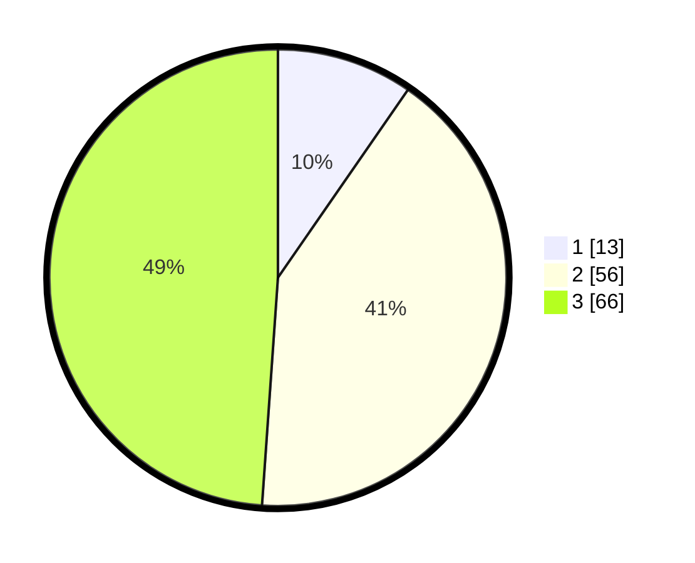

# Hasil

## Grafik

## Tabel

| No. | Nama Paslon    | Suara | Suara (raw) | Persentase |
|:--- |:-------------- | -----:| -----------:| ----------:|
| 1   | ANIES MUHAIMIN | 13    | [13][p-1]   | 9,63       |
| 2   | PRABOWO GIBRAN | 56    | [56][p-2]   | 41,48      |
| 3   | GANJAR MAHFUD  | 66    | [66][p-3]   | 48,89      |

[p-1]: https://github.com/gigit-pemilu/pemilu-2024-33-jawa-tengah/blob/main/pilpres/hitung-suara/sub/33-jawa-tengah/sub/07-wonosobo/sub/15-kalibawang/sub/2002-kalikarung/sub/012-tps/sub/paslon-1.txt
[p-2]: https://github.com/gigit-pemilu/pemilu-2024-33-jawa-tengah/blob/main/pilpres/hitung-suara/sub/33-jawa-tengah/sub/07-wonosobo/sub/15-kalibawang/sub/2002-kalikarung/sub/012-tps/sub/paslon-2.txt
[p-3]: https://github.com/gigit-pemilu/pemilu-2024-33-jawa-tengah/blob/main/pilpres/hitung-suara/sub/33-jawa-tengah/sub/07-wonosobo/sub/15-kalibawang/sub/2002-kalikarung/sub/012-tps/sub/paslon-3.txt

## Foto C Plano

https://sirekap-obj-formc.kpu.go.id/dcb0/pemilu/ppwp/33/07/15/20/02/3307152002012-20240215-003520--78ee143b-5eaa-45af-aeac-4f438adc5d19.jpg

https://sirekap-obj-formc.kpu.go.id/dcb0/pemilu/ppwp/33/07/15/20/02/3307152002012-20240214-141218--27f7503d-7f06-4efa-9a9c-e4ec9ca6678a.jpg

https://sirekap-obj-formc.kpu.go.id/dcb0/pemilu/ppwp/33/07/15/20/02/3307152002012-20240214-141315--133ec58c-1e91-44aa-8829-c8ce074aca00.jpg

## Metadata

| Key        | Value               |
| ---------- | ------------------- |
| Time Stamp | 2024-02-17 12:00:00 |

