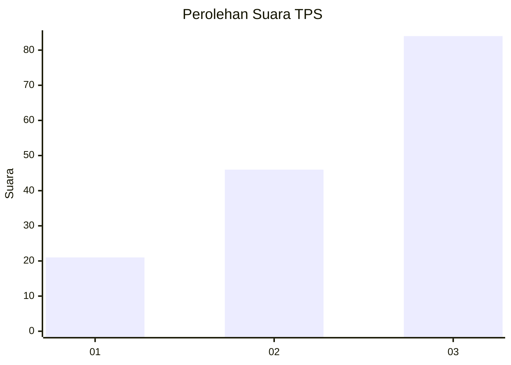
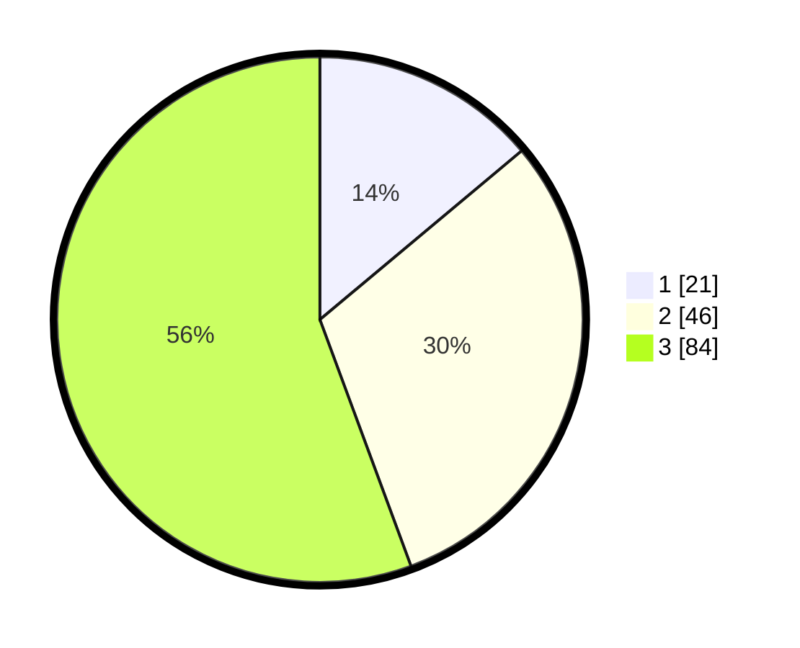

# Hasil

## Grafik

## Tabel

| No. | Nama Paslon    | Suara | Suara (raw) | Persentase |
|:--- |:-------------- | -----:| -----------:| ----------:|
| 1   | ANIES MUHAIMIN | 21    | [21][p-1]   | 13,91      |
| 2   | PRABOWO GIBRAN | 46    | [46][p-2]   | 30,46      |
| 3   | GANJAR MAHFUD  | 84    | [84][p-3]   | 55,63      |

[p-1]: https://github.com/gigit-pemilu/pemilu-2024-33-jawa-tengah/blob/main/pilpres/hitung-suara/sub/33-jawa-tengah/sub/07-wonosobo/sub/15-kalibawang/sub/2002-kalikarung/sub/020-tps/sub/paslon-1.txt
[p-2]: https://github.com/gigit-pemilu/pemilu-2024-33-jawa-tengah/blob/main/pilpres/hitung-suara/sub/33-jawa-tengah/sub/07-wonosobo/sub/15-kalibawang/sub/2002-kalikarung/sub/020-tps/sub/paslon-2.txt
[p-3]: https://github.com/gigit-pemilu/pemilu-2024-33-jawa-tengah/blob/main/pilpres/hitung-suara/sub/33-jawa-tengah/sub/07-wonosobo/sub/15-kalibawang/sub/2002-kalikarung/sub/020-tps/sub/paslon-3.txt

## Foto C Plano

https://sirekap-obj-formc.kpu.go.id/d760/pemilu/ppwp/33/07/15/20/02/3307152002020-20240214-141734--bb6f2459-a9c1-44c4-957a-76d52544bfe9.jpg

https://sirekap-obj-formc.kpu.go.id/d760/pemilu/ppwp/33/07/15/20/02/3307152002020-20240214-141847--810ccc50-e438-43c3-9684-76e466ccb935.jpg

https://sirekap-obj-formc.kpu.go.id/d760/pemilu/ppwp/33/07/15/20/02/3307152002020-20240214-141916--33857590-37c9-4993-8633-82784a96e385.jpg

## Metadata

| Key        | Value               |
| ---------- | ------------------- |
| Time Stamp | 2024-02-14 21:46:01 |

