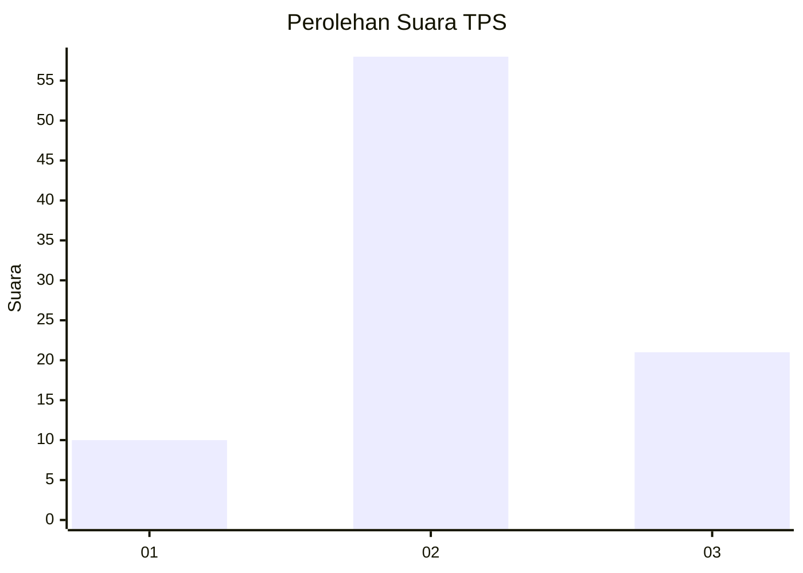
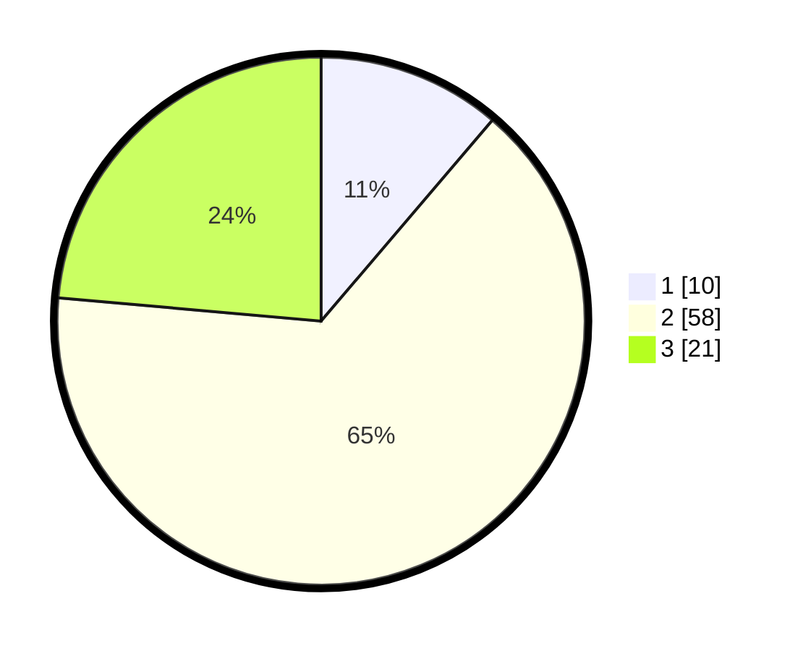

# Hasil

## Grafik

## Tabel

| No. | Nama Paslon    | Suara | Suara (raw) | Persentase |
|:--- |:-------------- | -----:| -----------:| ----------:|
| 1   | ANIES MUHAIMIN | 10    | [10][p-1]   | 11,24      |
| 2   | PRABOWO GIBRAN | 58    | [58][p-2]   | 65,17      |
| 3   | GANJAR MAHFUD  | 21    | [21][p-3]   | 23,60      |

[p-1]: https://github.com/gigit-pemilu/pemilu-2024-33-jawa-tengah/blob/main/pilpres/hitung-suara/sub/33-jawa-tengah/sub/07-wonosobo/sub/15-kalibawang/sub/2003-dempel/sub/015-tps/sub/paslon-1.txt
[p-2]: https://github.com/gigit-pemilu/pemilu-2024-33-jawa-tengah/blob/main/pilpres/hitung-suara/sub/33-jawa-tengah/sub/07-wonosobo/sub/15-kalibawang/sub/2003-dempel/sub/015-tps/sub/paslon-2.txt
[p-3]: https://github.com/gigit-pemilu/pemilu-2024-33-jawa-tengah/blob/main/pilpres/hitung-suara/sub/33-jawa-tengah/sub/07-wonosobo/sub/15-kalibawang/sub/2003-dempel/sub/015-tps/sub/paslon-3.txt

## Foto C Plano

https://sirekap-obj-formc.kpu.go.id/1a50/pemilu/ppwp/33/07/15/20/03/3307152003015-20240214-212445--d22126ec-8e7a-43be-a406-1f3dde5b4954.jpg

https://sirekap-obj-formc.kpu.go.id/1a50/pemilu/ppwp/33/07/15/20/03/3307152003015-20240214-212850--387ec9cd-db46-4a69-80b3-0ef261abacec.jpg

https://sirekap-obj-formc.kpu.go.id/1a50/pemilu/ppwp/33/07/15/20/03/3307152003015-20240214-213054--6cbb49cb-07f3-4db7-bde5-0e6a499f0787.jpg

## Metadata

| Key        | Value               |
| ---------- | ------------------- |
| Time Stamp | 2024-02-15 15:00:29 |

