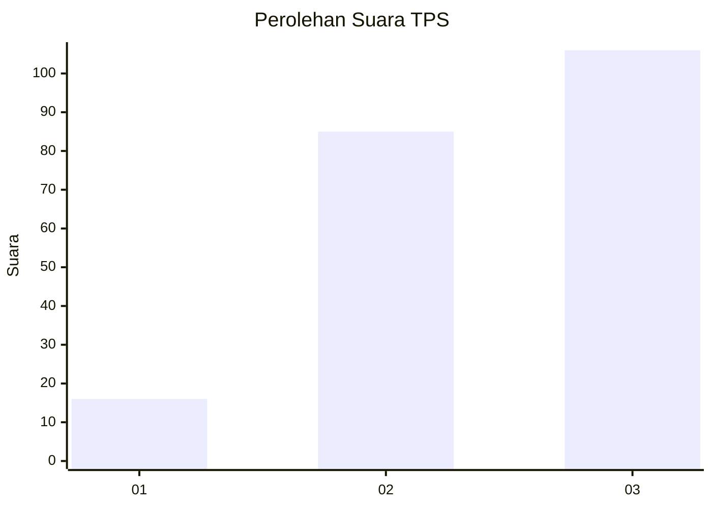
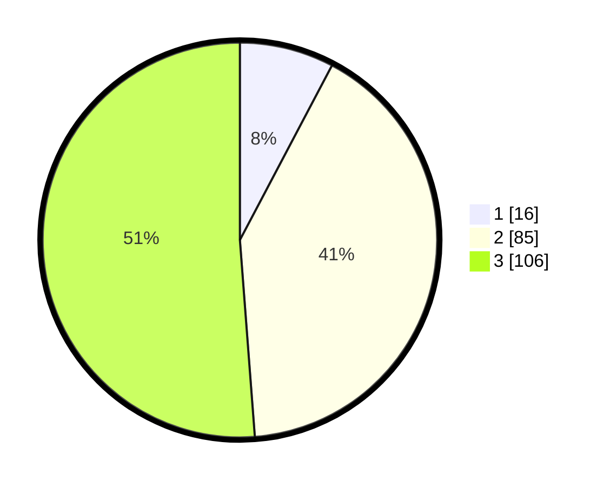

# Hasil

## Grafik

## Tabel

| No. | Nama Paslon    | Suara | Suara (raw) | Persentase |
|:--- |:-------------- | -----:| -----------:| ----------:|
| 1   | ANIES MUHAIMIN | 16    | [16][p-1]   | 7,73       |
| 2   | PRABOWO GIBRAN | 85    | [85][p-2]   | 41,06      |
| 3   | GANJAR MAHFUD  | 106   | [106][p-3]  | 51,21      |

[p-1]: https://github.com/gigit-pemilu/pemilu-2024/blob/main/pilpres/hitung-suara/sub/33-jawa-tengah/sub/07-wonosobo/sub/15-kalibawang/sub/2003-dempel/sub/017-tps/sub/paslon-1.txt
[p-2]: https://github.com/gigit-pemilu/pemilu-2024/blob/main/pilpres/hitung-suara/sub/33-jawa-tengah/sub/07-wonosobo/sub/15-kalibawang/sub/2003-dempel/sub/017-tps/sub/paslon-2.txt
[p-3]: https://github.com/gigit-pemilu/pemilu-2024/blob/main/pilpres/hitung-suara/sub/33-jawa-tengah/sub/07-wonosobo/sub/15-kalibawang/sub/2003-dempel/sub/017-tps/sub/paslon-3.txt

## Foto C Plano

https://sirekap-obj-formc.kpu.go.id/c3b7/pemilu/ppwp/33/07/15/20/03/3307152003017-20240214-141638--bb4ebfb9-76cc-432b-ad14-d7dff1e64e0a.jpg

https://sirekap-obj-formc.kpu.go.id/c3b7/pemilu/ppwp/33/07/15/20/03/3307152003017-20240214-141744--5de88c72-7ed7-40d7-a125-1d1258aadbe9.jpg

https://sirekap-obj-formc.kpu.go.id/c3b7/pemilu/ppwp/33/07/15/20/03/3307152003017-20240214-141850--bc5f2593-7fba-46cc-84e1-759fe0c2a937.jpg

## Metadata

| Key        | Value               |
| ---------- | ------------------- |
| Time Stamp | 2024-02-15 15:00:29 |

