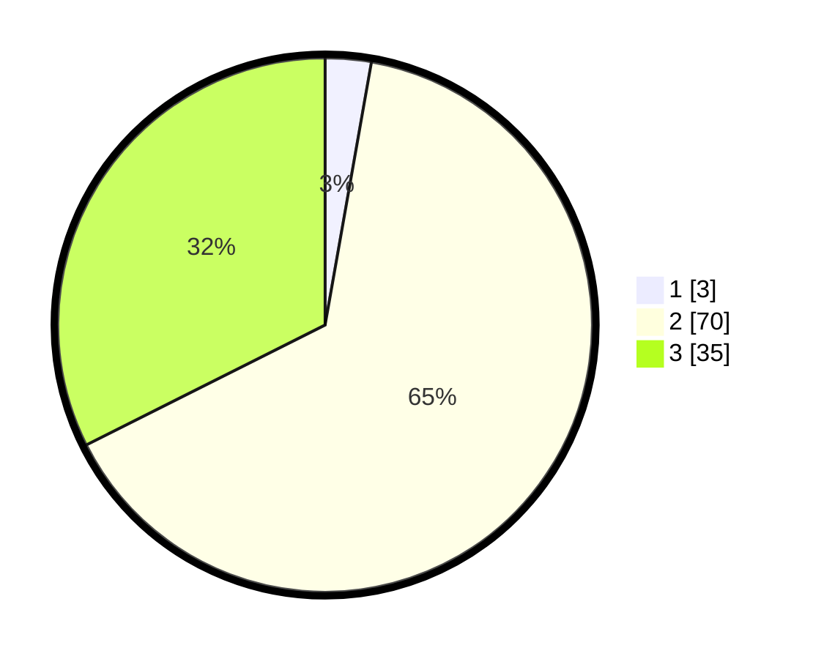

# Hasil

## Grafik

## Tabel

| No. | Nama Paslon    | Suara | Suara (raw) | Persentase |
|:--- |:-------------- | -----:| -----------:| ----------:|
| 1   | ANIES MUHAIMIN | 3     | [3][p-1]    | 2,78       |
| 2   | PRABOWO GIBRAN | 70    | [70][p-2]   | 64,81      |
| 3   | GANJAR MAHFUD  | 35    | [35][p-3]   | 32,41      |

[p-1]: https://github.com/gigit-pemilu/pemilu-2024/blob/main/pilpres/hitung-suara/sub/33-jawa-tengah/sub/07-wonosobo/sub/15-kalibawang/sub/2003-dempel/sub/022-tps/sub/paslon-1.txt
[p-2]: https://github.com/gigit-pemilu/pemilu-2024/blob/main/pilpres/hitung-suara/sub/33-jawa-tengah/sub/07-wonosobo/sub/15-kalibawang/sub/2003-dempel/sub/022-tps/sub/paslon-2.txt
[p-3]: https://github.com/gigit-pemilu/pemilu-2024/blob/main/pilpres/hitung-suara/sub/33-jawa-tengah/sub/07-wonosobo/sub/15-kalibawang/sub/2003-dempel/sub/022-tps/sub/paslon-3.txt

## Foto C Plano

https://sirekap-obj-formc.kpu.go.id/b2c1/pemilu/ppwp/33/07/15/20/03/3307152003022-20240215-191459--32deb3a3-a676-45cd-b673-b80046fb7e7b.jpg

https://sirekap-obj-formc.kpu.go.id/b2c1/pemilu/ppwp/33/07/15/20/03/3307152003022-20240219-105223--b8dcd354-e1ca-42c6-9300-86eeef62d6fa.jpg

https://sirekap-obj-formc.kpu.go.id/b2c1/pemilu/ppwp/33/07/15/20/03/3307152003022-20240219-105237--f88d9040-c61d-4e05-915a-ee096e0dd3c8.jpg

## Metadata

| Key        | Value               |
| ---------- | ------------------- |
| Time Stamp | 2024-02-19 11:00:00 |

