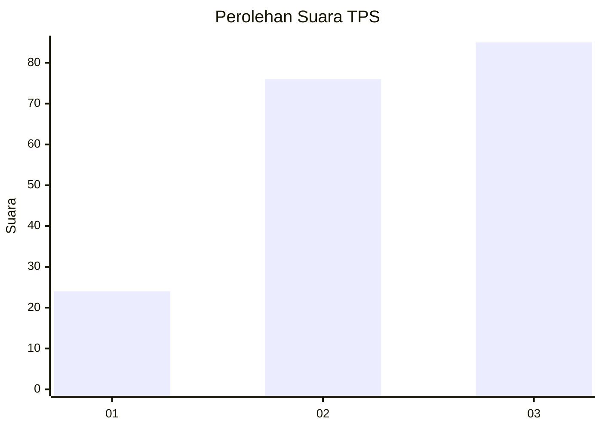
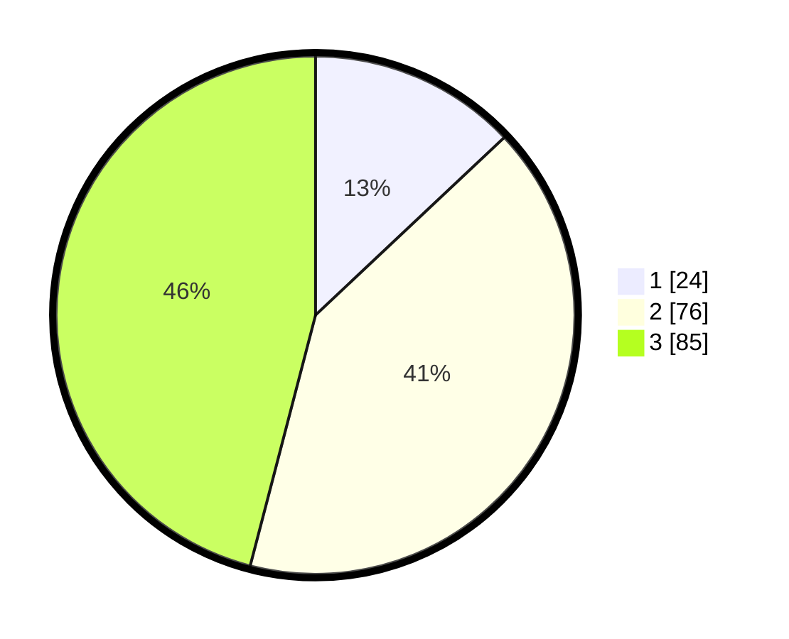

# Hasil

## Grafik

## Tabel

| No. | Nama Paslon    | Suara | Suara (raw) | Persentase |
|:--- |:-------------- | -----:| -----------:| ----------:|
| 1   | ANIES MUHAIMIN | 24    | [24][p-1]   | 12,97      |
| 2   | PRABOWO GIBRAN | 76    | [76][p-2]   | 41,08      |
| 3   | GANJAR MAHFUD  | 85    | [85][p-3]   | 45,95      |

[p-1]: https://github.com/gigit-pemilu/pemilu-2024-33-jawa-tengah/blob/main/pilpres/hitung-suara/sub/33-jawa-tengah/sub/07-wonosobo/sub/15-kalibawang/sub/2004-karangsambung/sub/001-tps/sub/paslon-1.txt
[p-2]: https://github.com/gigit-pemilu/pemilu-2024-33-jawa-tengah/blob/main/pilpres/hitung-suara/sub/33-jawa-tengah/sub/07-wonosobo/sub/15-kalibawang/sub/2004-karangsambung/sub/001-tps/sub/paslon-2.txt
[p-3]: https://github.com/gigit-pemilu/pemilu-2024-33-jawa-tengah/blob/main/pilpres/hitung-suara/sub/33-jawa-tengah/sub/07-wonosobo/sub/15-kalibawang/sub/2004-karangsambung/sub/001-tps/sub/paslon-3.txt

## Foto C Plano

https://sirekap-obj-formc.kpu.go.id/9bd7/pemilu/ppwp/33/07/15/20/04/3307152004001-20240214-234710--18a656e5-a40b-40f3-a216-6445d1bb747f.jpg

https://sirekap-obj-formc.kpu.go.id/9bd7/pemilu/ppwp/33/07/15/20/04/3307152004001-20240214-234822--873af7b0-700a-46c3-b1a4-525f2ff6011e.jpg

https://sirekap-obj-formc.kpu.go.id/9bd7/pemilu/ppwp/33/07/15/20/04/3307152004001-20240214-235135--599e0bdf-214c-4832-9e3d-fc791d9d8987.jpg

## Metadata

| Key        | Value               |
| ---------- | ------------------- |
| Time Stamp | 2024-02-25 12:00:00 |

