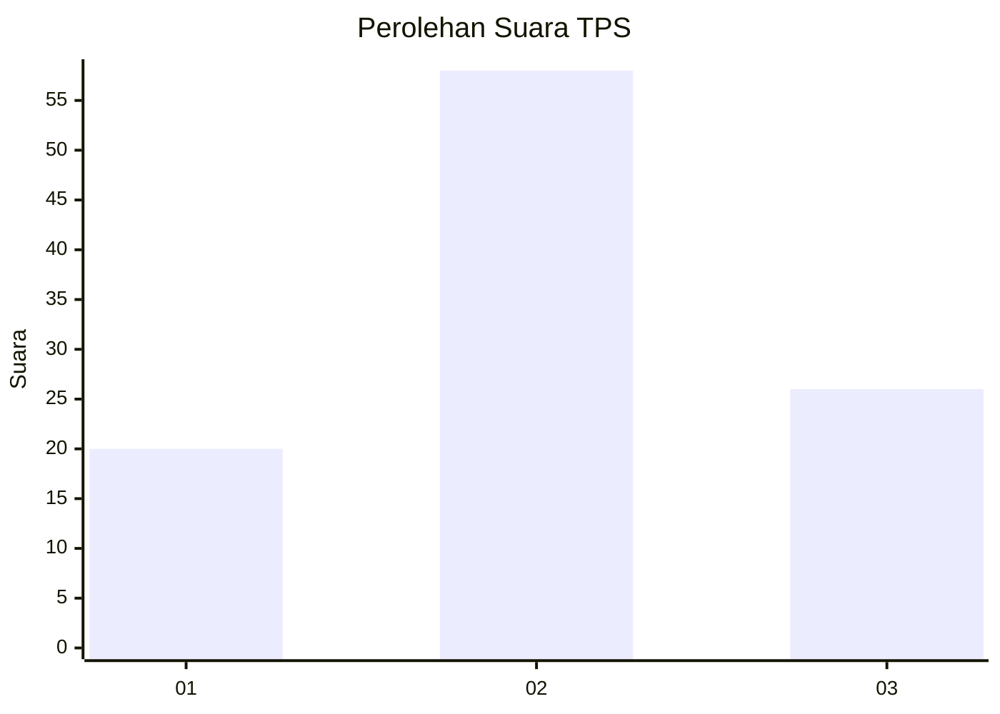
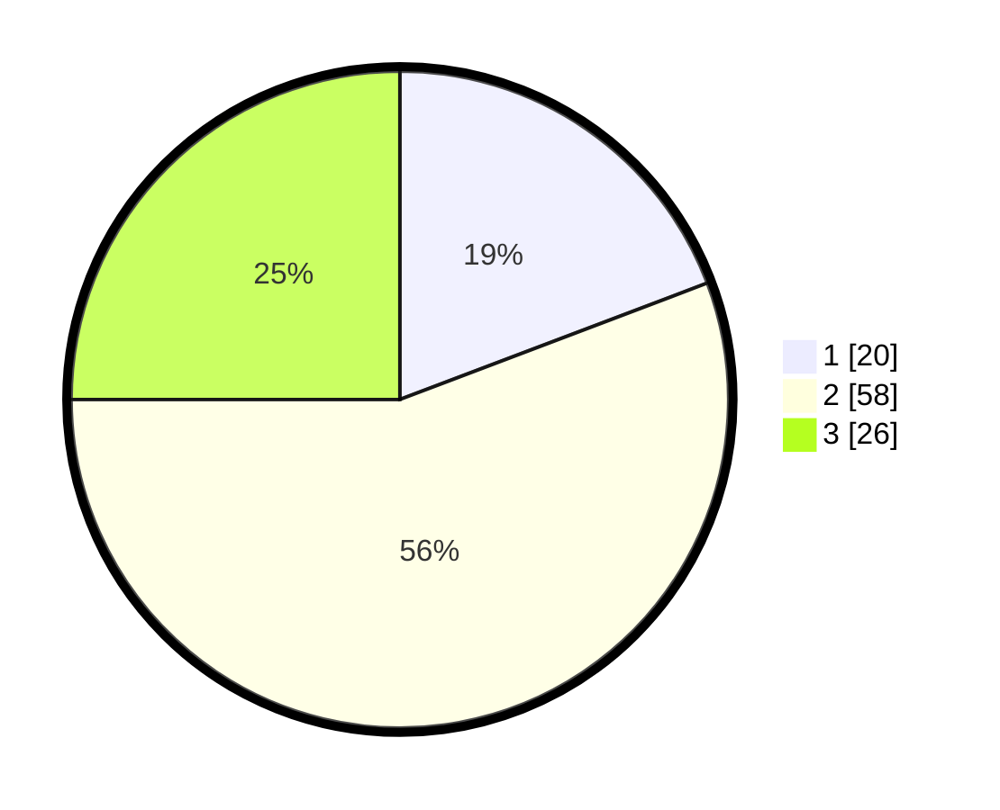

# Hasil

## Grafik

## Tabel

| No. | Nama Paslon    | Suara | Suara (raw) | Persentase |
|:--- |:-------------- | -----:| -----------:| ----------:|
| 1   | ANIES MUHAIMIN | 20    | [20][p-1]   | 19,23      |
| 2   | PRABOWO GIBRAN | 58    | [58][p-2]   | 55,77      |
| 3   | GANJAR MAHFUD  | 26    | [26][p-3]   | 25,00      |

[p-1]: https://github.com/gigit-pemilu/pemilu-2024-33-jawa-tengah/blob/main/pilpres/hitung-suara/sub/33-jawa-tengah/sub/07-wonosobo/sub/15-kalibawang/sub/2004-karangsambung/sub/007-tps/sub/paslon-1.txt
[p-2]: https://github.com/gigit-pemilu/pemilu-2024-33-jawa-tengah/blob/main/pilpres/hitung-suara/sub/33-jawa-tengah/sub/07-wonosobo/sub/15-kalibawang/sub/2004-karangsambung/sub/007-tps/sub/paslon-2.txt
[p-3]: https://github.com/gigit-pemilu/pemilu-2024-33-jawa-tengah/blob/main/pilpres/hitung-suara/sub/33-jawa-tengah/sub/07-wonosobo/sub/15-kalibawang/sub/2004-karangsambung/sub/007-tps/sub/paslon-3.txt

## Foto C Plano

https://sirekap-obj-formc.kpu.go.id/1329/pemilu/ppwp/33/07/15/20/04/3307152004007-20240214-222234--61d5647f-76a1-4a22-ae16-188bb65e7a76.jpg

https://sirekap-obj-formc.kpu.go.id/1329/pemilu/ppwp/33/07/15/20/04/3307152004007-20240214-222426--ae1b6f6d-a0da-4631-b305-bc35c0b5bb5e.jpg

https://sirekap-obj-formc.kpu.go.id/1329/pemilu/ppwp/33/07/15/20/04/3307152004007-20240214-222608--e619f20b-2241-4b81-93e3-1dea6ab9d0f2.jpg

## Metadata

| Key        | Value               |
| ---------- | ------------------- |
| Time Stamp | 2024-02-15 15:00:29 |

