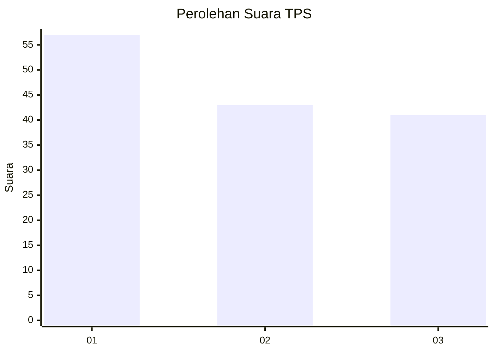
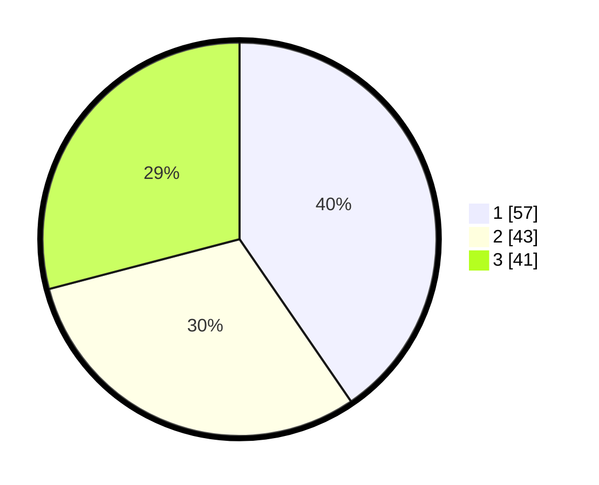

# Hasil

## Grafik

## Tabel

| No. | Nama Paslon    | Suara | Suara (raw) | Persentase |
|:--- |:-------------- | -----:| -----------:| ----------:|
| 1   | ANIES MUHAIMIN | 57    | [57][p-1]   | 40,43      |
| 2   | PRABOWO GIBRAN | 43    | [43][p-2]   | 30,50      |
| 3   | GANJAR MAHFUD  | 41    | [41][p-3]   | 29,08      |

[p-1]: https://github.com/gigit-pemilu/pemilu-2024-33-jawa-tengah/blob/main/pilpres/hitung-suara/sub/33-jawa-tengah/sub/07-wonosobo/sub/15-kalibawang/sub/2005-tempurejo/sub/010-tps/sub/paslon-1.txt
[p-2]: https://github.com/gigit-pemilu/pemilu-2024-33-jawa-tengah/blob/main/pilpres/hitung-suara/sub/33-jawa-tengah/sub/07-wonosobo/sub/15-kalibawang/sub/2005-tempurejo/sub/010-tps/sub/paslon-2.txt
[p-3]: https://github.com/gigit-pemilu/pemilu-2024-33-jawa-tengah/blob/main/pilpres/hitung-suara/sub/33-jawa-tengah/sub/07-wonosobo/sub/15-kalibawang/sub/2005-tempurejo/sub/010-tps/sub/paslon-3.txt

## Foto C Plano

https://sirekap-obj-formc.kpu.go.id/3a55/pemilu/ppwp/33/07/15/20/05/3307152005010-20240214-232118--05ee3760-80b7-4b48-8702-a90d1688f8f4.jpg

https://sirekap-obj-formc.kpu.go.id/3a55/pemilu/ppwp/33/07/15/20/05/3307152005010-20240214-191534--c9878a88-3ea4-4efb-b462-1856f371ca71.jpg

https://sirekap-obj-formc.kpu.go.id/3a55/pemilu/ppwp/33/07/15/20/05/3307152005010-20240214-202820--f11e29aa-f1e6-43ff-a1fe-1d64cdcab554.jpg

## Metadata

| Key        | Value               |
| ---------- | ------------------- |
| Time Stamp | 2024-02-15 00:41:44 |

