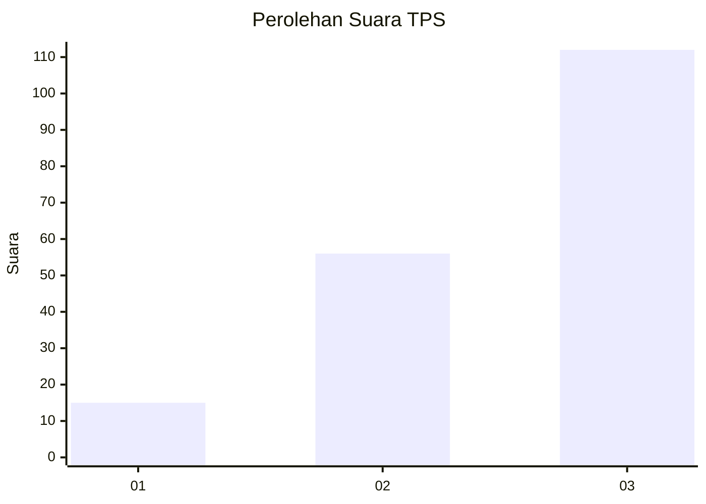
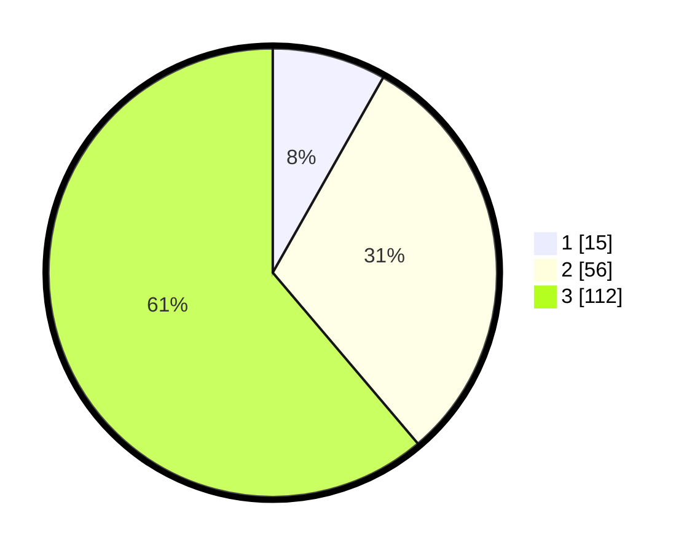

# Hasil

## Grafik

## Tabel

| No. | Nama Paslon    | Suara | Suara (raw) | Persentase |
|:--- |:-------------- | -----:| -----------:| ----------:|
| 1   | ANIES MUHAIMIN | 15    | [15][p-1]   | 8,20       |
| 2   | PRABOWO GIBRAN | 56    | [56][p-2]   | 30,60      |
| 3   | GANJAR MAHFUD  | 112   | [112][p-3]  | 61,20      |

[p-1]: https://github.com/gigit-pemilu/pemilu-2024-33-jawa-tengah/blob/main/pilpres/hitung-suara/sub/33-jawa-tengah/sub/07-wonosobo/sub/15-kalibawang/sub/2006-mergolangu/sub/001-tps/sub/paslon-1.txt
[p-2]: https://github.com/gigit-pemilu/pemilu-2024-33-jawa-tengah/blob/main/pilpres/hitung-suara/sub/33-jawa-tengah/sub/07-wonosobo/sub/15-kalibawang/sub/2006-mergolangu/sub/001-tps/sub/paslon-2.txt
[p-3]: https://github.com/gigit-pemilu/pemilu-2024-33-jawa-tengah/blob/main/pilpres/hitung-suara/sub/33-jawa-tengah/sub/07-wonosobo/sub/15-kalibawang/sub/2006-mergolangu/sub/001-tps/sub/paslon-3.txt

## Foto C Plano

https://sirekap-obj-formc.kpu.go.id/8af1/pemilu/ppwp/33/07/15/20/06/3307152006001-20240214-235048--94edd72a-f1b1-431d-8dfe-7ff7013a37da.jpg

https://sirekap-obj-formc.kpu.go.id/8af1/pemilu/ppwp/33/07/15/20/06/3307152006001-20240214-235120--9dc57eda-2b43-40cb-9e7f-d39a4b7db12f.jpg

https://sirekap-obj-formc.kpu.go.id/8af1/pemilu/ppwp/33/07/15/20/06/3307152006001-20240214-235249--b962bbf3-372f-4484-bce6-ad7fd86a4da6.jpg

## Metadata

| Key        | Value               |
| ---------- | ------------------- |
| Time Stamp | 2024-02-15 15:00:29 |

