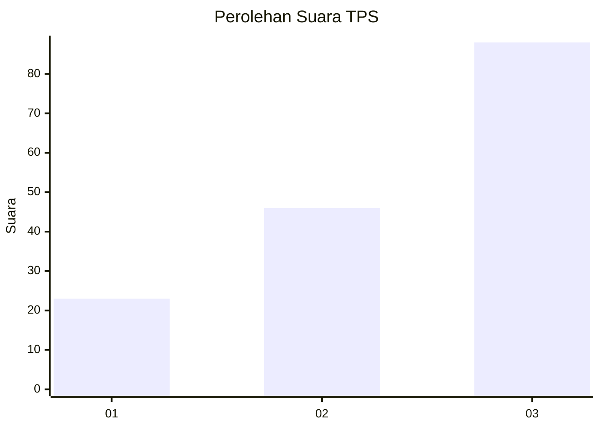
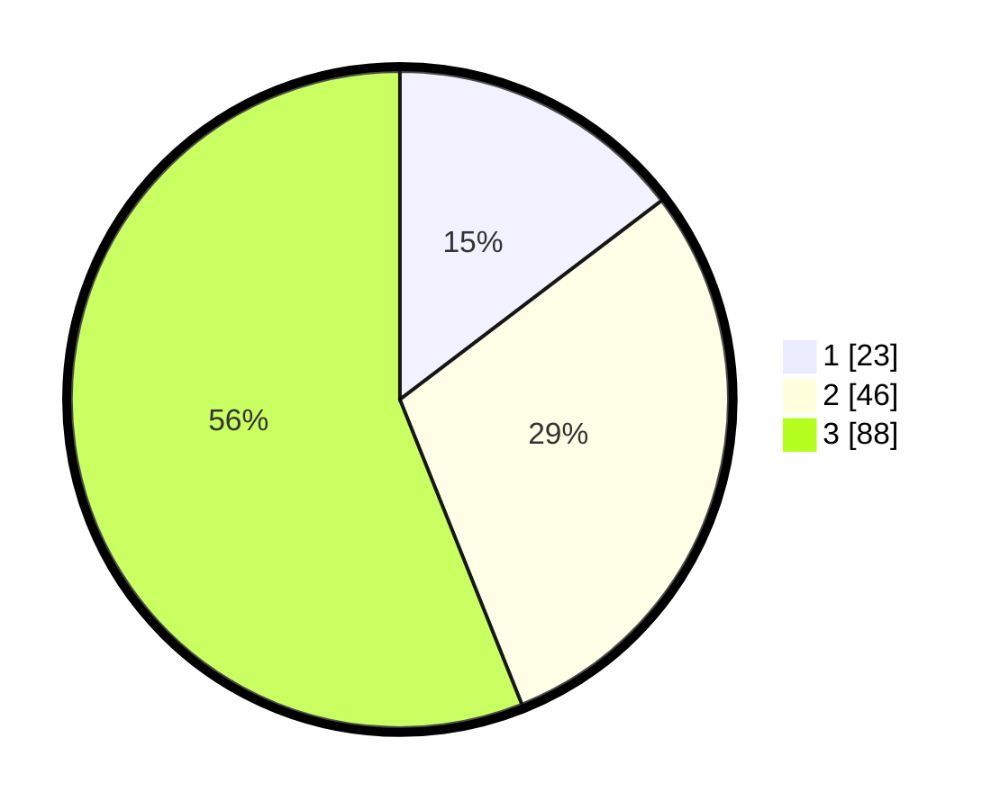

# Hasil

## Grafik

## Tabel

| No. | Nama Paslon    | Suara | Suara (raw) | Persentase |
|:--- |:-------------- | -----:| -----------:| ----------:|
| 1   | ANIES MUHAIMIN | 23    | [23][p-1]   | 14,65      |
| 2   | PRABOWO GIBRAN | 46    | [46][p-2]   | 29,30      |
| 3   | GANJAR MAHFUD  | 88    | [88][p-3]   | 56,05      |

[p-1]: https://github.com/gigit-pemilu/pemilu-2024-33-jawa-tengah/blob/main/pilpres/hitung-suara/sub/33-jawa-tengah/sub/07-wonosobo/sub/15-kalibawang/sub/2006-mergolangu/sub/003-tps/sub/paslon-1.txt
[p-2]: https://github.com/gigit-pemilu/pemilu-2024-33-jawa-tengah/blob/main/pilpres/hitung-suara/sub/33-jawa-tengah/sub/07-wonosobo/sub/15-kalibawang/sub/2006-mergolangu/sub/003-tps/sub/paslon-2.txt
[p-3]: https://github.com/gigit-pemilu/pemilu-2024-33-jawa-tengah/blob/main/pilpres/hitung-suara/sub/33-jawa-tengah/sub/07-wonosobo/sub/15-kalibawang/sub/2006-mergolangu/sub/003-tps/sub/paslon-3.txt

## Foto C Plano

https://sirekap-obj-formc.kpu.go.id/dde8/pemilu/ppwp/33/07/15/20/06/3307152006003-20240215-055643--6d21690d-b1ec-4ffc-96ab-193a7e2a681d.jpg

https://sirekap-obj-formc.kpu.go.id/dde8/pemilu/ppwp/33/07/15/20/06/3307152006003-20240215-055907--1cc46ce7-7d2d-4a8e-ba76-354efe510894.jpg

https://sirekap-obj-formc.kpu.go.id/dde8/pemilu/ppwp/33/07/15/20/06/3307152006003-20240215-055825--f8dc7c3e-ab24-49ce-b18a-a8ff5da52966.jpg

## Metadata

| Key        | Value               |
| ---------- | ------------------- |
| Time Stamp | 2024-02-25 15:00:00 |

