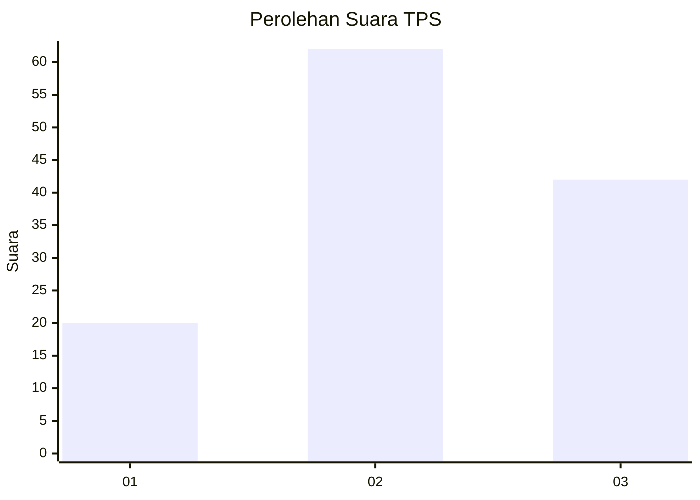
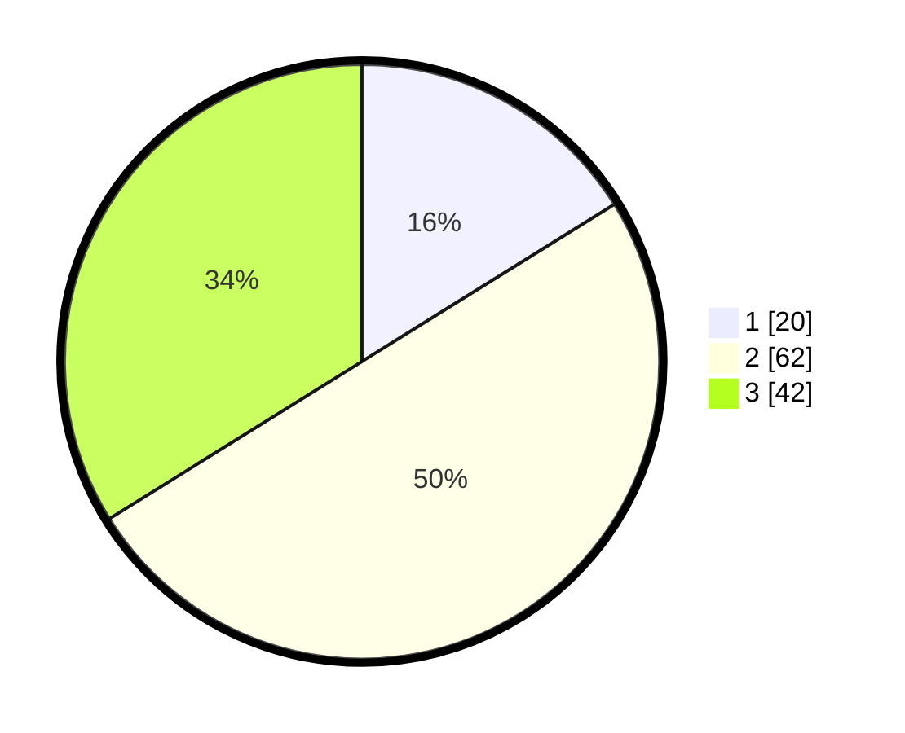

# Hasil

## Grafik

## Tabel

| No. | Nama Paslon    | Suara | Suara (raw) | Persentase |
|:--- |:-------------- | -----:| -----------:| ----------:|
| 1   | ANIES MUHAIMIN | 20    | [20][p-1]   | 16,13      |
| 2   | PRABOWO GIBRAN | 62    | [62][p-2]   | 50,00      |
| 3   | GANJAR MAHFUD  | 42    | [42][p-3]   | 33,87      |

[p-1]: https://github.com/gigit-pemilu/pemilu-2024-33-jawa-tengah/blob/main/pilpres/hitung-suara/sub/33-jawa-tengah/sub/07-wonosobo/sub/15-kalibawang/sub/2007-depok/sub/003-tps/sub/paslon-1.txt
[p-2]: https://github.com/gigit-pemilu/pemilu-2024-33-jawa-tengah/blob/main/pilpres/hitung-suara/sub/33-jawa-tengah/sub/07-wonosobo/sub/15-kalibawang/sub/2007-depok/sub/003-tps/sub/paslon-2.txt
[p-3]: https://github.com/gigit-pemilu/pemilu-2024-33-jawa-tengah/blob/main/pilpres/hitung-suara/sub/33-jawa-tengah/sub/07-wonosobo/sub/15-kalibawang/sub/2007-depok/sub/003-tps/sub/paslon-3.txt

## Foto C Plano

https://sirekap-obj-formc.kpu.go.id/3830/pemilu/ppwp/33/07/15/20/07/3307152007003-20240215-043705--c3c39dea-3318-4bac-b8b5-6f9b732066e1.jpg

https://sirekap-obj-formc.kpu.go.id/3830/pemilu/ppwp/33/07/15/20/07/3307152007003-20240215-043836--b22a13c1-f0db-4418-ac27-a6a1b23937e2.jpg

https://sirekap-obj-formc.kpu.go.id/3830/pemilu/ppwp/33/07/15/20/07/3307152007003-20240215-043957--211c82b3-fb21-4d56-8f75-0d329b213d0e.jpg

## Metadata

| Key        | Value               |
| ---------- | ------------------- |
| Time Stamp | 2024-02-15 15:00:29 |

