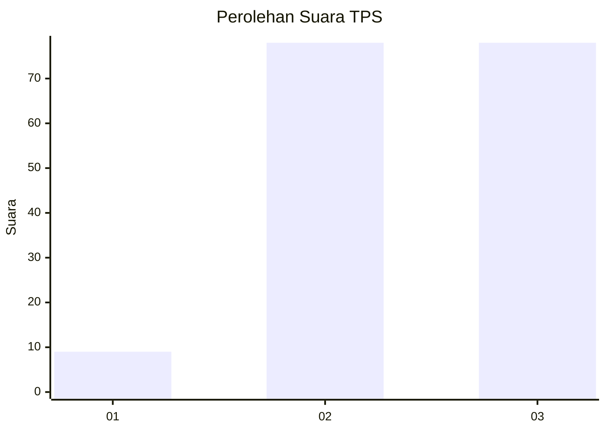
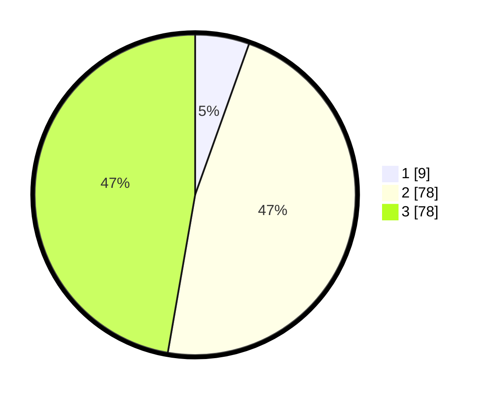

# Hasil

## Grafik

## Tabel

| No. | Nama Paslon    | Suara | Suara (raw) | Persentase |
|:--- |:-------------- | -----:| -----------:| ----------:|
| 1   | ANIES MUHAIMIN | 9     | [9][p-1]    | 5,45       |
| 2   | PRABOWO GIBRAN | 78    | [78][p-2]   | 47,27      |
| 3   | GANJAR MAHFUD  | 78    | [78][p-3]   | 47,27      |

[p-1]: https://github.com/gigit-pemilu/pemilu-2024/blob/main/pilpres/hitung-suara/sub/33-jawa-tengah/sub/07-wonosobo/sub/15-kalibawang/sub/2007-depok/sub/005-tps/sub/paslon-1.txt
[p-2]: https://github.com/gigit-pemilu/pemilu-2024/blob/main/pilpres/hitung-suara/sub/33-jawa-tengah/sub/07-wonosobo/sub/15-kalibawang/sub/2007-depok/sub/005-tps/sub/paslon-2.txt
[p-3]: https://github.com/gigit-pemilu/pemilu-2024/blob/main/pilpres/hitung-suara/sub/33-jawa-tengah/sub/07-wonosobo/sub/15-kalibawang/sub/2007-depok/sub/005-tps/sub/paslon-3.txt

## Foto C Plano

https://sirekap-obj-formc.kpu.go.id/acd9/pemilu/ppwp/33/07/15/20/07/3307152007005-20240214-214438--a0584887-608d-4ea2-948a-183fb68a83f6.jpg

https://sirekap-obj-formc.kpu.go.id/acd9/pemilu/ppwp/33/07/15/20/07/3307152007005-20240214-214749--260aae5e-97e0-496c-853d-b711f07f2511.jpg

https://sirekap-obj-formc.kpu.go.id/acd9/pemilu/ppwp/33/07/15/20/07/3307152007005-20240214-214923--e2883fbc-a4ff-47eb-a767-665e2fb302c0.jpg

## Metadata

| Key        | Value               |
| ---------- | ------------------- |
| Time Stamp | 2024-02-15 15:00:29 |

