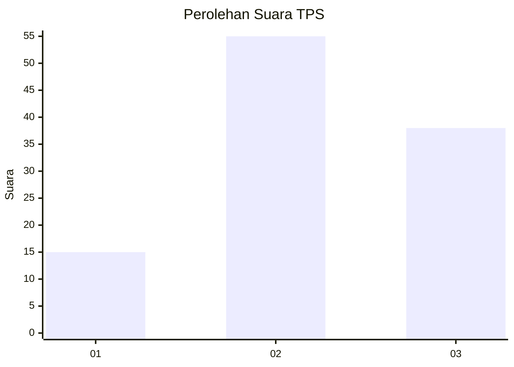
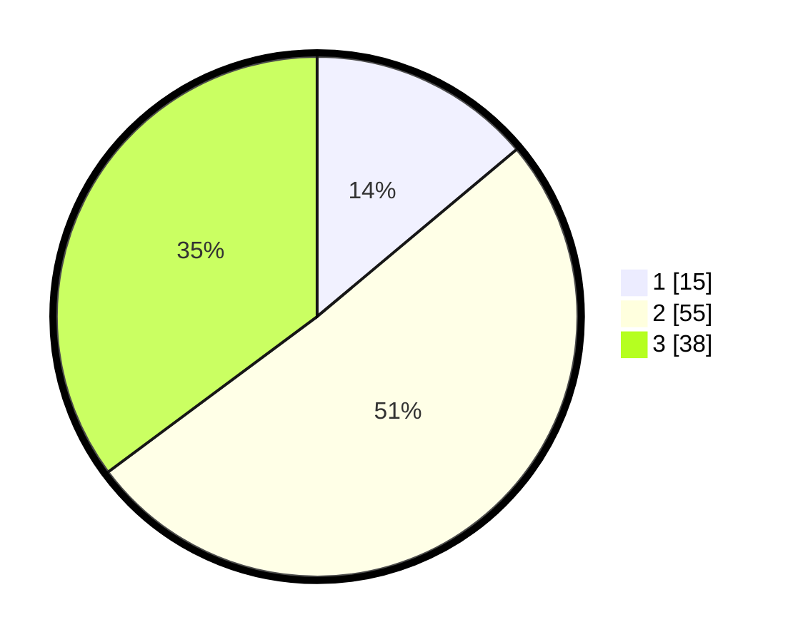

# Hasil

## Grafik

## Tabel

| No. | Nama Paslon    | Suara | Suara (raw) | Persentase |
|:--- |:-------------- | -----:| -----------:| ----------:|
| 1   | ANIES MUHAIMIN | 15    | [15][p-1]   | 13,89      |
| 2   | PRABOWO GIBRAN | 55    | [55][p-2]   | 50,93      |
| 3   | GANJAR MAHFUD  | 38    | [38][p-3]   | 35,19      |

[p-1]: https://github.com/gigit-pemilu/pemilu-2024-33-jawa-tengah/blob/main/pilpres/hitung-suara/sub/33-jawa-tengah/sub/07-wonosobo/sub/15-kalibawang/sub/2008-kalialang/sub/003-tps/sub/paslon-1.txt
[p-2]: https://github.com/gigit-pemilu/pemilu-2024-33-jawa-tengah/blob/main/pilpres/hitung-suara/sub/33-jawa-tengah/sub/07-wonosobo/sub/15-kalibawang/sub/2008-kalialang/sub/003-tps/sub/paslon-2.txt
[p-3]: https://github.com/gigit-pemilu/pemilu-2024-33-jawa-tengah/blob/main/pilpres/hitung-suara/sub/33-jawa-tengah/sub/07-wonosobo/sub/15-kalibawang/sub/2008-kalialang/sub/003-tps/sub/paslon-3.txt

## Foto C Plano

https://sirekap-obj-formc.kpu.go.id/ca6e/pemilu/ppwp/33/07/15/20/08/3307152008003-20240214-203952--1d9620e3-7958-4077-a4ba-2269c9fe33bc.jpg

https://sirekap-obj-formc.kpu.go.id/ca6e/pemilu/ppwp/33/07/15/20/08/3307152008003-20240214-204033--750a7b41-8fb4-4db0-ac67-86b014b2c02f.jpg

https://sirekap-obj-formc.kpu.go.id/ca6e/pemilu/ppwp/33/07/15/20/08/3307152008003-20240214-204052--f6aeacc6-87f0-4f93-94c3-bb5217b9f9a0.jpg

## Metadata

| Key        | Value               |
| ---------- | ------------------- |
| Time Stamp | 2024-02-15 09:00:24 |

