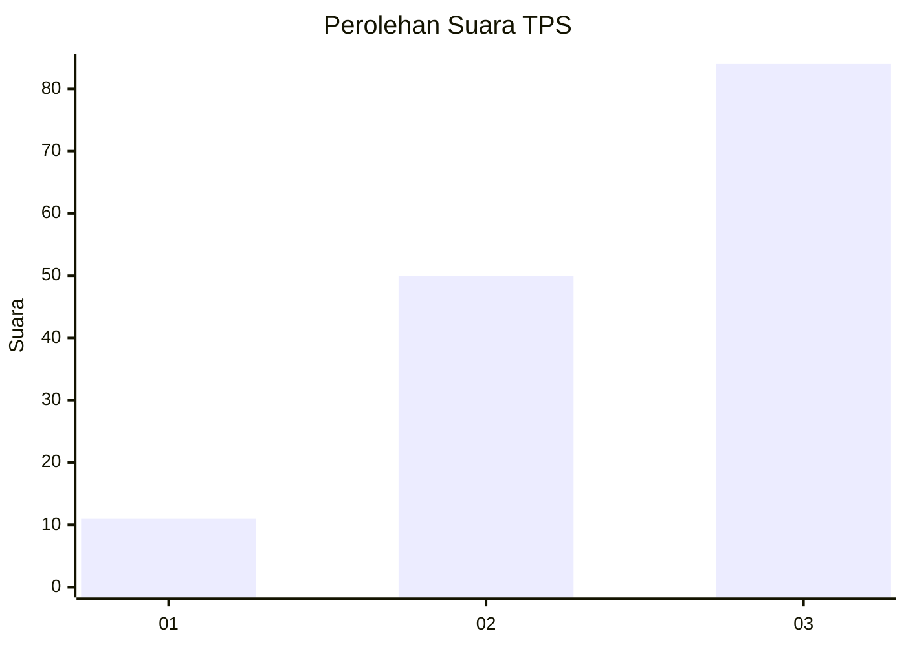
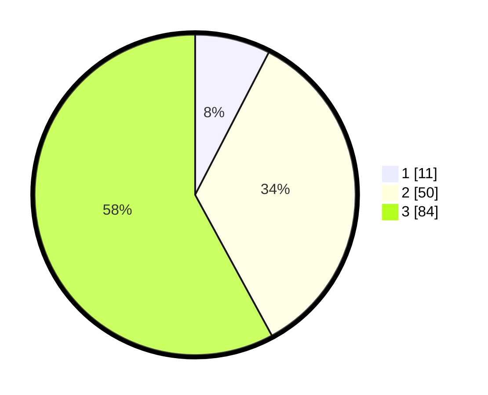

# Hasil

## Grafik

## Tabel

| No. | Nama Paslon    | Suara | Suara (raw) | Persentase |
|:--- |:-------------- | -----:| -----------:| ----------:|
| 1   | ANIES MUHAIMIN | 11    | [11][p-1]   | 7,59       |
| 2   | PRABOWO GIBRAN | 50    | [50][p-2]   | 34,48      |
| 3   | GANJAR MAHFUD  | 84    | [84][p-3]   | 57,93      |

[p-1]: https://github.com/gigit-pemilu/pemilu-2024/blob/main/pilpres/hitung-suara/sub/33-jawa-tengah/sub/07-wonosobo/sub/15-kalibawang/sub/2008-kalialang/sub/007-tps/sub/paslon-1.txt
[p-2]: https://github.com/gigit-pemilu/pemilu-2024/blob/main/pilpres/hitung-suara/sub/33-jawa-tengah/sub/07-wonosobo/sub/15-kalibawang/sub/2008-kalialang/sub/007-tps/sub/paslon-2.txt
[p-3]: https://github.com/gigit-pemilu/pemilu-2024/blob/main/pilpres/hitung-suara/sub/33-jawa-tengah/sub/07-wonosobo/sub/15-kalibawang/sub/2008-kalialang/sub/007-tps/sub/paslon-3.txt

## Foto C Plano

https://sirekap-obj-formc.kpu.go.id/13cf/pemilu/ppwp/33/07/15/20/08/3307152008007-20240214-230316--0a5b7a24-251f-473d-825d-2554bf3c50e7.jpg

https://sirekap-obj-formc.kpu.go.id/13cf/pemilu/ppwp/33/07/15/20/08/3307152008007-20240214-230428--dcbc09f6-73e6-4727-886d-cc9c72ff4bd3.jpg

https://sirekap-obj-formc.kpu.go.id/13cf/pemilu/ppwp/33/07/15/20/08/3307152008007-20240214-234414--3a5c3dec-326d-4bea-a3a0-e3c2e0123d86.jpg

## Metadata

| Key        | Value               |
| ---------- | ------------------- |
| Time Stamp | 2024-02-24 23:00:00 |

