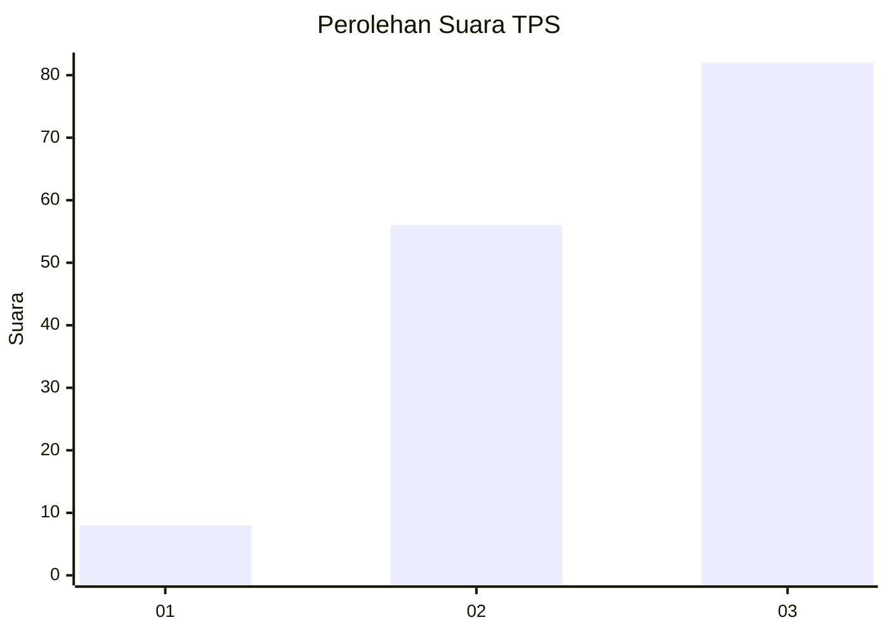
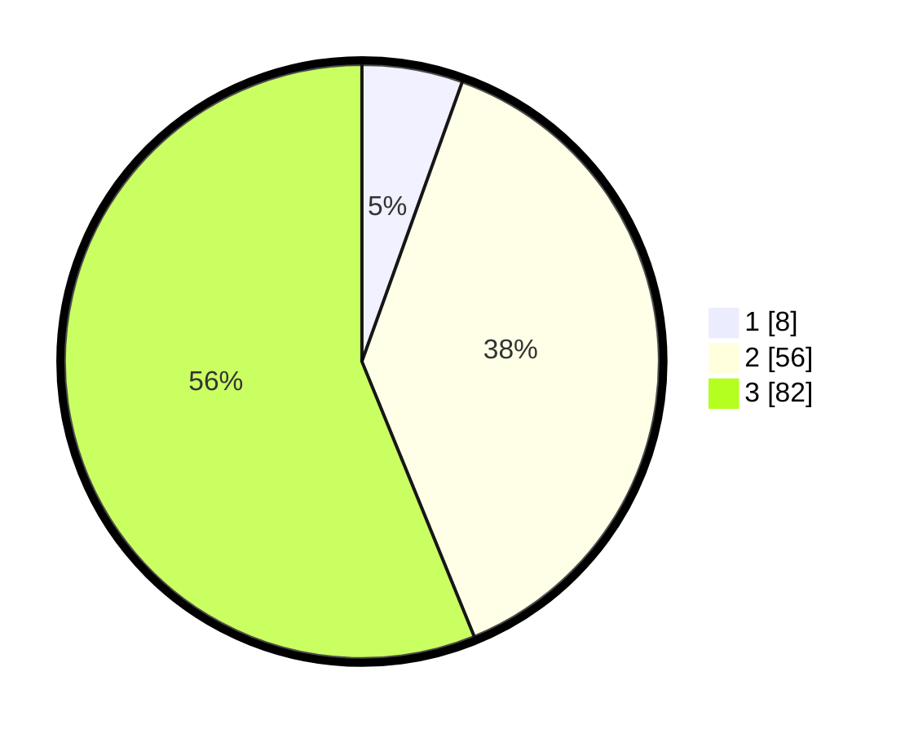

# Hasil

## Grafik

## Tabel

| No. | Nama Paslon    | Suara | Suara (raw) | Persentase |
|:--- |:-------------- | -----:| -----------:| ----------:|
| 1   | ANIES MUHAIMIN | 8     | [8][p-1]    | 5,48       |
| 2   | PRABOWO GIBRAN | 56    | [56][p-2]   | 38,36      |
| 3   | GANJAR MAHFUD  | 82    | [82][p-3]   | 56,16      |

[p-1]: https://github.com/gigit-pemilu/pemilu-2024/blob/main/pilpres/hitung-suara/sub/33-jawa-tengah/sub/08-magelang/sub/01-salaman/sub/2001-ngargoretno/sub/002-tps/sub/paslon-1.txt
[p-2]: https://github.com/gigit-pemilu/pemilu-2024/blob/main/pilpres/hitung-suara/sub/33-jawa-tengah/sub/08-magelang/sub/01-salaman/sub/2001-ngargoretno/sub/002-tps/sub/paslon-2.txt
[p-3]: https://github.com/gigit-pemilu/pemilu-2024/blob/main/pilpres/hitung-suara/sub/33-jawa-tengah/sub/08-magelang/sub/01-salaman/sub/2001-ngargoretno/sub/002-tps/sub/paslon-3.txt

## Foto C Plano

https://sirekap-obj-formc.kpu.go.id/0e96/pemilu/ppwp/33/08/01/20/01/3308012001002-20240216-131350--d8f4eb02-2a24-4ae8-88f5-53f867114346.jpg

https://sirekap-obj-formc.kpu.go.id/0e96/pemilu/ppwp/33/08/01/20/01/3308012001002-20240216-131351--7007a01a-c543-46c9-b0b5-2c2dd2461649.jpg

https://sirekap-obj-formc.kpu.go.id/0e96/pemilu/ppwp/33/08/01/20/01/3308012001002-20240216-131350--623abf89-7ebe-495e-92be-2f2b89fca9b9.jpg

## Metadata

| Key        | Value               |
| ---------- | ------------------- |
| Time Stamp | 2024-02-16 13:30:32 |

## DATA PEMILIH TETAP

Jumlah pemilih dalam DPT: **169**.
 * L: **85**.
 * P: **84**.

## DATA PENGGUNA HAK PILIH

Jumlah pengguna hak pilih dalam DPT: **149**.
 * L: **76**.
 * P: **73**.

Jumlah pengguna hak pilih dalam DPTb: **1**.
 * L: **0**.
 * P: **1**.

Jumlah pengguna hak pilih dalam DPK: **0**.
 * L: **0**.
 * P: **0**.

Jumlah pengguna hak pilih: **150**.
 * L: **76**.
 * P: **74**.

## JUMLAH SUARA SAH DAN TIDAK SAH

JUMLAH SELURUH SUARA SAH: **146**.

JUMLAH SUARA TIDAK SAH: **4**.

JUMLAH SELURUH SUARA SAH DAN SUARA TIDAK SAH: **150**.

