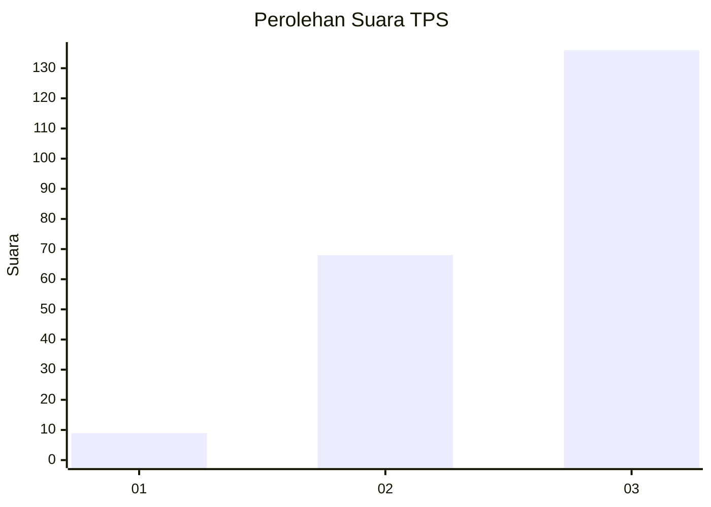
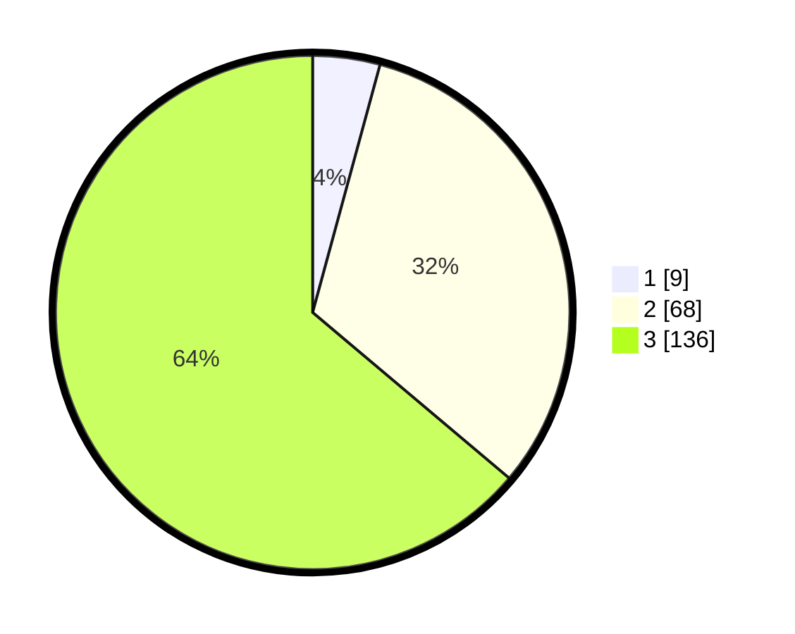

# Hasil

## Grafik

## Tabel

| No. | Nama Paslon    | Suara | Suara (raw) | Persentase |
|:--- |:-------------- | -----:| -----------:| ----------:|
| 1   | ANIES MUHAIMIN | 9     | [9][p-1]    | 4,23       |
| 2   | PRABOWO GIBRAN | 68    | [68][p-2]   | 31,92      |
| 3   | GANJAR MAHFUD  | 136   | [136][p-3]  | 63,85      |

[p-1]: https://github.com/gigit-pemilu/pemilu-2024/blob/main/pilpres/hitung-suara/sub/33-jawa-tengah/sub/08-magelang/sub/01-salaman/sub/2001-ngargoretno/sub/004-tps/sub/paslon-1.txt
[p-2]: https://github.com/gigit-pemilu/pemilu-2024/blob/main/pilpres/hitung-suara/sub/33-jawa-tengah/sub/08-magelang/sub/01-salaman/sub/2001-ngargoretno/sub/004-tps/sub/paslon-2.txt
[p-3]: https://github.com/gigit-pemilu/pemilu-2024/blob/main/pilpres/hitung-suara/sub/33-jawa-tengah/sub/08-magelang/sub/01-salaman/sub/2001-ngargoretno/sub/004-tps/sub/paslon-3.txt

## Foto C Plano

https://sirekap-obj-formc.kpu.go.id/ebfa/pemilu/ppwp/33/08/01/20/01/3308012001004-20240216-091531--fe410786-89d5-4b58-966c-f0a02a1c1593.jpg

https://sirekap-obj-formc.kpu.go.id/ebfa/pemilu/ppwp/33/08/01/20/01/3308012001004-20240216-091533--bc9b1fd6-813a-4b9d-abb4-356fa1dea64e.jpg

https://sirekap-obj-formc.kpu.go.id/ebfa/pemilu/ppwp/33/08/01/20/01/3308012001004-20240216-091532--f63c826d-0b66-4c28-8d56-825f2664d1fc.jpg

## Metadata

| Key        | Value               |
| ---------- | ------------------- |
| Time Stamp | 2024-02-16 10:30:29 |

## DATA PEMILIH TETAP

Jumlah pemilih dalam DPT: **250**.
 * L: **127**.
 * P: **123**.

## DATA PENGGUNA HAK PILIH

Jumlah pengguna hak pilih dalam DPT: **221**.
 * L: **111**.
 * P: **111**.

Jumlah pengguna hak pilih dalam DPTb: **0**.
 * L: **0**.
 * P: **0**.

Jumlah pengguna hak pilih dalam DPK: **0**.
 * L: **0**.
 * P: **0**.

Jumlah pengguna hak pilih: **221**.
 * L: **111**.
 * P: **110**.

## JUMLAH SUARA SAH DAN TIDAK SAH

JUMLAH SELURUH SUARA SAH: **213**.

JUMLAH SUARA TIDAK SAH: **8**.

JUMLAH SELURUH SUARA SAH DAN SUARA TIDAK SAH: **221**.

