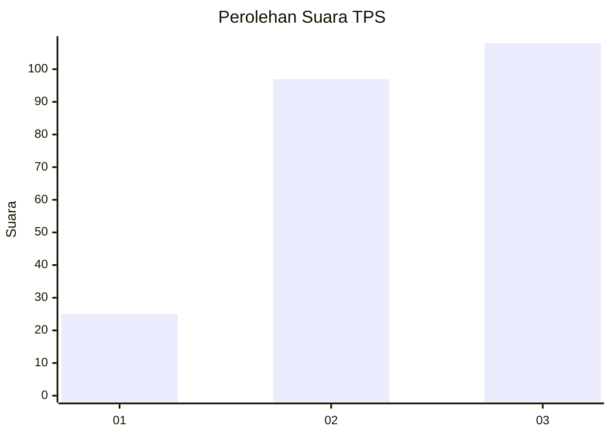
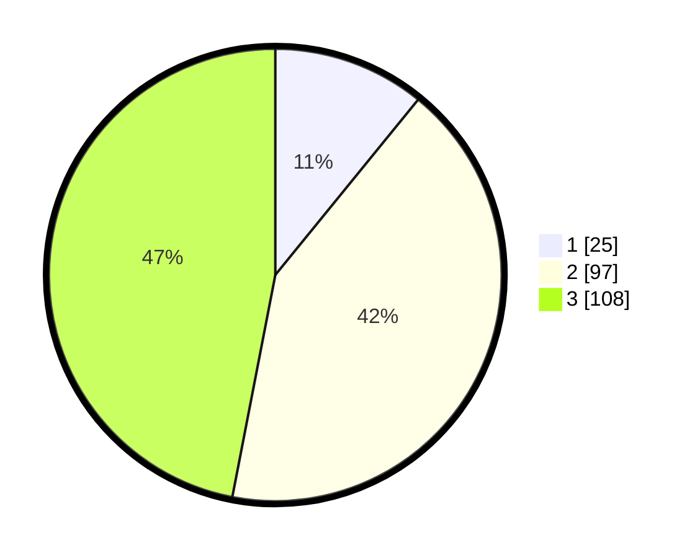

# Hasil

## Grafik

## Tabel

| No. | Nama Paslon    | Suara | Suara (raw) | Persentase |
|:--- |:-------------- | -----:| -----------:| ----------:|
| 1   | ANIES MUHAIMIN | 25    | [25][p-1]   | 10,87      |
| 2   | PRABOWO GIBRAN | 97    | [97][p-2]   | 42,17      |
| 3   | GANJAR MAHFUD  | 108   | [108][p-3]  | 46,96      |

[p-1]: https://github.com/gigit-pemilu/pemilu-2024/blob/main/pilpres/hitung-suara/sub/33-jawa-tengah/sub/08-magelang/sub/01-salaman/sub/2003-kalirejo/sub/003-tps/sub/paslon-1.txt
[p-2]: https://github.com/gigit-pemilu/pemilu-2024/blob/main/pilpres/hitung-suara/sub/33-jawa-tengah/sub/08-magelang/sub/01-salaman/sub/2003-kalirejo/sub/003-tps/sub/paslon-2.txt
[p-3]: https://github.com/gigit-pemilu/pemilu-2024/blob/main/pilpres/hitung-suara/sub/33-jawa-tengah/sub/08-magelang/sub/01-salaman/sub/2003-kalirejo/sub/003-tps/sub/paslon-3.txt

## Foto C Plano

https://sirekap-obj-formc.kpu.go.id/673b/pemilu/ppwp/33/08/01/20/03/3308012003003-20240216-210726--e6c2df1c-1268-44a7-a683-7eab0600f392.jpg

https://sirekap-obj-formc.kpu.go.id/673b/pemilu/ppwp/33/08/01/20/03/3308012003003-20240217-102355--0bf621cc-425e-4da7-827e-8d37e19f6ff6.jpg

https://sirekap-obj-formc.kpu.go.id/673b/pemilu/ppwp/33/08/01/20/03/3308012003003-20240216-210737--f26e9034-c013-4c10-a86b-c29f293f3ac7.jpg

## Metadata

| Key        | Value               |
| ---------- | ------------------- |
| Time Stamp | 2024-02-17 14:45:18 |

