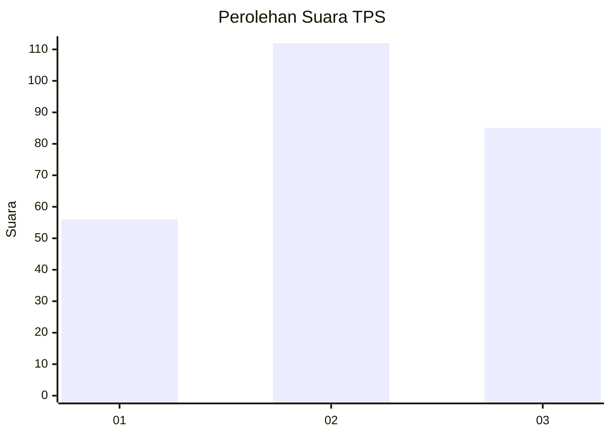
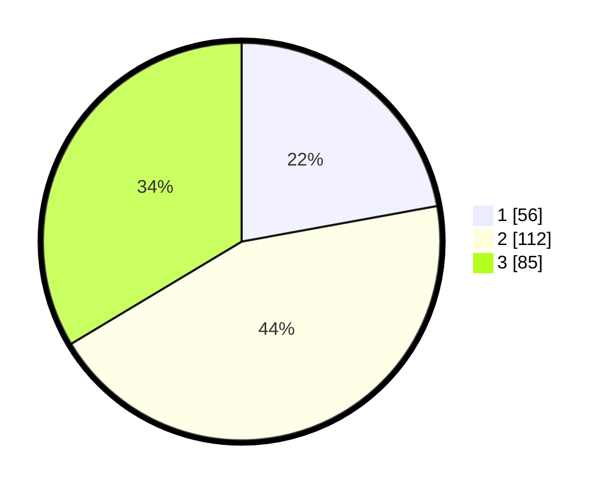

# Hasil

## Grafik

## Tabel

| No. | Nama Paslon    | Suara | Suara (raw) | Persentase |
|:--- |:-------------- | -----:| -----------:| ----------:|
| 1   | ANIES MUHAIMIN | 56    | [56][p-1]   | 22,13      |
| 2   | PRABOWO GIBRAN | 112   | [112][p-2]  | 44,27      |
| 3   | GANJAR MAHFUD  | 85    | [85][p-3]   | 33,60      |

[p-1]: https://github.com/gigit-pemilu/pemilu-2024/blob/main/pilpres/hitung-suara/sub/33-jawa-tengah/sub/08-magelang/sub/02-borobudur/sub/2014-karangrejo/sub/001-tps/sub/paslon-1.txt
[p-2]: https://github.com/gigit-pemilu/pemilu-2024/blob/main/pilpres/hitung-suara/sub/33-jawa-tengah/sub/08-magelang/sub/02-borobudur/sub/2014-karangrejo/sub/001-tps/sub/paslon-2.txt
[p-3]: https://github.com/gigit-pemilu/pemilu-2024/blob/main/pilpres/hitung-suara/sub/33-jawa-tengah/sub/08-magelang/sub/02-borobudur/sub/2014-karangrejo/sub/001-tps/sub/paslon-3.txt

## Foto C Plano

https://sirekap-obj-formc.kpu.go.id/9ff6/pemilu/ppwp/33/08/02/20/14/3308022014001-20240214-215955--0e6dccfa-1241-4ae4-9185-56718994a3f7.jpg

https://sirekap-obj-formc.kpu.go.id/9ff6/pemilu/ppwp/33/08/02/20/14/3308022014001-20240214-220705--7f978b29-b5f7-4e03-8f85-cc61aa84fb1b.jpg

https://sirekap-obj-formc.kpu.go.id/9ff6/pemilu/ppwp/33/08/02/20/14/3308022014001-20240214-220743--d75f7c65-3991-4852-95b8-1c5f7136d579.jpg

## Metadata

| Key        | Value               |
| ---------- | ------------------- |
| Time Stamp | 2024-02-25 01:00:00 |

