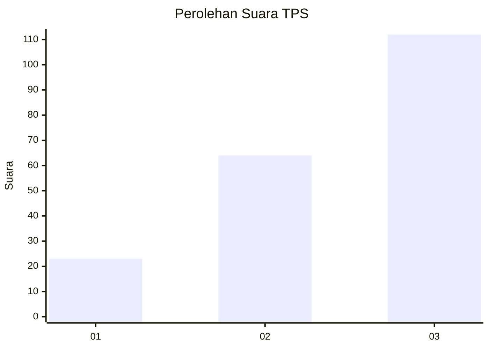
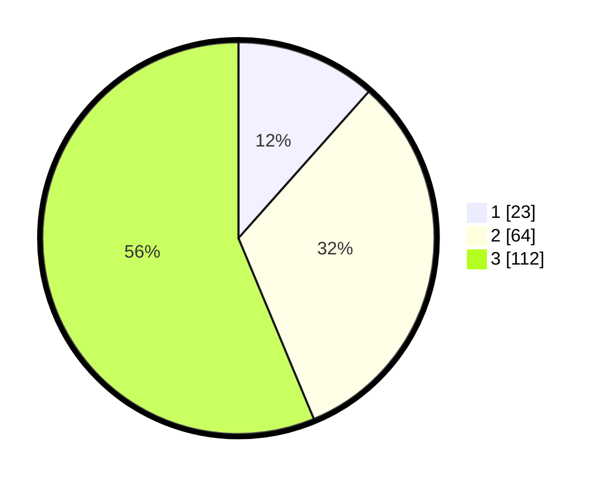

# Hasil

## Grafik

## Tabel

| No. | Nama Paslon    | Suara | Suara (raw) | Persentase |
|:--- |:-------------- | -----:| -----------:| ----------:|
| 1   | ANIES MUHAIMIN | 23    | [23][p-1]   | 11,56      |
| 2   | PRABOWO GIBRAN | 64    | [64][p-2]   | 32,16      |
| 3   | GANJAR MAHFUD  | 112   | [112][p-3]  | 56,28      |

[p-1]: https://github.com/gigit-pemilu/pemilu-2024/blob/main/pilpres/hitung-suara/sub/33-jawa-tengah/sub/08-magelang/sub/02-borobudur/sub/2015-ngadiharjo/sub/014-tps/sub/paslon-1.txt
[p-2]: https://github.com/gigit-pemilu/pemilu-2024/blob/main/pilpres/hitung-suara/sub/33-jawa-tengah/sub/08-magelang/sub/02-borobudur/sub/2015-ngadiharjo/sub/014-tps/sub/paslon-2.txt
[p-3]: https://github.com/gigit-pemilu/pemilu-2024/blob/main/pilpres/hitung-suara/sub/33-jawa-tengah/sub/08-magelang/sub/02-borobudur/sub/2015-ngadiharjo/sub/014-tps/sub/paslon-3.txt

## Foto C Plano

https://sirekap-obj-formc.kpu.go.id/4290/pemilu/ppwp/33/08/02/20/15/3308022015014-20240214-234302--7e638813-f442-4273-b82b-4caaa70fd692.jpg

https://sirekap-obj-formc.kpu.go.id/4290/pemilu/ppwp/33/08/02/20/15/3308022015014-20240214-234658--4f0ebfb1-4f7e-43a9-9a21-b76b7519c78a.jpg

https://sirekap-obj-formc.kpu.go.id/4290/pemilu/ppwp/33/08/02/20/15/3308022015014-20240214-234914--e7611eab-187e-4d2e-8fd2-9bd6500f2e0f.jpg

## Metadata

| Key        | Value               |
| ---------- | ------------------- |
| Time Stamp | 2024-02-15 15:00:29 |

