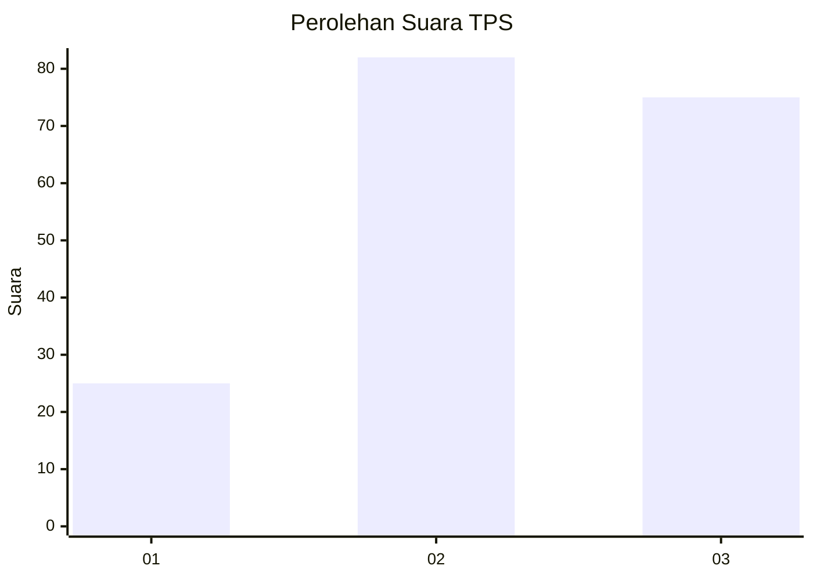
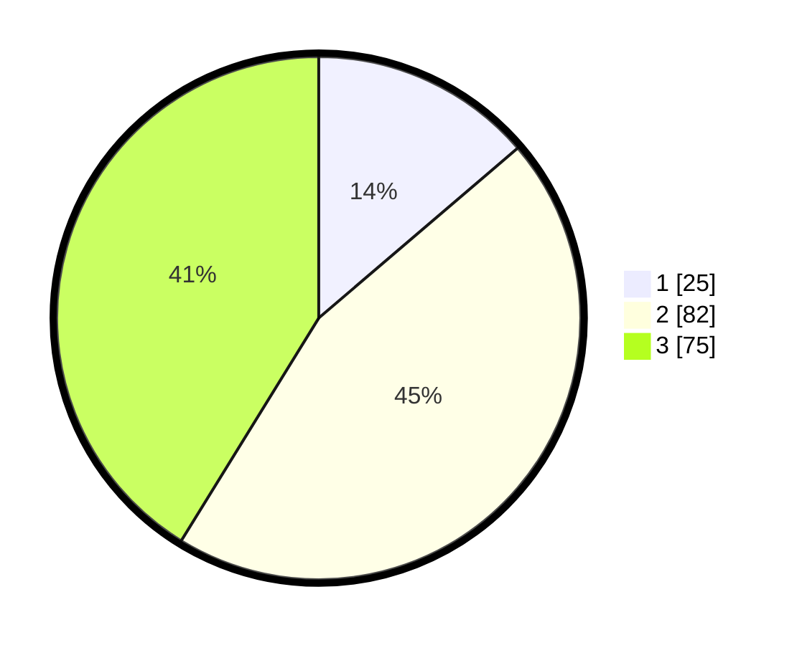

# Hasil

## Grafik

## Tabel

| No. | Nama Paslon    | Suara | Suara (raw) | Persentase |
|:--- |:-------------- | -----:| -----------:| ----------:|
| 1   | ANIES MUHAIMIN | 25    | [25][p-1]   | 13,74      |
| 2   | PRABOWO GIBRAN | 82    | [82][p-2]   | 45,05      |
| 3   | GANJAR MAHFUD  | 75    | [75][p-3]   | 41,21      |

[p-1]: https://github.com/gigit-pemilu/pemilu-2024-33-jawa-tengah/blob/main/pilpres/hitung-suara/sub/33-jawa-tengah/sub/08-magelang/sub/02-borobudur/sub/2019-wringinputih/sub/001-tps/sub/paslon-1.txt
[p-2]: https://github.com/gigit-pemilu/pemilu-2024-33-jawa-tengah/blob/main/pilpres/hitung-suara/sub/33-jawa-tengah/sub/08-magelang/sub/02-borobudur/sub/2019-wringinputih/sub/001-tps/sub/paslon-2.txt
[p-3]: https://github.com/gigit-pemilu/pemilu-2024-33-jawa-tengah/blob/main/pilpres/hitung-suara/sub/33-jawa-tengah/sub/08-magelang/sub/02-borobudur/sub/2019-wringinputih/sub/001-tps/sub/paslon-3.txt

## Foto C Plano

https://sirekap-obj-formc.kpu.go.id/4146/pemilu/ppwp/33/08/02/20/19/3308022019001-20240216-185943--dbd92e3e-9185-4212-9d27-32cc0fcd59a8.jpg

https://sirekap-obj-formc.kpu.go.id/4146/pemilu/ppwp/33/08/02/20/19/3308022019001-20240216-191716--af96f77a-63f3-4529-ac51-55c23a65f049.jpg

https://sirekap-obj-formc.kpu.go.id/4146/pemilu/ppwp/33/08/02/20/19/3308022019001-20240214-192732--ffe135f5-0446-4ba5-96cd-32c15a6be49a.jpg

## Metadata

| Key        | Value               |
| ---------- | ------------------- |
| Time Stamp | 2024-02-16 21:01:00 |

