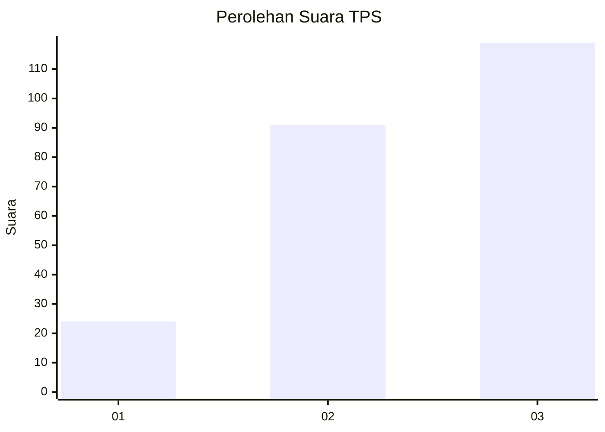
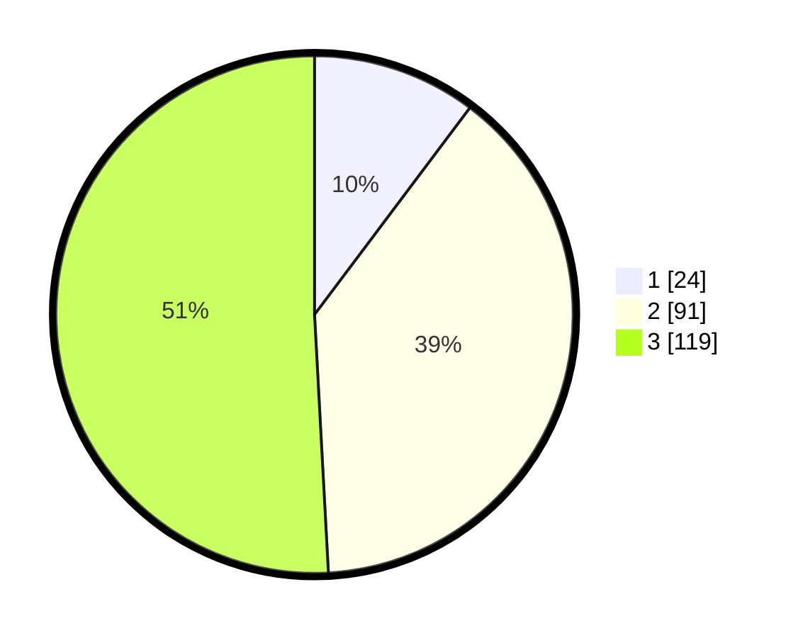

# Hasil

## Grafik

## Tabel

| No. | Nama Paslon    | Suara | Suara (raw) | Persentase |
|:--- |:-------------- | -----:| -----------:| ----------:|
| 1   | ANIES MUHAIMIN | 24    | [24][p-1]   | 10,26      |
| 2   | PRABOWO GIBRAN | 91    | [91][p-2]   | 38,89      |
| 3   | GANJAR MAHFUD  | 119   | [119][p-3]  | 50,85      |

[p-1]: https://github.com/gigit-pemilu/pemilu-2024/blob/main/pilpres/hitung-suara/sub/33-jawa-tengah/sub/08-magelang/sub/04-salam/sub/2006-jumoyo/sub/011-tps/sub/paslon-1.txt
[p-2]: https://github.com/gigit-pemilu/pemilu-2024/blob/main/pilpres/hitung-suara/sub/33-jawa-tengah/sub/08-magelang/sub/04-salam/sub/2006-jumoyo/sub/011-tps/sub/paslon-2.txt
[p-3]: https://github.com/gigit-pemilu/pemilu-2024/blob/main/pilpres/hitung-suara/sub/33-jawa-tengah/sub/08-magelang/sub/04-salam/sub/2006-jumoyo/sub/011-tps/sub/paslon-3.txt

## Foto C Plano

https://sirekap-obj-formc.kpu.go.id/997d/pemilu/ppwp/33/08/04/20/06/3308042006011-20240215-005921--76f8b350-1d10-4c24-8548-24fcb5ebc164.jpg

https://sirekap-obj-formc.kpu.go.id/997d/pemilu/ppwp/33/08/04/20/06/3308042006011-20240215-010035--516ecfc8-3218-4996-8c36-fdd293a71015.jpg

https://sirekap-obj-formc.kpu.go.id/997d/pemilu/ppwp/33/08/04/20/06/3308042006011-20240215-010217--8eda5848-e6db-4b02-b5a0-5e661229238b.jpg

## Metadata

| Key        | Value               |
| ---------- | ------------------- |
| Time Stamp | 2024-02-15 20:30:46 |

