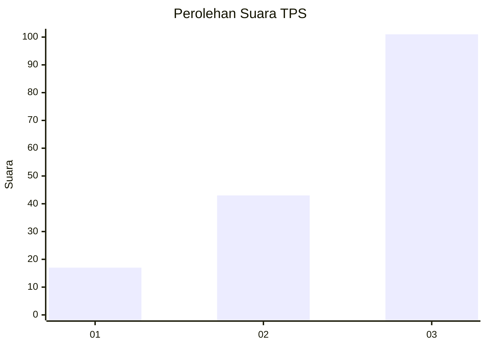
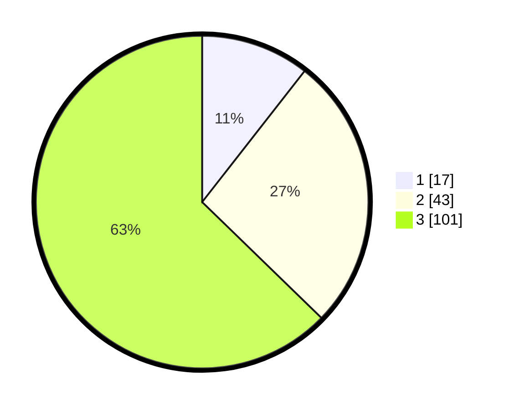

# Hasil

## Grafik

## Tabel

| No. | Nama Paslon    | Suara | Suara (raw) | Persentase |
|:--- |:-------------- | -----:| -----------:| ----------:|
| 1   | ANIES MUHAIMIN | 17    | [17][p-1]   | 10,56      |
| 2   | PRABOWO GIBRAN | 43    | [43][p-2]   | 26,71      |
| 3   | GANJAR MAHFUD  | 101   | [101][p-3]  | 62,73      |

[p-1]: https://github.com/gigit-pemilu/pemilu-2024-33-jawa-tengah/blob/main/pilpres/hitung-suara/sub/33-jawa-tengah/sub/08-magelang/sub/04-salam/sub/2006-jumoyo/sub/012-tps/sub/paslon-1.txt
[p-2]: https://github.com/gigit-pemilu/pemilu-2024-33-jawa-tengah/blob/main/pilpres/hitung-suara/sub/33-jawa-tengah/sub/08-magelang/sub/04-salam/sub/2006-jumoyo/sub/012-tps/sub/paslon-2.txt
[p-3]: https://github.com/gigit-pemilu/pemilu-2024-33-jawa-tengah/blob/main/pilpres/hitung-suara/sub/33-jawa-tengah/sub/08-magelang/sub/04-salam/sub/2006-jumoyo/sub/012-tps/sub/paslon-3.txt

## Foto C Plano

https://sirekap-obj-formc.kpu.go.id/44c0/pemilu/ppwp/33/08/04/20/06/3308042006012-20240216-151754--1bd73cf2-2405-48bf-a7ee-9e04b2f928df.jpg

https://sirekap-obj-formc.kpu.go.id/44c0/pemilu/ppwp/33/08/04/20/06/3308042006012-20240216-151554--72c22fae-7626-4af8-b1c0-d31cb3a12f32.jpg

https://sirekap-obj-formc.kpu.go.id/44c0/pemilu/ppwp/33/08/04/20/06/3308042006012-20240216-151956--1f9f3819-9288-40ad-9421-8060555d857a.jpg

## Metadata

| Key        | Value               |
| ---------- | ------------------- |
| Time Stamp | 2024-02-17 13:37:34 |

