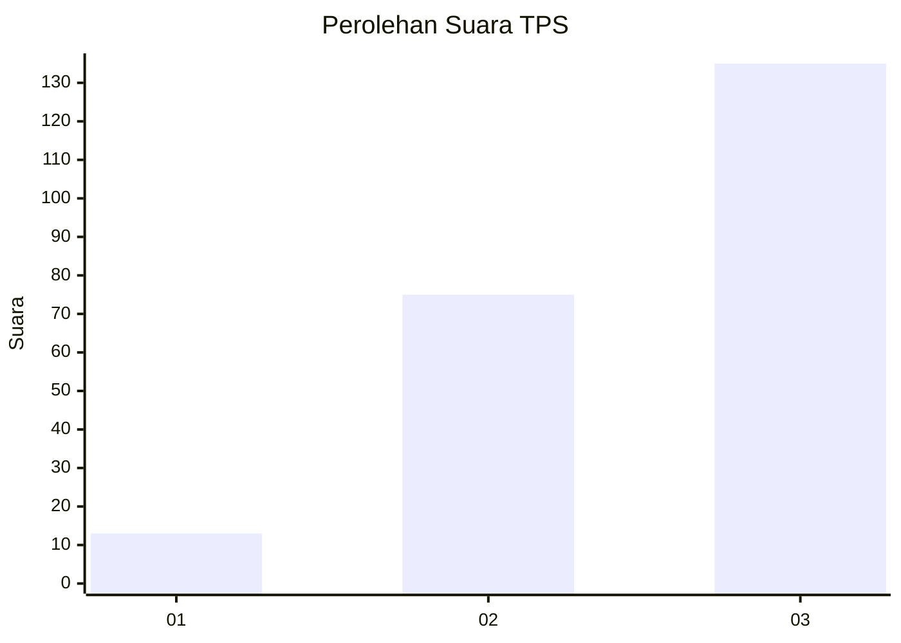
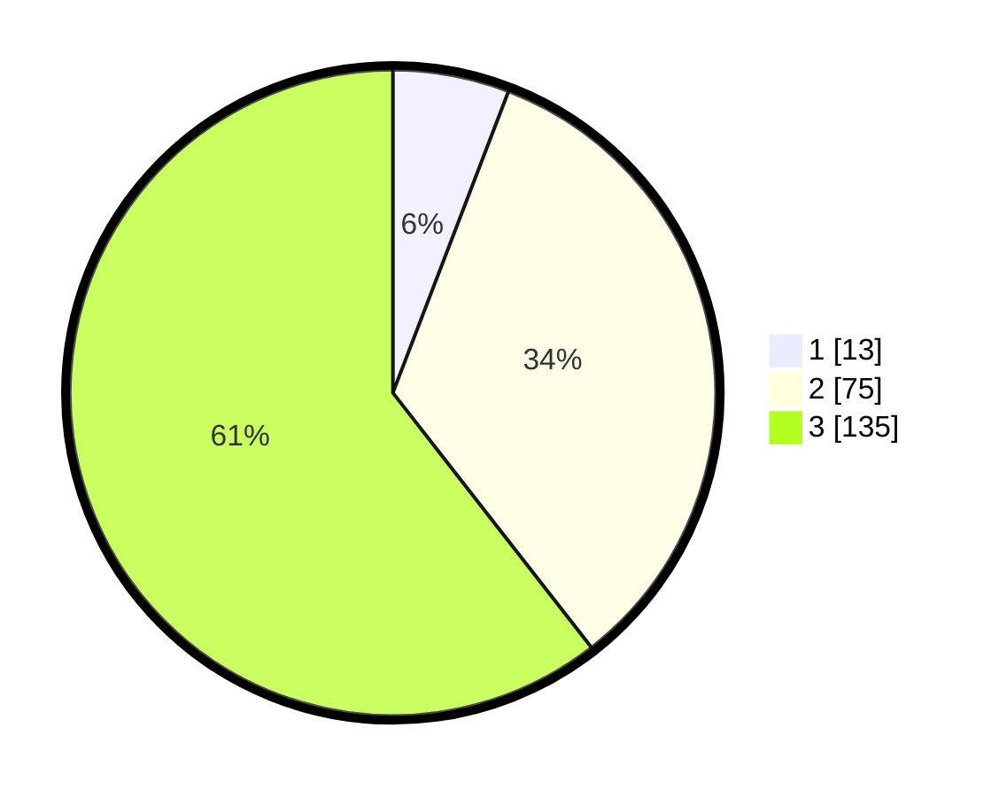

# Hasil

## Grafik

## Tabel

| No. | Nama Paslon    | Suara | Suara (raw) | Persentase |
|:--- |:-------------- | -----:| -----------:| ----------:|
| 1   | ANIES MUHAIMIN | 13    | [13][p-1]   | 5,83       |
| 2   | PRABOWO GIBRAN | 75    | [75][p-2]   | 33,63      |
| 3   | GANJAR MAHFUD  | 135   | [135][p-3]  | 60,54      |

[p-1]: https://github.com/gigit-pemilu/pemilu-2024/blob/main/pilpres/hitung-suara/sub/33-jawa-tengah/sub/08-magelang/sub/04-salam/sub/2006-jumoyo/sub/018-tps/sub/paslon-1.txt
[p-2]: https://github.com/gigit-pemilu/pemilu-2024/blob/main/pilpres/hitung-suara/sub/33-jawa-tengah/sub/08-magelang/sub/04-salam/sub/2006-jumoyo/sub/018-tps/sub/paslon-2.txt
[p-3]: https://github.com/gigit-pemilu/pemilu-2024/blob/main/pilpres/hitung-suara/sub/33-jawa-tengah/sub/08-magelang/sub/04-salam/sub/2006-jumoyo/sub/018-tps/sub/paslon-3.txt

## Foto C Plano

https://sirekap-obj-formc.kpu.go.id/cb78/pemilu/ppwp/33/08/04/20/06/3308042006018-20240215-020250--01aa78e1-eeb6-4b67-abd3-371b18c70b49.jpg

https://sirekap-obj-formc.kpu.go.id/cb78/pemilu/ppwp/33/08/04/20/06/3308042006018-20240215-025044--f6352343-9e84-44b5-b2d5-78c0ca7421fd.jpg

https://sirekap-obj-formc.kpu.go.id/cb78/pemilu/ppwp/33/08/04/20/06/3308042006018-20240215-020100--d4137955-607d-4ad9-af6f-53f9d19b53bb.jpg

## Metadata

| Key        | Value               |
| ---------- | ------------------- |
| Time Stamp | 2024-02-15 21:01:18 |

