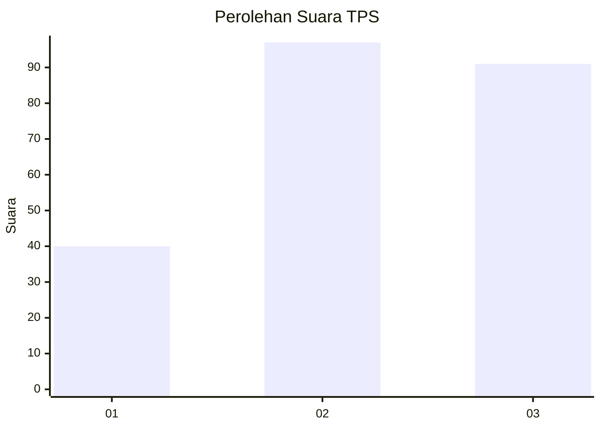
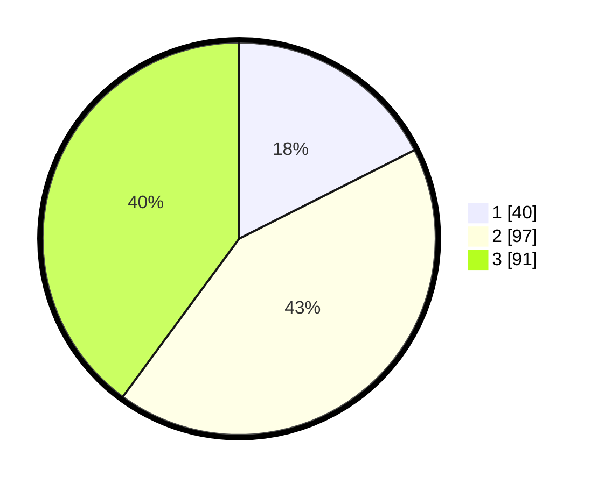

# Hasil

## Grafik

## Tabel

| No. | Nama Paslon    | Suara | Suara (raw) | Persentase |
|:--- |:-------------- | -----:| -----------:| ----------:|
| 1   | ANIES MUHAIMIN | 40    | [40][p-1]   | 17,54      |
| 2   | PRABOWO GIBRAN | 97    | [97][p-2]   | 42,54      |
| 3   | GANJAR MAHFUD  | 91    | [91][p-3]   | 39,91      |

[p-1]: https://github.com/gigit-pemilu/pemilu-2024-33-jawa-tengah/blob/main/pilpres/hitung-suara/sub/33-jawa-tengah/sub/08-magelang/sub/04-salam/sub/2006-jumoyo/sub/021-tps/sub/paslon-1.txt
[p-2]: https://github.com/gigit-pemilu/pemilu-2024-33-jawa-tengah/blob/main/pilpres/hitung-suara/sub/33-jawa-tengah/sub/08-magelang/sub/04-salam/sub/2006-jumoyo/sub/021-tps/sub/paslon-2.txt
[p-3]: https://github.com/gigit-pemilu/pemilu-2024-33-jawa-tengah/blob/main/pilpres/hitung-suara/sub/33-jawa-tengah/sub/08-magelang/sub/04-salam/sub/2006-jumoyo/sub/021-tps/sub/paslon-3.txt

## Foto C Plano

https://sirekap-obj-formc.kpu.go.id/9fd7/pemilu/ppwp/33/08/04/20/06/3308042006021-20240218-204137--80d10488-5f76-4ae3-be5a-9fc47c132ffc.jpg

https://sirekap-obj-formc.kpu.go.id/9fd7/pemilu/ppwp/33/08/04/20/06/3308042006021-20240218-204457--e51e8a19-b6b1-4090-a85d-cd3b03e364c0.jpg

https://sirekap-obj-formc.kpu.go.id/9fd7/pemilu/ppwp/33/08/04/20/06/3308042006021-20240215-020344--65a97986-eee3-4140-a238-40f15698b997.jpg

## Metadata

| Key        | Value               |
| ---------- | ------------------- |
| Time Stamp | 2024-02-19 06:16:00 |

