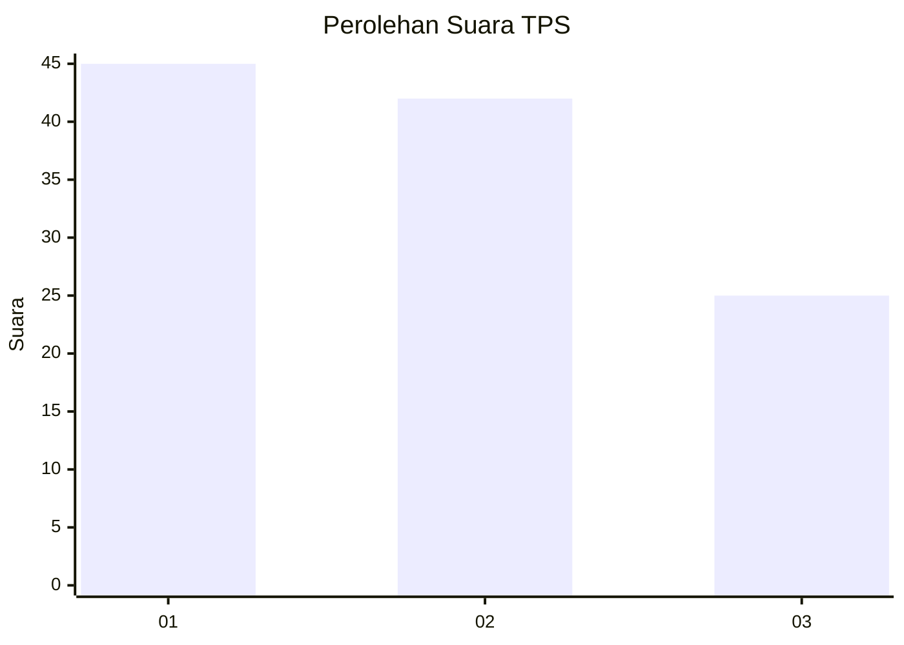
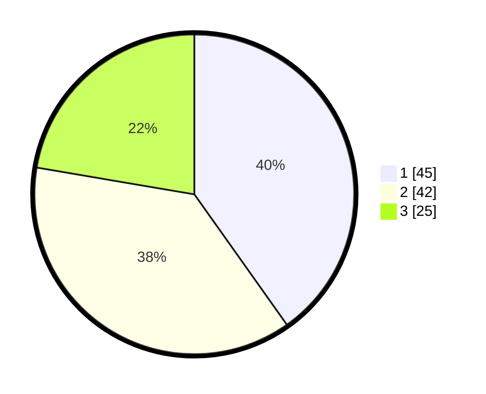

# Hasil

## Grafik

## Tabel

| No. | Nama Paslon    | Suara | Suara (raw) | Persentase |
|:--- |:-------------- | -----:| -----------:| ----------:|
| 1   | ANIES MUHAIMIN | 45    | [45][p-1]   | 40,18      |
| 2   | PRABOWO GIBRAN | 42    | [42][p-2]   | 37,50      |
| 3   | GANJAR MAHFUD  | 25    | [25][p-3]   | 22,32      |

[p-1]: https://github.com/gigit-pemilu/pemilu-2024/blob/main/pilpres/hitung-suara/sub/33-jawa-tengah/sub/08-magelang/sub/05-srumbung/sub/2005-kamongan/sub/005-tps/sub/paslon-1.txt
[p-2]: https://github.com/gigit-pemilu/pemilu-2024/blob/main/pilpres/hitung-suara/sub/33-jawa-tengah/sub/08-magelang/sub/05-srumbung/sub/2005-kamongan/sub/005-tps/sub/paslon-2.txt
[p-3]: https://github.com/gigit-pemilu/pemilu-2024/blob/main/pilpres/hitung-suara/sub/33-jawa-tengah/sub/08-magelang/sub/05-srumbung/sub/2005-kamongan/sub/005-tps/sub/paslon-3.txt

## Foto C Plano

https://sirekap-obj-formc.kpu.go.id/21a1/pemilu/ppwp/33/08/05/20/05/3308052005005-20240215-011031--b94526ae-0c6d-44c1-b7c9-13cf2ec71d65.jpg

https://sirekap-obj-formc.kpu.go.id/21a1/pemilu/ppwp/33/08/05/20/05/3308052005005-20240214-140941--2bdfc7f0-2190-43e6-9ecd-380602ec96d1.jpg

https://sirekap-obj-formc.kpu.go.id/21a1/pemilu/ppwp/33/08/05/20/05/3308052005005-20240215-011203--99747c73-568a-4e28-847b-b4317741d356.jpg

## Metadata

| Key        | Value               |
| ---------- | ------------------- |
| Time Stamp | 2024-02-15 16:00:26 |

