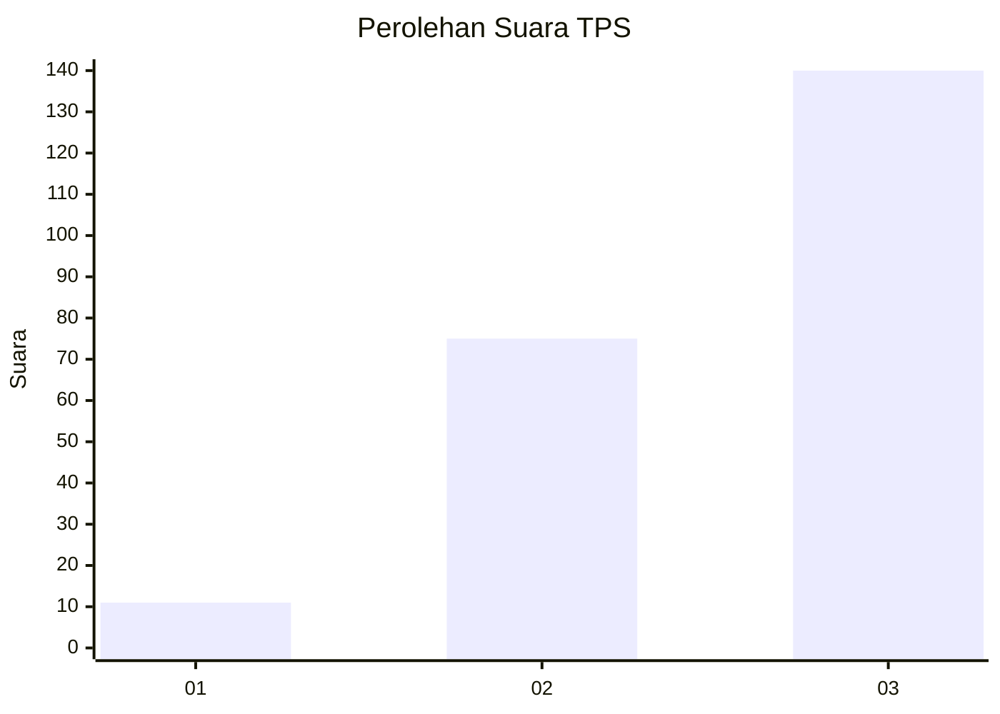
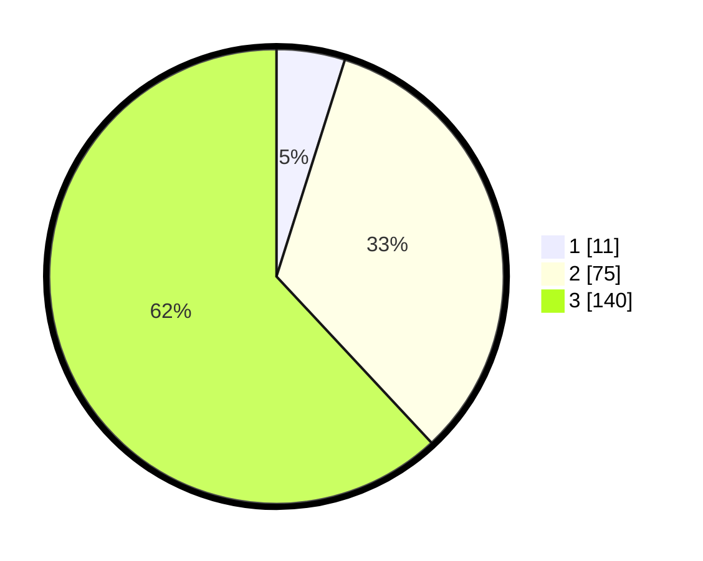

# Hasil

## Grafik

## Tabel

| No. | Nama Paslon    | Suara | Suara (raw) | Persentase |
|:--- |:-------------- | -----:| -----------:| ----------:|
| 1   | ANIES MUHAIMIN | 11    | [11][p-1]   | 4,87       |
| 2   | PRABOWO GIBRAN | 75    | [75][p-2]   | 33,19      |
| 3   | GANJAR MAHFUD  | 140   | [140][p-3]  | 61,95      |

[p-1]: https://github.com/gigit-pemilu/pemilu-2024/blob/main/pilpres/hitung-suara/sub/33-jawa-tengah/sub/08-magelang/sub/05-srumbung/sub/2011-bringin/sub/010-tps/sub/paslon-1.txt
[p-2]: https://github.com/gigit-pemilu/pemilu-2024/blob/main/pilpres/hitung-suara/sub/33-jawa-tengah/sub/08-magelang/sub/05-srumbung/sub/2011-bringin/sub/010-tps/sub/paslon-2.txt
[p-3]: https://github.com/gigit-pemilu/pemilu-2024/blob/main/pilpres/hitung-suara/sub/33-jawa-tengah/sub/08-magelang/sub/05-srumbung/sub/2011-bringin/sub/010-tps/sub/paslon-3.txt

## Foto C Plano

https://sirekap-obj-formc.kpu.go.id/160f/pemilu/ppwp/33/08/05/20/11/3308052011010-20240217-115740--d3da66ff-0f93-4ba0-a2c2-fdb1c5254699.jpg

https://sirekap-obj-formc.kpu.go.id/160f/pemilu/ppwp/33/08/05/20/11/3308052011010-20240215-030925--3cd07f20-3060-41a7-92eb-5dbc24191691.jpg

https://sirekap-obj-formc.kpu.go.id/160f/pemilu/ppwp/33/08/05/20/11/3308052011010-20240215-031018--423c4644-a454-4596-87a6-d14d4d714236.jpg

## Metadata

| Key        | Value               |
| ---------- | ------------------- |
| Time Stamp | 2024-02-17 12:00:00 |

