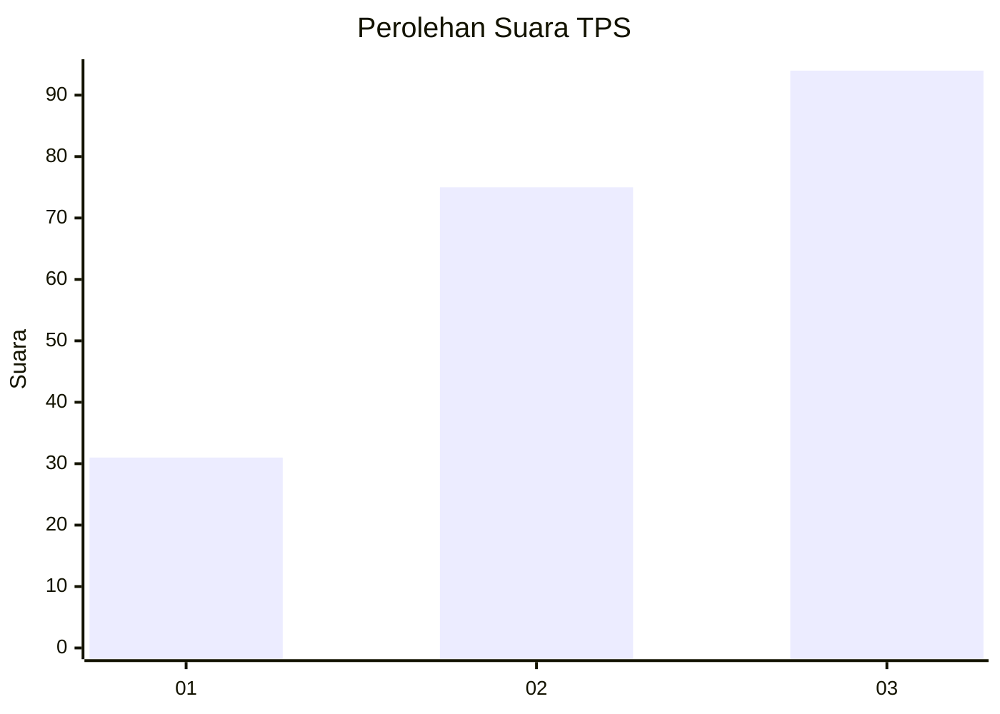
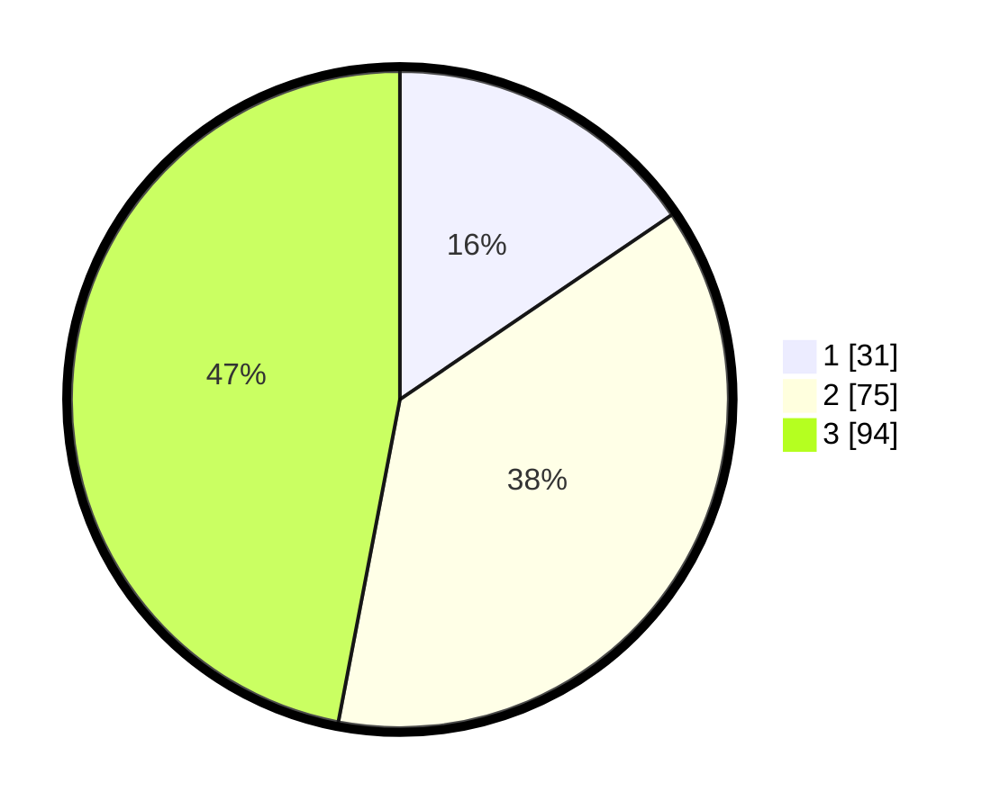

# Hasil

## Grafik

## Tabel

| No. | Nama Paslon    | Suara | Suara (raw) | Persentase |
|:--- |:-------------- | -----:| -----------:| ----------:|
| 1   | ANIES MUHAIMIN | 31    | [31][p-1]   | 15,50      |
| 2   | PRABOWO GIBRAN | 75    | [75][p-2]   | 37,50      |
| 3   | GANJAR MAHFUD  | 94    | [94][p-3]   | 47,00      |

[p-1]: https://github.com/gigit-pemilu/pemilu-2024/blob/main/pilpres/hitung-suara/sub/33-jawa-tengah/sub/08-magelang/sub/05-srumbung/sub/2011-bringin/sub/011-tps/sub/paslon-1.txt
[p-2]: https://github.com/gigit-pemilu/pemilu-2024/blob/main/pilpres/hitung-suara/sub/33-jawa-tengah/sub/08-magelang/sub/05-srumbung/sub/2011-bringin/sub/011-tps/sub/paslon-2.txt
[p-3]: https://github.com/gigit-pemilu/pemilu-2024/blob/main/pilpres/hitung-suara/sub/33-jawa-tengah/sub/08-magelang/sub/05-srumbung/sub/2011-bringin/sub/011-tps/sub/paslon-3.txt

## Foto C Plano

https://sirekap-obj-formc.kpu.go.id/e5b2/pemilu/ppwp/33/08/05/20/11/3308052011011-20240214-220549--43da3bdd-46d7-4b5e-bbf7-b7114a25d168.jpg

https://sirekap-obj-formc.kpu.go.id/e5b2/pemilu/ppwp/33/08/05/20/11/3308052011011-20240214-220701--95a26386-4f44-4161-aeca-2b2d5d13182a.jpg

https://sirekap-obj-formc.kpu.go.id/e5b2/pemilu/ppwp/33/08/05/20/11/3308052011011-20240214-220755--5ce8007d-0a98-4839-a9f6-461a4ff36c91.jpg

## Metadata

| Key        | Value               |
| ---------- | ------------------- |
| Time Stamp | 2024-02-16 21:01:00 |

